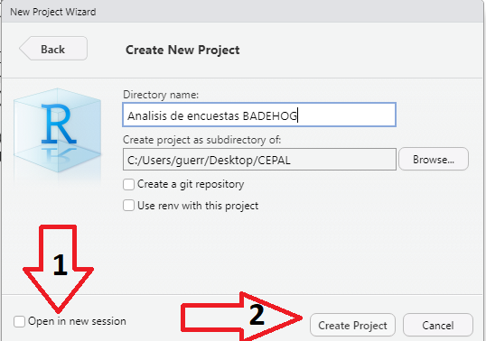

```{r setup, include=FALSE}
knitr::opts_chunk$set(warning = FALSE, 
                      message = FALSE,
                      cache = TRUE)
```

# Manejando una base de encuestas de hogares con `R` 

`R` fue creado en 1992 en Nueva Zelanda por Ross Ihaka y Robert Gentleman. A manera introductoria, `R` es un software diseñado para realizar análisis estadísticos tanto sencillos como complejos. Este software ha ganado popularidad entre los investigadores puesto que su manejo es sencillo y además, es de libre uso; es decir, no requiere de ninguna licencia para su utilización. Puede descargarse desde la página web https://www.r-project.org. `R` es un lenguaje de programación de libre distribución, bajo Licencia GNU, y mantiene un ambiente para el cómputo estadístico y gráfico. Este software está diseñado para utilizarse en distintos sistemas operativos como, Windows, MacOS o Linux. 

El concepto de ambiente se enfoca en caracterizarlo como un sistema totalmente planificado y coherente, en lugar de una acumulación gradual de herramientas muy específicas y poco flexibles, como suele ser con otro software de análisis de datos. `R` es un lenguaje de programación y, por ende, su interfaz puede ser poco amigable para los investigadores que inician sus primeros cálculos. Una solución a este incinveniente es RStudio, el cual es un entorno de desarrollo integrado (IDE, por sus siglas en inglés), lo que significa que RStudio es un software que permite manejar y utilizar `R` de manera más cómoda y agradable.

## Fundamentos básicos de `R` y `Rstudio` 

`R` es un lenguaje colaborativo, el cual permite que la comunidad vaya haciendo aportes al desarrollo de funciones dentro de paquetes o librerías. Alguna de las librerías más usadas para el análisis de bases de datos son las siguientes:

-   `dplyr` es un paquete enfocado en el trabajo con bases de datos rectangulares [@dplyr2023]. Entre sus principales propiedades están 1) la identificación de herramientas de manipulación de datos más importantes necesarias para el análisis de datos y hacerlas fáciles de usar desde `R`; 2) proporcionar un rendimiento rápido y eficiente para los datos almacenados en la memoria del computador; 3) utilizar la misma interfaz para trabajar con datos sin importar dónde o cómo estén almacenados, ya sea en un marco de datos, una tabla de datos o una base de datos.
    
- `tidyverse` es una colección de paquetes disponibles en `R` y orientados a la manipulación, importación, exploración y visualización de datos y que se utiliza exhaustivamente en ciencia de datos [@tidyverse2019]. El uso de `tidyverse` permite facilitar el trabajo estadístico y la generación de procesamientos reproducibles.
    
-   `readstata13` permite leer y escribir todos los formatos de archivo de Stata (versión 17 y anteriores) en un marco de datos `R` [@readstata132023]. Se admiten las versiones de formato de archivo de datos 102 a 119. para leer las bases de datos de `STATA`. Además, el paquete admite muchas características del formato Stata dta, como conjuntos de etiquetas en diferentes idiomas  o calendarios comerciales.

-   `survey` ha sido elaborado por Thomas Lumley y nos proporciona funciones en `R` útiles para analizar datos provenientes de encuestas complejas [@TL]. Alguno de los parámetros que se pueden estimar usando este paquete son medias, totales, razones, cuantiles, tablas de contingencias, modelos de regresión, modelos loglineales, entre otros.

-   `srvyr` permite utilizar el operador `pipeline` (`%>%`) en las consultas que se realizan con el paquete `survey` [@srvyr2023].

-   `ggplot2` es un paquete de visualización de datos para el lenguaje `R` que implementa lo que se conoce como la gramática de los gráficos, que no es más que una representación esquemática y en capas de lo que se dibuja en dichos gráficos, como lo pueden ser los marcos y los ejes, el texto de los mismos, los títulos, así como, por supuesto, los datos o la información que se grafica, el tipo de gráfico que se utiliza, los colores, los símbolos y tamaños, entre otros [@ggplot22016].

-   `TeachingSampling` permite al usuario extraer muestras probabilísticas y hacer inferencias a partir de una población finita basada en varios diseños de muestreo. Entre los diseño empleados en esta librería están: Muestreo Aleatorio Simple (MAS), Muestreo estratificado, Muestreo en varias etapas, muestreos proporcionales al tamaño, entre otros [@TeachingSampling2020].

-   `samplesize4surveys` permite calcular el tamaño de muestra requerido para la estimación de totales, medias y proporciones bajo diseños de muestreo complejos [@samplesize4surveys2020].

Antes de poder utilizar las diferentes funciones que cada librería tiene, es necesario descargarlas de antemano de la web. El comando `install.packages` permite realizar esta tarea. Note que algunas librerías pueden depender de otras, así que para poder utilizarlas es necesario instalar también las dependencias.

```{r, eval=F}
install.packages("dplyr")
install.packages("tidyverse")
install.packages("readstata13") 
install.packages("survey")
install.packages("srvyr")
install.packages("ggplot2")
install.packages("TeachingSampling")
install.packages("samplesize4surveys")
```

Una vez instaladas las librerías hay que informarle al software que vamos a utilizarlas con el comando `library`. Nótese que es necesario haber instalado las librerías para poder utilizarlas. 

```{r, warning=FALSE, echo=TRUE, message=FALSE}
rm(list = ls())

library("dplyr")
library("tidyverse")
library("readstata13") 
library("survey")
library("srvyr")
library("ggplot2")
library("TeachingSampling")
library("samplesize4surveys")
```

## Creación de proyectos en `R`

Una vez se descargan e instalan las librerías o paquetes en `R`, el paso recomendado es que todos los procesamientos que se realicen se hagan a través de un la creación de proyectos. Un proyecto de `R` se define como un archivo que contiene los archivos de origen y contenido asociados con el trabajo que se está realizando. Adicionalmente, contiene información que permite la compilación de cada archivo de `R` que se va a utilizar, mantiene la información para integrarse con sistemas de control de código fuente y ayuda a organizar la aplicación de los procesamientos en componentes lógicos.  

Ahora bien, atendiendo a una cultura de buenas practicas de programación, se recomienda crear un proyecto en donde se tenga disponible toda la información con la cual se va a trabajar. A continuación, se muestran los pasos para crear un proyecto dentro de RStudio.

-   **Paso 1:** Abrir `RStudio`.
-   **Paso 2:** ir a file -\> New Project {width="450"}

-   *Paso 3:* Tipos de proyecto.

Para este ejemplo se tomará *New Directory* 

{width="450"}

Un aspecto importante a tener en cuenta en este paso es que al hacer clic en *New Directory*, RStudio brinda una variedad de opciones dependiendo de las características del procesamiento que se desea realizar. Ahora bien, si se cuenta con algunos código previamente desarrollados y se desea continuar con ese proyecto, se debe tomar la opción *Existing Directory*. Además, es posible clonar repositorios existentes en *Git* a través de la opción *Version Control*. 

-   *Paso 4:* Seleccionar el tipo de proyecto.

{width="450"}

-   *Paso 5*: Diligenciar el nombre del proyecto y la carpeta de destino.

{width="450"} 

Al realizar estos pasos todas las rutinas creadas dentro del proyecto estarán ancladas a la carpeta del proyecto.

## Lectura de las bases de datos y procesamientos básicos

Es muy usual que al trabajar proyectos en `R` sea necesario importar bases de datos con información relevante para un estudio en particular. Los formatos de bases de datos que `R` permite importar son diversos, entre ellos se tienen `xlsx`, `csv`, `txt`, `STATA`, etc. Particularmente, para la lectura de bases de datos provenientes de `STATA 13`, se deb utilizar la función `read.dta13`.

Una vez leída la base de datos en el formato pertinente es recomendable transformarla al formato nativo de `R`, es decir `.RDS`. Este es un formato más eficiente y propio de `R`. Una vez se carga la base de datos se procede a utilizar las funciones en `R` para poder obtener resultados de los procesamientos agregados y gráficos de interés. Para ejemplificar el uso de funciones que permitan obtener resultados agregados, utilizaremos la base de datos BigCity del paquete TeachinSampling. Esta base corresponde a un conjunto de variables socioeconómicas de 150266 personas en un año en particular. 

```{r, warning=FALSE, echo=TRUE, message=FALSE, eval=T}
library(TeachingSampling)
data(BigCity)
data1 <- BigCity
```

Una vez guardada la base en nuestros archivos de trabajo, la función `head` permite vizualizar rápidamente los primeros datos de la base.

```{r}
head(data1)
```

Una vez cargada la base de datos en `R`, se puede empezar a reliazar los procesamientos según las necesidades de cada investigador. En este sentido, una de las primeras revisiones que se realizan al cargar las bases de datos es revisar su dimensión; es decir, verificar la cantidad de filas y columnas que tiene la base. Lo anterior se puede hacer con la función `nrow`, que identifica el número de registros (unidades efectivamente observadas) en la base de datos y con la función `ncol`, que muestra el número de variables en la base de datos. Los códigos computacionales son los siguientes:

```{r}
nrow(data1)
```

```{r}
ncol(data1)
```

Una forma resumida de revisar la cantidad de filas y columnas que tiene la base de datos es con la función `dim`, la cual nos devuelve un vector cuya primera componente contiene la cantidad de filas y su segunda componente, la cantidad de columnas:

```{r}
dim(data1)
```

Es usual que en las encuestas de hogares las bases de datos sean extensas; es decir, que contengan una cantidad importante de variables observadas y que, por lo general, su tamaño de muestra sea grande. Es por lo anterior que, para poder visualizar apropiadamente dichas bases de datos, una vez cargadas en `R` sea necesario hacerlo de manera externa. Esto es, abrir una pestaña diferente en `R` y hacer la navegación de la base como un texto plano. Lo anterior se realiza con la función `View` como se muestra a continuación:

```{r, eval=F}
View(data1)
```

{width="850"} 

Otra verificación importante que se debe realizar al momento de cargar una base de datos en `R` es el reconocimiento de las variables que incluye. Esto se puede hacer utilizando la función `names` la cual identifica las variables de la base de datos.

```{r, eval=F}
names(data1)
```

La función `names` solo devuelve un vector con los nombres de las variables que contiene la base. Sin embargo, si se quiere profundizar en qué información contiene cada variable, La función `str` muestra de manera compacta la estructura de un objeto y sus componentes. Para nuestra base se utilizaría de la siguiente manera:

```{r, eval=T}
str(data1)
```

Como se puede observar en la salida anterior, por ejemplo, la variable `HHID` es de tipo caracter al igual que la variable `Sex`, mientras que la variable `Income` es de tipo numérico. Todos los demás atributos de las variables se encuentran en la salida del código. Esta función es muy útil al momento de querer tener un panorama amplio del contenido y clase de cada variable en una base de datos, particularmente en una encuesta de hogares en donde se tiene, por la misma estructura del estudio, muchas clases o tipos de variables observadas.

## El operador `pipeline` (%>%)

El software estadístico `R` es un lenguaje de programación creado por estadísticos y para estadísticos. Una de las contribuciones recientes a este software es el desarrollo de los `pipelines` (tuberías) que permiten de una forma intuitiva generar consultas y objetos desde una base de datos. El operador `pipeline`, `%>%`, es nativo del paquete @magrittr2022 y está cargado automáticamente en los paquetes del `tidyverse`. 

El objetivo del operador es ayudar a escribir el código de una manera que sea más fácil de leer y entender. En este sentido, el operador ` %>% ` permite encadenar operaciones para que el resultado de una operación anterior se convierta en el argumento de la siguiente operación. A continuación, se presenta un ejemplo sencillo del uso del operador ` %>% ` con la base de datos BigLucy haciendo el conteo del total de elementos que contiene la base de datos utilizando la función `count`.

```{r, eval=T}
data1 %>% count()
```

La anterior línea de código se entiende así: con la base de datos realice un conteo. Por otro lado, existe una gama amplia de funciones que se pueden utilizar con el operador ` %>% `. A continuación, se enlistan una serie de funciones muy útiles al momento de hacer análisis con bases de datos provenientes de encuestas de hogares:  

-   **filter**: mantiene un criterio de filtro sobre alguna variable o mezcla de variables.
-   **select**: selecciona columnas por nombres.
-   **arrange**: ordena las filas de la base de datos.
-   **mutate**: añade nuevas variables a la base de datos.
-   **summarise**: reduce variables a valores agrupados y los presenta en una tabla.
-   **group_by**: ejecuta funciones y agrupa el resultado por las variables de interés.

Una de las primeras consultas que se pueden realizar en las encuestas de hogares es saber el número de entrevistas efectivamente realizadas. Usando ` %>% ` se realiza de la siguiente manera:


```{r}
data1 %>% nrow()
```

Otro de los ejercicios que se hacen usualmente con las encuestas de hogares está relacionado con hacer descriptivos de la base por sexo. Una de las formas más sencillas de hacer esta revisión es usar la función `filter`, para generar dos bases de datos. 

```{r}
datasexH <- data1 %>%
  filter(Sex == "Male")
datasexM <- data1 %>%
  filter(Sex == "Female")
```

Por otro lado, si el interés ahora es filtrar la base de datos por aquellas personas que no son pobres, se realiza de la siguiente manera:

```{r, eval=T}
datanopobre <- data1 %>%
  filter(Poverty == "NotPoor")
```

En este mismo sentido, es posible también crear nuevas bases de datos filtradas por algunos ingresos particulares mensuales, es posible realizarlo de la siguiente manera:

```{r, eval=T}
dataingreso1 <- data1 %>%
  filter(Income %in% c(265, 600))

dataingreso2 <- data1 %>%
  filter(Income %in% c(1000, 2000))
```

Dado que la base del ejemplo no cuenta con regiones geográficas definidas, se pueden construir agrupando algunos estratos, para ello se usa el siguiente código:  

```{r}
Region <- as.numeric(gsub(
  pattern = "\\D",
  replacement =  "",
  x = data1$Stratum
))

data1$Region <-
  cut(
    Region,
    breaks = 5,
    labels = c("Norte", "Sur", "Centro", "Occidente", "Oriente")
  )
```

La mayoría de veces, para los análisis con las bases de hogares, es necesario recodificar los niveles de los factores. El siguiente código permite generar los nombres de las regiones, junto con sus respectivos rótulos.

```{r}
data1$IDRegion <- factor(
  data1$Region,
  levels = c("Norte", "Sur", "Centro", "Occidente", "Oriente"),
  labels = c("01", "02", "03", "04", "05")
)
```

Por último, para efectos de visualización en tablas y gráficos es conviene codificar los nombres de las variables como sigue:

```{r}
data1$Nom_corto <- factor(
  data1$Region,
  levels = c("Norte", "Sur", "Centro", "Occidente", "Oriente"),
  labels = c("N", "S", "C", "O", "E")
)
```

Otra función muy útil en los procesamientos descriptivos de las encuestas de hogares es la función `select`, la cual permite seleccionar un grupo de variables de interés que se quieren analizar. Si, por ejemplo, se desea seleccionar de la base de ejemplo solo las variables que identifican al hogar (`HHID`), a las unidades primarias de muestreo (`PSU`), la Zona (`Zone`), el sexo de la persona (`Sex`) y sus ingresos (`Income`), se realiza de la siguiente manera:

```{r}
datared <- data1 %>%
  select(HHID, PSU, Zone, Sex, Income)
```

La función `select` no solo sirve para seleccionar variables de una base de datos, también se puede utilizar para eliminar algunas variables de la base de datos que ya no son de interés para el análisis o que, simplemente, se generaron en la manipulación de la base de datos como variables temporales para realizar algunos cálculos de interés. Por ejemplo, si se desea eliminar de la base de datos de ejemplo las variables de identificación del hogar y de identificación de las personas, se podría realizar introduciendo un signo "menos" (-) delante del nombre de la variable como sigue:

```{r, eval=T}
datagrey <- data1 %>%
  select(-HHID, -PersonID)
```

Por otro lado, si el objetivo fuese ordenar las filas de la base por alguna variable en particular, se utilizaría la función `arrange` para realizar esta operación. A continuación, se ejemplifica con la base de datos `dataingreso1`, cómo se ordena la base de acuerdo con la variable `Income`:

```{r}
datadog <- dataingreso1 %>%
  arrange(Income)

datadog %>% 
  head()
```

Es posible utilizar la función `arrange` para hacer ordenamientos más complicados. Por ejemplo, ordenar por más de una variable. A modo de ejemplo, ordenemos la base de datos `dataingreso1` de acuerdo con las variables `Sexo` y `Edad`.

```{r, eval=T}
dataingreso1 %>%
  arrange(Sex, Age) %>%
  head()
```

También es posible utilizar la función `arrange` junto con la opción `desc()` para que el ordenamiento sea descendente.

```{r}
dataingreso1 %>%
  arrange(desc(Age)) %>%
  head()
```

## Creación de variables y resumen de conteos

Las funciones `mutate`, `summarise` y `group_by` están cargadas en el paquete `tidyverse` y son muy importantes al momento de realizar análisis descriptivos simples con las bases de datos de las encuestas de hogares. En primer lugar, la función `mutate` permite realizar transformaciones de variables en una base de datos. Usualmente, en las encuestas de hogares es necesario crear nuevas variables, por ejemplo, si el hogar está en estado de pobreza extrema o no, la cual se calcula a partir de los ingresos del hogar. La función `mutate` proporciona una interfaz clara para realizar este tipo de operaciones. A modo de ejemplo, utilizaremos la base de ejemplo para crear una nueva variable llamada `logingreso`, la cual corresponde al logaritmo natural de los ingresos de la persona dentro del hogar. Los códigos computacionales se muestran a continuación:

```{r, eval=TRUE}
datablue2 <- dataingreso1 %>%
  mutate(Logincome = log(Income))

datablue2 %>%
  select(PersonID, Income, Logincome) %>%
  head()
```

Si fuera necesario, se puede crear más de una variable en la base de datos. Cabe recalcar que la función `mutate` reconoce sistemáticamente las variables que van siendo creadas de manera ordenada. A continuación, se presenta un ejemplo de cómo crear más de una nueva variable en la base de datos:

```{r, eval=TRUE}
datacat <- datablue2 %>%
  mutate(Income2 = 2 * Income,
         Income4 = 2 * Income2)

datacat %>%
  select(PersonID, Income2, Income4) %>%
  head()
```

Ahora bien, la función `summarise` crea un nuevo archivo de datos con información resumida de la base de datos. Como se mencionó anteriormente, esta función sirve para resumir o colapsar la información de las filas; toma un grupo de valores como argumento y devuelve un conjunto de valores que resumen la información de los datos en la base. Por ejemplo, con `summarise` es posible hallar la media de los ingresos, sus percentiles o algunas medidas de dispersión en la base de datos. En el siguiente código computacional se muestra cómo se utiliza la función para conocer el número de envuestas de la base. 

```{r eval=T}
data1 %>%
  summarise(n = n()) 
```

Por otro lado, la función `group_by` permite agrupar información de acuerdo con una o varias variables de interés. Usadas en conjunto, estas dos funciones proporcionan un medio poderoso para obterner infomración desagregada. El siguiente código permite generar el número de registros en cada una de las regiones de BigCity. El comando `group_by` agrupa los datos por región, el comando `summarise` hace los cálculos requeridos y el comando `arrange` ordena los resultados:

```{r eval=T}
data1 %>%
  group_by(Region) %>%
  summarise(n = n()) %>%
  arrange(desc(n))
```

Por ejemplo, para generar el número de encuestas efectivas discriminado por el sexo del respondiente, es posible utilizar el siguiente código computacional:

```{r}
data1 %>%
  group_by(Sex) %>%
  summarise(n = n()) %>%
  arrange(desc(n)) 
```

Si ahora se desea realizar la consulta del número de encuestas efectivas por área geográfica, se realiza de la siguiente manera:

```{r}
data1 %>%
  group_by(Zone) %>%
  summarise(n = n()) %>%
  arrange(desc(n))
```

Por último, resulta fundamental categorizar variables como la edad para agilizar y estandarizar la revisión de los datos en la base. En este escenario, optaremos por emplear la función `case_when`, la cual posibilita la evaluación de distintas condiciones para una variable particular.

```{r}
data1 <- data1 %>%
  mutate(
    CatAge = case_when(
      Age <= 5 ~ "0-5",
      Age <= 15 ~ "6-15",
      Age <= 30 ~ "16-30",
      Age <= 45 ~ "31-45",
      Age <= 60 ~ "46-60",
      TRUE ~ "Más de 60"
    ),
    CatAge = factor(
      CatAge,
      levels = c("0-5", "6-15", "16-30",
                 "31-45", "46-60", "Más de 60"),
      ordered = TRUE
    )
  )
```


## Algunas estadísticas descriptivas sobre la base de datos

En este apartado se mostrará cómo se pueden utilizar las funciones de `tidyverse` para obtener estadísticas descriptivas de la base de datos. Nótese que es muy importante recalcar que, los siguientes resultados no tienen ninguna interpretación poblacional y se realizan con el único propósito de ilustrar el manejo de las bases de datos de las encuestas. 

La función `summarise` permite conocer el total de los ingresos en la base de datos y la media de los ingresos sobre los respondientes de la muestra.

```{r}
data1 %>%
  summarise(total.ing = sum(Income),
            media.ing = mean(Income))
```

También se puede calcular medias de manera agrupada. Particularmente, si se desea calcular la media de los ingresos por región, junto con el total de respondientes, se hace de la siguiente manera:

```{r}
data1 %>%
  group_by(Region) %>%
  summarise(n = n(),
            media = mean(Income))
```

Si ahora el análisis de los ingresos se desea hacer por sexo se realiza de la siguiente manera:


```{r}
data1 %>%
  group_by(Sex) %>%
  summarise(n = n(),
            media = mean(Income))
```

La función `summarise` también permite conocer algunas medidas de localización de los ingresos en la base de datos.

```{r}
data1 %>% summarise(
  mediana = median(Income),
  decil1 = quantile(Income, 0.1),
  decil9 = quantile(Income, 0.9),
  rangodecil = decil9 - decil1
)
```


Utilizando la función `summarise` también podemos conocer también el comportamiento variacional de los ingresos sobre los respondientes. A continuación, se calcula la varianza, la desviación estandar, el mínimo, el máximo, el rango y el rango intercuartílico de la variable ingreso en la base de datos. 

```{r}
data1 %>% summarise(
  varianza = var(Income),
  desv = sd(Income),
  mini = min(Income),
  maxi = max(Income),
  rango = maxi - mini,
  rangoiq = IQR(Income)
) 
```

Por último, si se desea realizar el cálculo de la media, la desviación estándar y el rango de los ingresos por condición de ocupación se procede con el siguiente código:

```{r}
data1 %>% group_by(Employment) %>%
  summarise(
    n = n(),
    media = mean(Income),
    desv = sd(Income),
    rangoiq = IQR(Income)
  )
```

Como se ha podido ejemplificar en este capítulo, son muchas las ventajas que ofrece `R` a la hora de realizar procesamientos con bases de datos. Más aún, el entorno de `tidyverse` hace que el cómputo en las bases sea muy eficiente. Además, su sintaxis es coherente y consistente en todos sus paquetes, lo que facilita la lectura y escritura de código. El uso de los operadores `%>%`, permite encadenar fácilmente una serie de operaciones, mejorando la claridad y la legibilidad del procesamiento.

Este ambiente también cuenta con una comunidad activa de usuarios y desarrolladores, así como una amplia documentación, lo que facilita la resolución de problemas y la mejora continua del análisis de datos. Asimismo, se integra bien con otras herramientas y paquetes en el ecosistema de `R`, lo que permite combinar diferentes enfoques para análisis de datos de manera efectiva. Este enfoque será usado durante el resto del documento para poder analizar de forma apropiada los datos que provienen de encuestas complejas. 

Por último, este conjunto de librearía está en constante desarrollo y mejora, lo que garantiza que los usuarios tengan acceso a las últimas herramientas y técnicas para el análisis de datos en `R`.

