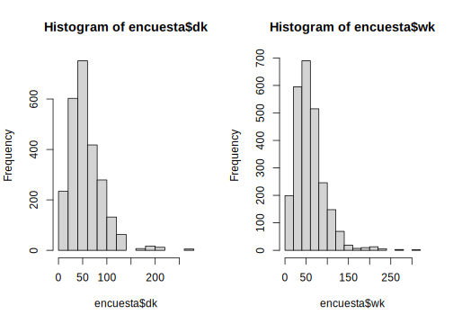

# Conceptos básicos en encuestas de hogares

En este capítulo se presentan algunos de los conceptos más importantes y necesarios para el correcto entendimiento, definición y posterior análisis de una encuesta de hogares. en general, estos principios son tomadas de @Sarndal_Swensson_Wretman_2003 y @Gutierrez_2009. Alguno de los conceptos que se encontrarán en este capítulo están relacionados con la población objetivo, universo de estudio, marco muestral, etc. 

Para continuar con lo análisis de las encuestas de hogares es necesario que el lector tenga claro algunos conceptos básicos en el muestreo probabilístico. Según @Groves_Fowler_Couper_Lepkowski_Singer_Tourangeau_2009, una encuesta es un método sistemático para recopilar información de una muestra de elementos con el propósito de construir descriptores cuantitativos de los parámetros de la población. Asimismo, @Gutierrez_2009 afirma que una muestra representativa es un modelo reducido de la población y de aquí se desprende un argumento de validez sobre la muestra. En pocas palabras, se desea que la muestra representativa tenga la cantidad de información suficiente para poder hacer una inferencia adecuada a la población.

Si la muestra es representativa, las conclusiones que se obtienen de la población utilizando las técnicas de muestreo adecuadas, son correctas. Sin embargo, si se toma una muestra no representativa, no es correcto realizar inferencias dado que estas no representan la realidad de la población. A continuación se presentan algunas preguntas que motivan un uso cuidadoso de los estadísticas descriptivas en las bases de datos de las encuestas de hogares:

- Si se calcula el promedio de los ingresos en una base de datos de una encuesta, ¿qué significa esa cifra? Esta cifra representa los ingresos medios que reportaron las personas entrevistadas en el estudio. En ningún momento se puede hablar de que este valor representa a la población a la cual queremos hacer inferencia. Para poder realizar las conclusiones a nivel poblacional se deben utilizar los factores de expansión que se obtuvieron empleando el diseño muestral.
- Si se calcula el total de los ingresos en una base de datos de una encuesta, ¿qué significa esa cifra? Similar a lo anterior, significa los ingresos totales que reportaron los entrevistados en el estudio. Se recalca que, bajo ninguna circunstancia se puede inferir que este valor muestral representa a la población de estudio.

¿Qué se necesita para que la inferencia sea precisa y exacta? Se requiere de un buen diseño de muestreo, que la muestra que se recolecte sea representativa de la población en el estudio y que el tamaño de muestra sea suficiente para poder inferir en todas las desagregaciones, tanto geográficas como temáticas que se plantearon en el diseño muestral.

La representatividad es la característica más importante de una muestra probabilística, y se define como la capacidad que tiene una muestra de poder representar a la población a la cual se desea hacer inferencia. En este sentido, el muestreo adquiere todo su sentido en cuanto se garantice que las características que se quieren medir en la población quedan reflejadas adecuadamente en la muestra expandida con los pesos de muestreo. Cabe resaltar que, una muestra representativa no es aquella que se parece a la población, de tal forma que las categorías aparecen
con las mismas proporciones que en la población dado que, en algunas ocasiones
es fundamental sobre-representar algunas categorías o incluso seleccionar unidades con probabilidades desiguales para poderlas medir con precisión.

Las medidas descriptivas permiten la presentación resumida de un conjunto de datos con el fin de poder describir apropiadamente las diversas características de interés presentes en la información de la muestra. La estadísticas descriptiva involucra cualquier labor o actividad para resumir y describir los datos univariados o multivariados sin tratar de hacer inferencia más allá de los mismos. Este tipo de análisis son primordiales en cualquier encuesta de hogares dado que, permiten tener una idea inicial del comportamiento de la población en ciertas variables de estudio. 

Dadas las definiciones hechas anteriormente, una encuesta de hogares requiere el análisis de todas las variables que dispuestas en la encuesta. Este proceso debe ser llevado a cabo por separado para asegurar la calidad y consistencia de los datos recolectados. Sin embargo, en este capítulo *no* vamos a adentrarnos en el análisis de las variables en la muestra, porque los datos muestrales no son de interés para el investigador. El interés se centra en lo que suceda a nivel poblacional y este análisis se debe abordar desde la teoría del muestreo.

## Unidades y marcos de muestreo

El término encuesta se encuentra directamente relacionado con una población finita compuesta de individuos a los cuales es necesario entrevistar. El *universo de estudio* lo constituye el total de individuos o elementos que poseen las características que quieren ser estudiadas. Ahora bien, el conjunto de unidades de interés sobre los cuales se tendrán resultados poblacionales recibe el nombre de *población objetivo*. Por ejemplo, *la Encuesta Nacional de Empleo y Desempleo* de Ecuador define su población objetivo como todas las personas mayores de 10 años residentes en viviendas particulares en Ecuador.

Asimismo los *dominios de análisis* corresponden a los diferentes niveles de desagregación establecidos para consolidar el diseño probabilístico y sobre los que se presentan los resultados de interés. Por ejemplo, en México, la *Encuesta Nacional de Ingresos y Gastos de los Hogares* define como unidades de análisis el ámbito al que pertenece la vivienda, urbano alto, complemento urbano y rural; la *Gran Encuesta Integrada de Hogres* de Colombia tiene cobertura nacional y sus unidades de análisis están definidas por 13 grandes ciudades junto con sus áreas metropolitanas.

En general, para seleccionar una muestra de las unidades del universo de estudio, se debe acceder a un dispositivo que permita identificarlas y ubicarlas. Tales dispositivos se conocen como marcos de muestreo. En general, no existe un marco de muestreo actualizado de personas u hogares. Por tal razón, el diseño de una encuesta de hogares plantea la necesidad de seleccionar en varias etapas algunas *unidades de muestreo* que sirven como medio para seleccionar finalmente a los hogares que participarán de la muestra.

A manera de ejemplo, la antigua *Pesquisa Nacional por Amostra de Domicilios* (PNAD) en Brasil se realiza por medio de una muestra de viviendas en tres etapas, cada etapa se define como una unidad de muestreo. Por ejemplo, las unidades de muestreo en PNAD son:

-   Las unidades primarias de muestreo (UPM) son los municipios,
-   Las unidades secundarias de muestreo (USM) son los sectores censales, que conforman una malla territorial conformada en el último Censo Demográfico.
-   Las últimas unidades en ser seleccionadas son las viviendas.

En este sentido esta encuesta contaba con tres unidades de muestreo que eran seleccionadas de manera sistemática para seleccionar finalmente a las viviedas hogares y personas: primero los municipios; luego, dentro de los municipios seleccionados, sectores censales; finalmente, dentro de los sectores seleccionados en los municipios seleccionados, viviendas. 

Para realizar el proceso de selección sistemática de los hogares es necesario contar con un marco de muestreo que sirva de vínculo entre los hogares o personas y las unidades de muestreo y que permita el acceso a la población de interés. En este sentido, el marco de muestreo es el conjunto sobre el cual se identifican a los elementos que componen la población objeto de estudio, del cual se selecciona la muestra. Los marcos de muestreo más utilizados en encuestas complejas son de áreas geográficas y se crean directamente después de cada levantamiento censal.

A modo de ejemplo, la *Encuesta Nacional de Hogares* de Costa Rica utiliza un marco muestral construido a partir de los censos nacionales de población y vivienda de 2011. Dicho marco corresponde a uno de áreas en donde sus unidades son superficies geográficas asociadas con las viviendas. Este marco permite la definición de UPM con 150 viviendas en las zonas urbanas y 100 viviendas en las zonas rurales. Este marco está conformado por 10461 UPM (64.5% urbanas y 35.5% rurales).


## La base de datos BigCity

@GAMBINO2009407 afirman que, desde que se popularizaron las encuestas de hogares en 1940, se ha hecho evidente algunas tendencias que están ligadas a los avances tecnológicos en las agencias estadísticas y en la sociedad y, con la introducción del computador, se ha acelerado su uso. Detrás de cada encuesta hay una muestra, y detrás de cada muestra hay un esquema de selección por muestreo probabilístico.  

El muestreo es un procedimiento que responde a la necesidad de información estadística precisa sobre una población objetivo de estudio; Como lo menciona @Gutierrez_2009, el muestreo trata con investigaciones parciales sobre la población que apuntan a inferir a la población completa. Es así como en las últimas décadas ha tenido bastante desarrollo en diferentes campos principalmente en el sector gubernamental con la publicación de las estadísticas oficiales que permiten realizar un seguimiento a las metas del gobierno, en el sector académico, en el sector privado y de comunicaciones. 

Como se ha venido mencionando anteriormente, este documento está enfocado en el análisis de las encuestas de hogares. En ese sentido y para que el lector tenga un fundamento estándar a través de sus capítulos, en este documento se utilizará, para los ejemplos computacionales, la base de datos `BigCity` del paquete `TeachingSampling`. Esta base de datos corresponde a un conjunto de datos que contiene algunas variables socioeconómicas de $150266$ personas de una ciudad en un año en particular. Algunas de las variables de esta base de datos son:

-  *HHID*, que corresponde al identificador del hogar.
-  *PersonID*, que hace referencia al identificador de la persona dentro del hogar.
-  *Stratum*, que asigna el estrato geográfico del hogar. Son 119 estratos.
-   *PSU*, que corresponde a las unidades primarias de muestreo. La base de datos cuenta con $1664$ PSU.
-   *Zone*,  que identifica las áreas urbanas o rurales a lo largo de la ciudad.
-   *Sex*, que establece el sexo del entrevistado.
-   *Income*, que detalla los ingresos mensuales per cápita.
-   *Expenditure*, que describe los gastos mensuales per cápita.
-   *Employment*, que muestra la situación laboral de la persona entrevistada.
-   *Poverty*, que indica si la persona es pobre o no. Depende de los ingresos.


## Un esquema de muestreo para BigCity

En esta sección se establecerán las condiciones de selección de una muestra probabilística correspondiente con un esquema tradicional en la región. Los diseños de muestreo en las encuestas de hogares se caracterizan por ser **diseños complejos** los cuales involucran, entre otras, más de una etapa en la selección de las unidades de observación, estratos y estimadores complejos. En su mayoría, las unidades primarias de muestreo  son seleccionadas dentro de los estratos. 

Es muy común que, en las encuestas de hogares de la región, se formen estratos geográficos, socioeconómicos o una mezcla de ellos. Según la teoría de muestreo, los estratos corresponden con subgrupos poblacionales que abarcan grandes subdivisones de la población objetivo. Además la inferencia en los estratos se hace de forma independiente; esto es, las estimaciones del total, así como el cálculo y estimación de la varianza son el resultado de añadir o sumar para cada estrato la respectiva cantidad. 

Se asume que, dentro de cada estrato $U_h$ ($h=1,\ldots, H$) existen $N_{Ih}$ unidades primarias de muestreo, de las cuales se selecciona una muestra $s_{Ih}$ de tamaño $n_{Ih}$ mediante un diseño de muestreo aleatorio simple. Estas muestras $s_{Ih}$ corresponden con conglomerados o unidades primarias de muestreo (UPM) constituidas por unión o escisión de los sectores censales del país. Además, se supone que el sub-muestreo dentro de cada unidad primaria seleccionada es también aleatorio simple. En este sentido, para cada unidad primaria de muestreo seleccionada $i\in s_{Ih}$ de tamaño $N_i$ se selecciona una muestra $s_i$ de elementos de tamaño $n_i$.

En esta sección se utilizarán las funciones estudiadas en el capítulo anterior para la manipulación de la base de datos de ejemplo. Inicialmente, se cargarán las librerías `ggplot2` que permitirá generar gráficos de alta calidad en `R`, `TeachingSampling` que permite tomar muestras probabilísticas utilizando los diseños de muestreo usuales, `survey` y `srvyr` que permitirán definir los diseños muestrales y por último `dplyr` que permite la manipulación de las bases de datos.


```r
library(ggplot2)
library(TeachingSampling)
library(dplyr)
library(survey)
library(srvyr)
```

Una vez cargada las librerías, se procede a realizar una agregación de las 1664 unidades primarias de muestreo en esta base de datos y calcular, para cada una de ellas, la cantidad de personas, el total de ingresos y total de gastos, además de la identificación de su estrato de muestreo:  


```r
data('BigCity')

FrameI <- BigCity %>% group_by(PSU) %>%
  summarise(
    Stratum = unique(Stratum),
    Persons = n(),
    Income = sum(Income),
    Expenditure = sum(Expenditure)
  )

attach(FrameI)
```

El siguiente código computacional muestra la información de las unidades primarias de muestreo. 


```r
head(FrameI, 10)
```


|PSU     |Stratum   | Persons|   Income| Expenditure|
|:-------|:---------|-------:|--------:|-----------:|
|PSU0001 |idStrt001 |     118| 70911.72|    44231.78|
|PSU0002 |idStrt001 |     136| 68886.60|    38381.90|
|PSU0003 |idStrt001 |      96| 37213.10|    19494.78|
|PSU0004 |idStrt001 |      88| 36926.46|    24030.74|
|PSU0005 |idStrt001 |     110| 57493.88|    31142.36|
|PSU0006 |idStrt001 |     116| 75272.06|    43473.28|
|PSU0007 |idStrt001 |      68| 33027.84|    21832.66|
|PSU0008 |idStrt001 |     136| 64293.02|    47660.02|
|PSU0009 |idStrt001 |     122| 33156.14|    23292.16|
|PSU0010 |idStrt002 |      70| 65253.78|    37114.76|

Ahora bien, se va a suponer que en cada estrato se tomará una muestra de dos UPM. Suponiendo que el muestreo dentro del estrato es aleatorio simple, el factor de expansión será la división entre el número total de UPM en el estrato y el tamaño de muestra. Para calcular los tamaños poblacionales de los estratos (NIh), definir los tamaños de muestra dentro de cada estrato (nIh), y calcular el factor de expansión, se realiza de la siguiente manera:


```r
sizes = FrameI %>% group_by(Stratum) %>%
  summarise(NIh = n(),
            nIh = 2,
            dI = NIh / nIh)

NIh <- sizes$NIh
nIh <- sizes$nIh
```

La siguiente tabla ejemplifica el esquema de muestreo para los primeros 10 estratos de la población. 


```r
head(sizes, 10)
```


|Stratum   | NIh| nIh|  dI|
|:---------|---:|---:|---:|
|idStrt001 |   9|   2| 4.5|
|idStrt002 |  11|   2| 5.5|
|idStrt003 |   7|   2| 3.5|
|idStrt004 |  13|   2| 6.5|
|idStrt005 |  11|   2| 5.5|
|idStrt006 |   5|   2| 2.5|
|idStrt007 |  14|   2| 7.0|
|idStrt008 |   7|   2| 3.5|
|idStrt009 |   8|   2| 4.0|
|idStrt010 |   8|   2| 4.0|

Como se desea extraer una muestra probabilística bajo un diseño aleatorio simple estratificado, se procede a utilizar la función `S.STSI` de la librería `TeachingSampling` como se muestra a continuación:


```r
samI <- S.STSI(Stratum, NIh, nIh)
UI <- levels(as.factor(FrameI$PSU))
sampleI <- UI[samI]
```

En este caso, el objeto `sampleI` contendrá la información asociada a las UPM que fueron seleccionadas en esta primera etapa. Ahora bien, con la función `left_join` se procede a pegar los tamaños muestrales a aquellas UPM's que fueron seleccionadas en la muestra:


```r
FrameII <- left_join(sizes,
                     BigCity[which(BigCity$PSU %in% sampleI),])
attach(FrameII)
```

Una vez se tiene la base de datos con la muestra de UMP, se selecciona aquellas variables que son de interés para el estudio como sigue a continuación:


```r
head(FrameII, 10) %>% select(Stratum:Zone)
```


|Stratum   | NIh| nIh|  dI|HHID      |PersonID |PSU     |Zone  |
|:---------|---:|---:|---:|:---------|:--------|:-------|:-----|
|idStrt001 |   9|   2| 4.5|idHH00082 |idPer01  |PSU0007 |Rural |
|idStrt001 |   9|   2| 4.5|idHH00082 |idPer02  |PSU0007 |Rural |
|idStrt001 |   9|   2| 4.5|idHH00082 |idPer03  |PSU0007 |Rural |
|idStrt001 |   9|   2| 4.5|idHH00082 |idPer04  |PSU0007 |Rural |
|idStrt001 |   9|   2| 4.5|idHH00083 |idPer01  |PSU0007 |Rural |
|idStrt001 |   9|   2| 4.5|idHH00083 |idPer02  |PSU0007 |Rural |
|idStrt001 |   9|   2| 4.5|idHH00084 |idPer01  |PSU0007 |Rural |
|idStrt001 |   9|   2| 4.5|idHH00084 |idPer02  |PSU0007 |Rural |
|idStrt001 |   9|   2| 4.5|idHH00084 |idPer03  |PSU0007 |Rural |
|idStrt001 |   9|   2| 4.5|idHH00084 |idPer04  |PSU0007 |Rural |

Luego de tener la información muestral de la primera etapa, en la base `FrameII` se procede a calcular los tamaños de muestra dentro de cada UPM. En este caso, a modo de ejemplo, se tomará el 10% del tamaño de la UPM como tamaño de muestra en la segunda etapa y se utilizará la función `ceiling` la cual aproxima al siguiente entero.


```r
HHdb <- FrameII %>%
  group_by(PSU) %>%
  summarise(Ni = length(unique(HHID)),
            ni = ceiling(Ni * 0.1))

Ni <- as.numeric(HHdb$Ni)
ni <- ceiling(Ni * 0.1)
sum(ni)
```

```
## [1] 691
```

Teniendo el vector de tamaños de hogares en cada UPM, junto con su correspondiente tamaño de muestra, se procede a realizar la selección mediante un muestreo aleatorio simple con la función `S.SI` de la librería `TeachingSampling`. A modo ilustrativo, la selección en la segunda etapa del diseño se realizará, inicialmente para la primera UPM. Posterior a eso, se realizará un ciclo con la función `for` para hacerlo con las demás UPM. Para la primera UPM se realiza de la siguiente manera:


```r
sam = S.SI(Ni[1], ni[1])

clusterII = FrameII[which(FrameII$PSU == sampleI[1]), ]
sam.HH <- data.frame(HHID = unique(clusterII$HHID)[sam])

clusterHH <- left_join(sam.HH, clusterII, by = "HHID")
clusterHH$dki <- Ni[1] / ni[1]
clusterHH$dk <- clusterHH$dI * clusterHH$dki

sam_data = clusterHH
```

De esta manera se ha seleccionado una muestra de unidades de la primera UPM seleccionada. A continuación se muestran los prime


```r
head(sam_data, 10) %>% select(Stratum:Zone)
```


|Stratum   | NIh| nIh|  dI|PersonID |PSU     |Zone  |
|:---------|---:|---:|---:|:--------|:-------|:-----|
|idStrt001 |   9|   2| 4.5|idPer01  |PSU0007 |Rural |
|idStrt001 |   9|   2| 4.5|idPer02  |PSU0007 |Rural |
|idStrt001 |   9|   2| 4.5|idPer01  |PSU0007 |Rural |
|idStrt001 |   9|   2| 4.5|idPer02  |PSU0007 |Rural |
|idStrt001 |   9|   2| 4.5|idPer01  |PSU0007 |Rural |
|idStrt001 |   9|   2| 4.5|idPer02  |PSU0007 |Rural |
|idStrt001 |   9|   2| 4.5|idPer03  |PSU0007 |Rural |

Para las demás UPM seleccionadas en la primera etapa de muestreo, la selección de la muestra se automatiza con el siguiente código computacional.


```r
for (i in 2:length(Ni)) {
  sam = S.SI(Ni[i], ni[i])
  clusterII = FrameII[which(FrameII$PSU == sampleI[i]),]
  sam.HH <- data.frame(HHID = unique(clusterII$HHID)[sam])
  clusterHH <- left_join(sam.HH, clusterII, by = "HHID")
  clusterHH$dki <- Ni[i] / ni[i]
  clusterHH$dk <- clusterHH$dI * clusterHH$dki
  data1 = clusterHH
  sam_data = rbind(sam_data, data1)
}

encuesta <- sam_data
attach(encuesta
)
```

Nótese que la base de datos `encuesta` contiene una muestra probabilística de la base poblacional BigCity. Una vez se obtiene la muestra (como se mostró anteriormente), el paso siguiente es definir el diseño utilizado y guardarlo como un objeto en `R` para posteriormente poderlo utilizar y realizar el proceso de estimación de parámetros y cálculo de indicadores. Para realizar esta tarea, se utilizará el paquete `srvyr` el cual ya fue definido en el capítulo anterior. Para este ejemplo, el diseño de muestreo utilizado fue un estratificado-bietápico en el cual, los estratos correspondieron a la variable `Stratum`, las UPM correspondieron a la variable `PSU`, los factores de expansión^[El factor de expansión es el número de elementos menos uno de la población (no incluidos en la muestra) representados por el elemento incluido. Está inducido por el inverso de la probabilidad de inclusión.
] están en la variable `dk` y por último, se le indica a la función `as_survey_design` que las UPM's están dentro de los estrato con el argumento `nest = T`. A continuación, se presenta el código computacional:


```r
diseno <- encuesta %>%
  as_survey_design(
    strata = Stratum,
    ids = PSU,
    weights = dk,
    nest = T
  )
```

Ya definido el diseño de muestreo como un objeto de `R` se puede empezar a extraer información del mismo. Por ejemplo, se pueden extraer los pesos de muestreo de dicho diseño con la función `weights` y luego sumarlos para revisar hasta cuánto me está expandiendo mi muestra. El código es el siguiente:


```r
sum(weights(diseno))
```

```
## [1] 146712.8
```

Como se puede observar, el tamaño poblacional estimado utilizando el diseño propuesto es de $140579.2$. Sin embargo, el tamaño poblacional de la base BigCity es de $150266$. Es normal que esto suceda pero debe ser corregido puesto que la suma de los factores de expansión debe sumar el total de la población. La solución para esto es calibrar los pesos de muestreo que se abordará a continuación.

## Calibración de los factores de expansión

La calibración es un ajuste que se realiza a los pesos de muestreo con el propósito de que las estimaciones de algunas variables de control reproduzcan de forma perfecta los totales poblacionales de estas variables [@Deville_Sarndal_1992]. Esta propiedad de consistencia es deseable en un sistema de ponderadores. En este sentido, cuando los estudios por muestreo están afectados por la ausencia de respuesta, como en muchos casos pasa en las encuestas de hogares, es deseable tener las siguientes propiedades en la estructura inferencial que sustenta el muestreo:

-   Sesgo pequeño o nulo.
-   Errores estándares pequeños.
-   Un sistema de ponderación que reproduzca la información auxiliar disponible.
-   Un sistema de ponderación que sea eficiente al momento de estimar cualquier característica de interés en un estudio multipropósito.

La calibración es usualmente el último paso en el ajuste de los ponderadores. Hace uso de información auxiliar que reduce la varianza y corrige los problemas de cobertura que no pudieron ser corregidos en los pasos previos. Puesto que el estimador de calibración depende exclusivamente de la información auxiliar disponible, esta información puede aparecer en diversas formas:

1. Puede estar de forma explícita en el marco de unidades. $x_k \ (\forall \ k \in U)$
2. Puede ser un agregado poblacional proveniente de un censo o de  registros administrativos. $t_x = \sum_U x_k$
3. Puede ser una estimación poblacional $\hat{t}_x = \sum_s w_kx_k$ muy confiable.

Particularmente, en encuestas de hogares, existen conteos de personas disponibles a nivel de desagregaciones de interés. Por ejemplo, número de personas por edad, raza y género que se permite utilizar como información auxiliar para calibrar las estimaciones.

La necesidad de calibrar en las encuestas de hogares se da porque no todos los grupos de personas se cubren apropiadamente desde el diseño de muestreo. Además, las estimaciones del número de personas en estos subgrupos son menores a las proyecciones que se tienen desde los censos. Por último, al ajustar los pesos para que sumen exactamente la cifra de los conteos censales, se reduce el sesgo de subcobertura.

Para ejemplificar el estimador de calibración en `R` usando la base de datos de ejemplo se utilizarán la función `calibrate` del paquete `survey`. En primer lugar, para poder calibrar se requiere construir la información poblacional a la cual se desea calibrar. En este ejemplo se calibrará a nivel de zona y sexo. Por tanto, los totales se obtienen como sigue: 


```r
library(survey)
totales <- colSums(model.matrix( ~ -1 + Zone:Sex, BigCity)) 
```

En la salida anterior se puede observar que, por ejemplo, en la zona rural hay 37238 mujeres mientras que en la urbana hay 41952. De igual manera se puede leer para el caso de los hombres. Una vez obtenido estos totales, se procede a utilizar la función `calibrate` para calibrar los pesos de muestreo como sigue:


```r
diseno_cal <- calibrate(diseno, 
                        ~ -1 + Zone:Sex, 
                        totales, 
                        calfun = "linear")  
```

Luego de que se hayan calibrado los pesos se puede observar que, al sumar los pesos calibrados estos reproducen el total poblacional de la base de ejemplo.


```r
sum(weights(diseno_cal))
```

```
## [1] 150266
```

```r
encuesta$wk <- weights(diseno_cal)
```

Dado que uno de los principios de los pesos calibrados es que dichos pesos no sean muy diferentes a los pesos originales que provienen del diseño de muestreo, se puede observar a continuación, la distribución de los pesos, sin calibrar y calibrados respectivamente. A continuación se observa que los histogramas de los factores de expansión antes y después de la calibración es similar. 


```r
par(mfrow = c(1, 2))
hist(encuesta$dk)
hist(encuesta$wk)
```


