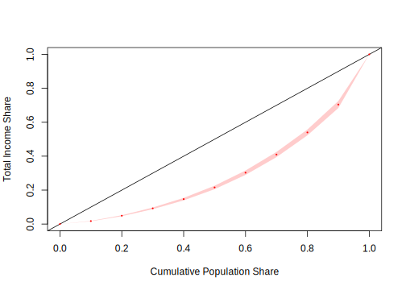

# Análisis de variables continuas

En encuestas de hogares una variable continua se puede definir como aquella que puede tomar cualquier valor dentro de un rango específico. Por lo general, se refieren a cantidades que pueden ser medidas con precisión y que tienen una gama infinita o muy amplia de valores posibles. Algunos ejemplos de variables continuas en encuestas de hogares podrían incluir los ingresos y los gastos familiares, que pueden variar en un rango continuo, ya que pueden tomar cualquier valor positivo. La edad de los miembros del hogar también puede considerarse continua porque puede expresarse en años y puede tener valores fraccionarios. 

En contraste, las variables categóricas en encuestas de hogares podrían incluir categorías de interés como el estado civil, el nivel educativo, la ubicación geográfica, entre otras, que se clasifican en categorías discretas y no pueden tomar valores continuos en un rango.


## Definición del diseño de muestreo

Las bases de datos (tablas de datos) pueden estar disponibles en una variedad de formatos (.`xlsx`, `.dat`, `.cvs`, `.sav`, `.txt`, etc.); sin embargo, al momento de analizar una base de datos de encuestas de hogares, es recomendable realizar la lectura de cualesquiera de estos formatos y proceder inmediatamente a guardarlo en un archivo de extensión `.rds` , la cual es nativa^[Existen otro tipo de archivos propios de `R` como los `.Rdata` . Sin embargo existen algunas diferencias importantes entre ellos. Por ejemplo, mientras que los archivos `.rds`  pueden contener cualquier número de objetos, los archivos `.Rdata`  se limitan a un solo objeto.] del software `R` y permiten almacenar cualquier objeto o información (como pueden ser marcos de datos, vectores, matrices, listas, entre otros). Los archivos `.rds`  se carcaterizan por su flexibilidad a la hora de ser almacenados en memoria y por su perfecta compatibilidad con `R`.

Para ejemplifcar las sintaxis que se utilizarán en `R`, se tomará la misma base del capítulo anterior la cual contiene una muestra de 2427 registros y proviene de la estrategia de muestreo compleja que se implementó anteriormente (estratificado, bietápico con calibración de los factores de expansión). A continuación, se muestra la sintaxis en `R` de cómo cargar un archivo con extensión `.rds`.


```r
library(tidyverse)

encuesta <- readRDS("Data/encuesta.rds")
head(encuesta)
```

```
##        HHID   Stratum NIh nIh  dI PersonID     PSU  Zone    Sex Age MaritalST
## 1 idHH00031 idStrt001   9   2 4.5  idPer01 PSU0003 Rural   Male  68   Married
## 2 idHH00031 idStrt001   9   2 4.5  idPer02 PSU0003 Rural Female  56   Married
## 3 idHH00031 idStrt001   9   2 4.5  idPer03 PSU0003 Rural Female  24   Married
## 4 idHH00031 idStrt001   9   2 4.5  idPer04 PSU0003 Rural   Male  26   Married
## 5 idHH00031 idStrt001   9   2 4.5  idPer05 PSU0003 Rural Female   3      <NA>
## 6 idHH00041 idStrt001   9   2 4.5  idPer01 PSU0003 Rural Female  61   Widowed
##   Income Expenditure Employment Poverty dki dk       wk Region    CatAge
## 1 409.87      346.34   Employed NotPoor   8 36 34.50371  Norte Más de 60
## 2 409.87      346.34   Employed NotPoor   8 36 33.63761  Norte     46-60
## 3 409.87      346.34   Employed NotPoor   8 36 33.63761  Norte     16-30
## 4 409.87      346.34   Employed NotPoor   8 36 34.50371  Norte     16-30
## 5 409.87      346.34       <NA> NotPoor   8 36 33.63761  Norte       0-5
## 6 823.75      392.24   Employed NotPoor   8 36 33.63761  Norte Más de 60
```

Una vez cargada la base de datos de la muestra compleja en el ambiente de `R`, el siguiente paso es definir el diseño de muestreo del cual proviene dicha muestra. Para esto se utilizará el paquete `srvyr` el cual, como se definió anteriormente, surge como un complemento para el paquete `survey`. Estas librerías permiten definir objetos  tipo `survey.design` a los que se aplican las funciones de estimación y análisis de encuestas cargadas en el paquete `srvyr` complementados con la programación de tubería (%>%) del paquete `tidyverse`. Para ejemplificar los conceptos mencionados anteriormente, se definirá en `R` el diseño de muestreo del cual proviene la muestra contenida en el objeto `encuesta`:


```r
library(survey)
library(srvyr)

options(survey.lonely.psu = "adjust")

diseno <- encuesta %>%
  as_survey_design(
    strata = Stratum,
    ids = PSU,
    weights = wk,
    nest = T
  )
```

En el código anterior se puede observar que, en primera instancia se debe definir la base de datos en la cual se encuentra la muestra seleccionada. Seguido de eso, se debe definir el tipo de objeto en `R` con el cual se trabajará, para nuestro caso, será un objeto tipo `survey_design`, el cual se define usando la función `as_survey_design`. Ahora bien, una vez establecido el tipo de objeto se procede a definir los parámetros del diseño complejo. Para este caso el diseño de muestreo fue estratificado y en varias etapas. Estos argumentos se definen dentro de la función `as_survey_design` como sigue:

- Para definir los estratos, se utiliza el argumento `strata` incluyendo la columna específica en donde están los estratos de muestreo en la base de datos.
- Para definir las UPM, se usa el argumento `ids` incluyendo la columna particular en donde se encuentran los conglomerados o unidades primarias de muestreo que fueron seleccionadas en la muestra de la primera etapa. 
- Para definir los factores de expansión, se acude al argumento `weights`.
- Por último, con el argumento `nest = T` se hace explícito que las UPM están efectivamente anidadas dentro de los estratos de  muestreo. 

Con la función `summary` es posible observar un resumen rápido del diseño de muestreo, en este caso conteninedo 119 estratos con 2 UPM por estrato, para un total de 238 UPM. 


```r
summary(diseno)
```

Además, como verificación adicional, es recomendable asegurarse que la suma de los factores de expansión en la muestra dé un resultado coherente. En este caso, esta suma es igual a 1.50266\times 10^{5}, que es el tamaño de la población de interés. 


```r
sum(weights(diseno))
```

```
## [1] 150266
```

Como se mostró en capítulos anteriores, el diseño de muestreo permite dividir la muestra en sub grupos. La primera subdvisión de interés es por zona (urbano y rural), la cual corresponde también a un estrato de muestreo. Es decir, tanto en la zona urbana, como en la zona rural hay independencia en el muestreo. Esto básicamente implica que la selección en estas zonas no está relacionada. De hecho, no existe ninguna intersección en las UPM que componen estos estratos puesto que, por definición, si una UPM está localizadas en la zona urbana, no puede estar en la zona rural, y viceversa. 


```r
sub_Urbano <- diseno %>% filter(Zone == "Urban")
sub_Rural <- diseno %>% filter(Zone == "Rural")
```

La segunda subdivisión de interés es por sexo. Sin embargo, esta subdivisión no conforma estratos independientes. En particular, nótese que, en la gran mayoría de casos, las UPM seleccionadas que contienen a hombres, serán las mismas que contengan a las mujeres. 


```r
sub_Mujer <- diseno %>% filter(Sex == "Female")
sub_Hombre <- diseno %>% filter(Sex == "Male")
```

## Estimación puntual

Después de realizar el análisis gráfico de las tendencias de las variables continuas de la encuesta, es necesario obtener las estimaciones puntuales de los parámetros que se midieron. Dichas estimaciones se pueden obtener de forma general, para toda la población, o desagregadas por dominios de interés, de acuerdo con las necesidades de la investigación. Entiéndase como estimaciones puntuales en el contexto de las encuestas de hogares a la estimación de totales, promedios, razones, medias, etc. Como lo mencionan @Heeringa_West_Berglund_2017, la estimación de los totales o promedios de un avariable de interés en la población junto con la estimación de su varianza ha jugado un papel muy importante en el desarrollo de la teoría del muestreo probabilístico, dado que permiten llegar a valores insesgados y precisos, dando una estimación muy acertada de lo que está pasando en los hogares estudiados y con ello tomar decisiones de política publica de manera informada.

### Estimación de totales

Una vez definido el diseño muestral, lo cual se hizo en la sección anterior, se procede a realizar los procesos de estimación de los parámetros de interés. Para la estimación de totales con diseños muestrales complejos que incluyen estratificación $\left(h=1,2,...,H\right)$ y submuestreo en las UPM (que se suponen están dentro del estrato $h$) indexadas por $\alpha=1,2,...,a_{h}$, el estimador para el total se puede escribir como:

\begin{eqnarray}
\hat{y}_{\omega} & = & \sum_{h=1}^{H}\sum_{\alpha=1}^{a_{h}}\sum_{i=1}^{n_{h\alpha}}\omega_{h\alpha i}y_{h\alpha i}.
\end{eqnarray}

En donde $n_{h\alpha}$ es el tamaño de muestra de hogares o personas en la UPM $\alpha$ del estrato $h$; $a_{h}$ es el tamaño de muestra de UPM dentro del estrato $h$; $H$ es el total de los estratos en el diseño de muestreo. Finalmente, $y_{h\alpha i}$ y $\omega_{h\alpha i}$ corresponden respectivamente con la observación de la variable de interés y el factor de expansión del elemento $i$ asociado a la UPM $\alpha$ dentro del estrato $h$. El estimador insesgado de la varianza para este estimador $\hat{y}_{\omega}$ es:

\begin{eqnarray}
\widehat{var}\left(\hat{y}_{\omega}\right) & = & \sum_{h=1}^{H}\frac{a_{h}}{\left(a_{h}-1\right)}\left[\sum_{\alpha=1}^{a_{h}}\left(\sum_{i=1}^{n_{h\alpha}}\omega_{h\alpha i}y_{h\alpha i}\right)^{2}-\frac{\left({ \sum_{\alpha=1}^{a_{h}}}\omega_{h\alpha i}y_{h\alpha i}\right)^{2}}{a_{h}}\right]
\end{eqnarray}


Como se puede observar, calcular la estimación del total y su varianza estimada es complejo. Sin embargo,  dichos cálculos se pueden hacer en `R` mediante la función `svytotal`. El intervalo de confianza está dado por la siguiente expresión:

\begin{eqnarray}
\hat{y}_{\omega} \pm 1.96 * \sqrt{\widehat{var}\left(\hat{y}_{\omega}\right)}
\end{eqnarray}

El intervalos de confianza en `R` se calcula con la función `confint`. A continuación, se muestran los códigos pertinentes:


```r
total_Ingresos <- svytotal( ~ Income, diseno, deff = T,)
total_Ingresos
```

```
##           total       SE DEff
## Income 85793667  4778674   11
```

```r
confint(total_Ingresos, level = 0.95)
```

```
##           2.5 %   97.5 %
## Income 76427637 95159697
```

Los argumentos que utiliza de la función `svytotal` son muy sencillos. Para el ejemplo, se introduce primero la variable en la cual está la información que se desea estimar (`Income`). Posterior a esto, se introduce el diseño muestral del cual proviene la muestra y, por último, se indica si desea que se reporte el efecto de diseño `deff` de la estimación o no. Por otro lado, para el cálculo del intervalo de confianza, lo único que se requiere es indicarle a la función `confint` el estimador y la confianza requerida.

Para seguir ilustrando el uso de la función `svytotal` y de `confint`, estimaremos el total de gastos de los hogares, pero ahora el intervalo de confianza se calculará al 90% de confianza. Los siguientes códigos realizan las estimaciones:


```r
total_gastos <- svytotal ( ~ Expenditure, diseno, deff = T)
total_gastos
```

```
##                total       SE   DEff
## Expenditure 55677504  2604138 10.222
```

```r
confint(total_gastos, level = 0.9)
```

```
##                  5 %     95 %
## Expenditure 51394077 59960931
```


Si el objetivo ahora es estimar el total de los ingresos pero discriminando por sexo, se utilizará la función `cascade`de la librería `srvyr`, la cual permite agregar la suma de las categorías al final la tabla. También se utilizará la función `group_by` la cual permite obtener resultados agrupados por los niveles de interés. 


```r
diseno %>% group_by(Sex) %>%
  cascade(Total = survey_total(Income, level = 0.95,
                               vartype =  c("se", "ci")),
          .fill = "Total ingreso")
```

```
## # A tibble: 3 × 5
##   Sex               Total Total_se Total_low Total_upp
##   <chr>             <dbl>    <dbl>     <dbl>     <dbl>
## 1 Female        44153820. 2324452. 39551172. 48756467.
## 2 Male          41639847. 2870194. 35956576. 47323118.
## 3 Total ingreso 85793667. 4778674. 76331414. 95255920.
```

Como se pudo observar en lo códigos anteriores, otra forma de obtener las estimaciones del total, su desviación estándar y el intervalo de confianza es usando el argumento `vartype` e indicándole las opciones "se", "ci" respectivamente.

### Estimación de promedios

La estimación del promedio o media poblacional es un parámetro muy importante en las encuestas de hogares. Según @Gutierrez_2016, un estimador de la media poblacional se puede escribir como una razón no lineal de dos totales de población finitas estimados como sigue:

\begin{eqnarray}
\hat{\bar{y}}_{\omega} & = & \frac{\sum_{h=1}^{H}\sum_{\alpha=1}^{a_{h}}\sum_{i=1}^{n_{h\alpha}}\omega_{h\alpha i}y_{h\alpha i}}{\sum_{h=1}^{H}\sum_{\alpha=1}^{a_{h}}\sum_{i=1}^{n_{h\alpha}}\omega_{h\alpha i}}  =  \frac{\hat{y}_{\omega}}{\hat{N}_{\omega}}.
\end{eqnarray}

Como observación, se debe tener en cuenta que, si $y$ es una variable
binaria, la media ponderada estima la proporción de la población.
Por otro lado, como $\hat{\bar{y}}_{\omega}$ no es una estadística lineal,
no existe una fórmula cerrada para la varianza de este estimador.
Es por lo anterior que, se deben recurrir a usar métodos de remuestreo
o series de Taylor. Para este caso en particular, usando series de
Taylor, la varianza del estimador es como sigue:

\begin{eqnarray}
var\left(\hat{\bar{y}}_{\omega}\right) & \dot{=} & \frac{var\left(\hat{y}_{\omega}\right)+\hat{\bar{y}}_{\omega}^{2}\times var\left(\hat{N}_{\omega}\right)-2\times\hat{\bar{y}}_{\omega}\times cov\left(\hat{y}_{\omega},\hat{N}_{\omega}\right)}{\hat{N}_{\omega}^{2}}
\end{eqnarray}

Como se puede observar, el cálculo de la estimación de la varianza tiene componentes complejos de calcular de manera analítica, como la covarianza entre el total estimado y el tamaño poblacional estimado. Sin embargo, `R` incorpora estos cálculos de forma automática. A continuación, se presenta la sintaxis para estimar la media de los ingresos.


```r
Media_ingresos <- svymean( ~ Income, diseno, deff = T)
Media_ingresos
```

```
##           mean      SE   DEff
## Income 570.945  28.478 8.8211
```

```r
confint(Media_ingresos, level = 0.95)
```

```
##           2.5 %   97.5 %
## Income 515.1299 626.7607
```

Como se puede observar, los argumentos que utiliza la función `svymean` para realizar la estimación del promedio de los ingresos, junto con su error estándar estimado son similares a los utilizados con la función `svytotal`. Algo similar ocurre con los intervalos de confianza. Por otro lado, se estima la media de los gastos en los hogares como sigue a continuación:


```r
Media_gastos <- svymean ( ~ Expenditure, diseno, deff = T)
Media_gastos
```

```
##                mean      SE   DEff
## Expenditure 370.526  13.294 6.0156
```

```r
confint(Media_gastos)
```

```
##                2.5 %   97.5 %
## Expenditure 344.4697 396.5829
```

También se pueden realizar estimaciones de la media por subgrupos siguiendo el mismo esquema mostrado para la función `svytotal`. Particularmente, los gastos de los hogares discriminados por sexo es:


```r
diseno %>%
  group_by(Sex) %>%
  cascade(Media = survey_mean(Expenditure, level = 0.95,
                              vartype =  c("se", "ci")),
          .fill = "Gasto promedio") %>%
  arrange(desc(Sex))
```

```
## # A tibble: 3 × 5
##   Sex            Media Media_se Media_low Media_upp
##   <chr>          <dbl>    <dbl>     <dbl>     <dbl>
## 1 Male            374.     16.1      343.      406.
## 2 Gasto promedio  371.     13.3      344.      397.
## 3 Female          367.     12.3      343.      391.
```

También se pueden realizar estimaciones del promedio en desagregaciones más complejas, por ejemplo las interacciones entre sexo y zona. El siguiente código permite obtenerlos:


```r
diseno %>% group_by(Zone, Sex) %>%
  cascade(Media = survey_mean(Expenditure, level = 0.95,
                              vartype =  c("se", "ci")),
          .fill = "Promedio") %>%
  arrange(desc(Zone), desc(Sex)) %>%
  data.frame()
```

```
##       Zone      Sex    Media Media_se Media_low Media_upp
## 1    Urban Promedio 459.6162 22.20655  415.6450  503.5874
## 2    Urban     Male 469.8124 26.96068  416.4276  523.1973
## 3    Urban   Female 450.8151 20.11853  410.9784  490.6518
## 4    Rural Promedio 273.9461 10.26141  253.6275  294.2647
## 5    Rural     Male 275.3018 10.24848  255.0088  295.5948
## 6    Rural   Female 272.6769 11.61470  249.6786  295.6751
## 7 Promedio Promedio 370.5263 13.29444  344.2020  396.8506
```

### Estimación de medidas de dispersión y localización

En las encuestas de hogares siempre es necesario estimar medidas de dispersión de las variables estudiadas. Por ejemplo, para conocer qué tan disímiles son los ingresos en un país determinado y con esto poder tomar acciones de política pública. Por lo anterior, es importante estudiar este tipo de parámetros. A continuación, se presenta el estimador de la desviación estándar:

\begin{eqnarray*}
s_{\omega}\left(y\right) & = & \frac{\sum_{h=1}^{H}\sum_{\alpha=1}^{a_{h}}\sum_{i=1}^{n_{h\alpha}}\omega_{h\alpha i}\left(y_{h\alpha i}-\hat{\bar{y}}_{\omega}\right)^{2}}{\sum_{h=1}^{H}\sum_{\alpha=1}^{a_{h}}\sum_{i=1}^{n_{h\alpha}}\omega_{h\alpha i}-1}
\end{eqnarray*}

Para llevar a cabo la estimación de la desviación estándar en `R`, se utiliza la función `survey_var`, la cual se ejemplifica a continuación:


```r
diseno %>% group_by(Zone) %>%
  summarise(Sd = sqrt(survey_var(
    Income,
    level = 0.95,
    vartype =  c("se", "ci"),
  )))
```

```
## # A tibble: 2 × 5
##   Zone     Sd Sd_se Sd_low Sd_upp
##   <chr> <dbl> <dbl>  <dbl>  <dbl>
## 1 Rural  310.  117.   263.   352.
## 2 Urban  582.  285.   422.   707.
```

Como se pudo ver en el ejemplo anterior, se estimó la desviación estándar de los ingresos por zona reportando el error estándar en la estimación y un intervalo de confianza al 95%. Los argumentos que utiliza la función `survey_var` son similares a los usados en las funciones anteriores para estimar medias y totales. Si el interés ahora se centra en estimar la desviación estándar desagregando por sexo y zona, los códigos computacionales son los siguientes:


```r
diseno %>% group_by(Zone, Sex) %>%
  summarise(Sd = sqrt(survey_var(
    Income,
    level = 0.95,
    vartype =  c("se", "ci"),
  )))
```

```
## # A tibble: 4 × 6
## # Groups:   Zone [2]
##   Zone  Sex       Sd Sd_se Sd_low Sd_upp
##   <chr> <chr>  <dbl> <dbl>  <dbl>  <dbl>
## 1 Rural Female  295.  112.   250.   334.
## 2 Rural Male    326.  125.   274.   370.
## 3 Urban Female  568.  286.   401.   697.
## 4 Urban Male    597.  289.   437.   722.
```

Las medidas de posición no central (percentiles) se establecen con el fin de conocer otros puntos característicos de la distribución de los datos que no son los valores centrales. Entre las medidas de posición no central más importantes están la mediana, los cuartiles y los percentiles. En la mayoría de las encuestas de hogares no solo se estiman totales, medias y proporciones; para algunos indicadores es necesario estimar otros parámetros, por ejemplo, medianas y percentiles. 

La mediana es una medida de tendencia central la cual, a diferencia del promedio, no es fácilmente influenciada por datos atípicos y, por esto, se conoce como una medida robusta. La mediana es el valor que divide la población en dos partes iguales. Lo que implica que, la mitad de las observaciones de la característica de interés está por encima de la mediana y la otra mitad está por debajo. 

Por otro lado, la estimación de los percentiles de los ingresos en un país determinado puede definir el inicio de una política pública. por ejemplo, al establecer un impuesto a aquellas personas naturales que etán ubicadas en el 10% más alto de la distribución de los ingresos o por el contrario, generar subsidios de transporte a aquellas personas que están en el 15% inferior de la distribución de los ingresos.

La estimación de cuantiles se basa en los resultados relacionados con el estimador ponderado para totales, empleando una estimación de la función de distribución (CDF, por sus siglas en inglés) acumulada de la población. Específicamente, la CDF para una variable y en una población finita dada de tamaño $N$ se define de la siguiente manera:

$$
F (x)  =  \sum_{i=1}^{N} I(y_{i}\leq x)/N
$$

En donde, $I\left(y_{i}\leq x\right)$ es una variable indicadora que toma  el valor de 1 si $y_{i}$ es menor o igual a un valor específico
$x$, y cero en cualquier otro caso. Un estimador de la CDF en un diseño de muestreo complejo está dado por:

\begin{eqnarray}
\hat{F}_{\omega}\left(x\right) & = & \frac{\sum_{h=1}^{H}\sum_{\alpha=1}^{a_{h}}\sum_{i=1}^{n_{h\alpha}}\omega_{h\alpha i}I\left(y_{i}\leq x\right)}{\sum_{h=1}^{H}\sum_{\alpha=1}^{a_{h}}\sum_{i=1}^{n_{h\alpha}}\omega_{h\alpha i}}
\end{eqnarray}

Una vez estimada la CDF utilizando los pesos del diseño muestral, el cuantil $q$-ésimo de una variable $y$ es el valor más pequeño de $y$ tal que la CDF es mayor o igual que $q$. Como es bien sabido, la mediana es aquel valor donde la CDF es mayor o igual a 0.5 y, por tanto, la media estimada es aquel valor donde la estimación de CDF es mayor o igual a 0.5. Siguiendo las recomendaciones de @Heeringa_West_Berglund_2017, para estimar cuantiles primero se consideran las estadísticas de orden que se denotan como $y_{(1)},\ldots,y_{(n)}$, y se encuentra el valor de $j$ $(j=1,\ldots,n)$ tal que:

\begin{eqnarray*}
\hat{F}_{\omega}\left(y_{j}\right)\leq q\leq\hat{F}_{\omega}\left(y_{j+1}\right)
\end{eqnarray*}

Ahora bien, la estimación del q-ésimo cuantil $y_{(q)}$ en un diseño de muestreo complejo está dado por:

\begin{eqnarray}
\hat{y}_{(q)} & = & y_{j}+\frac{q-\hat{F}_{\omega}\left(y_{j}\right)}{\hat{F}_{\omega}\left(y_{j+1}\right)-\hat{F}_{\omega}\left(y_{j}\right)}\left(y_{j+1}-y_{j}\right)
\end{eqnarray}

Para la estimación de la varianza e intervalos de confianza de cuantiles, @kovar1988bootstrap muestran los resultados de un estudio de simulación en donde recomiendan el uso de la técnica BRR (*Balanced Repeated Replication*) para estimarla. Los estimadores y procedimientos antes mencionados para la estimación de percentiles y sus varianzas están implementados en `R`. Particularmente, la estimación de la mediana se realiza usando la función `survey_median`. A continuación, se muestra la sintaxis de cómo calcular la mediana de los gastos, la desviación estándar y el intervalo de confianza al 95% de los hogares en la población.


```r
diseno %>%
  summarise(Mediana =
              survey_median(
                Expenditure,
                level = 0.95,
                vartype =  c("se", "ci"),
              ))
```

```
## # A tibble: 1 × 4
##   Mediana Mediana_se Mediana_low Mediana_upp
##     <dbl>      <dbl>       <dbl>       <dbl>
## 1    298.       8.83        282.        317.
```

Como se puede observar, los argumentos de la función `survey_median` son similares a los del total y la media. Ahora bien, al igual que con los demás parámetros, si el objetivo ahora es estimar la mediana de los gastos de los hogares, pero esta vez discriminada por zona y también por sexo, el código computacional sería el siguiente:


```r
diseno %>%
  group_by(Zone) %>%
  summarise(Mediana =
              survey_median(
                Expenditure,
                level = 0.95,
                vartype =  c("se", "ci"),
              ))
```

```
## # A tibble: 2 × 5
##   Zone  Mediana Mediana_se Mediana_low Mediana_upp
##   <chr>   <dbl>      <dbl>       <dbl>       <dbl>
## 1 Rural    241.       11.0        214.        258.
## 2 Urban    381.       19.8        337.        416.
```


```r
diseno %>% group_by(Sex) %>% 
  summarise(Mediana = 
  survey_median(
    Expenditure,
    level = 0.95,
    vartype =  c("se", "ci"),
   ))
```

```
## # A tibble: 2 × 5
##   Sex    Mediana Mediana_se Mediana_low Mediana_upp
##   <chr>    <dbl>      <dbl>       <dbl>       <dbl>
## 1 Female    300.      10.5         282.        324.
## 2 Male      297.       9.29        277.        314.
```

Si el objetivo ahora es estimar cuantiles, por ejemplo, el cuantil 0.25 de los gastos de los hogares, se realizaría usando la función `survey_quantile` como sigue:


```r
diseno %>%
  summarise(Q =  survey_quantile(
    Expenditure,
    quantiles = 0.5,
    level = 0.95,
    vartype =  c("se", "ci"),
    interval_type = "score"
  ))
```

```
## # A tibble: 1 × 4
##   Q_q50 Q_q50_se Q_q50_low Q_q50_upp
##   <dbl>    <dbl>     <dbl>     <dbl>
## 1  298.     12.0      265.      312.
```

Si ahora se desea estimar el cuantil 0.25 pero discriminando por sexo y por zona se realizaría como sigue:


```r
diseno %>%
  group_by(Sex) %>%
  summarise(Q =  survey_quantile(
    Expenditure,
    quantiles = 0.25,
    level = 0.95,
    vartype =  c("se", "ci"),
    interval_type = "score"
  ))
```

```
## # A tibble: 2 × 5
##   Sex    Q_q25 Q_q25_se Q_q25_low Q_q25_upp
##   <chr>  <dbl>    <dbl>     <dbl>     <dbl>
## 1 Female  210.     14.9      169.      228.
## 2 Male    193.     10.4      163.      205.
```


```r
diseno %>%
  group_by(Zone) %>%
  summarise(Q =  survey_quantile(
    Expenditure,
    quantiles = 0.25,
    level = 0.95,
    vartype =  c("se", "ci"),
    interval_type = "score"
  ))
```

```
## # A tibble: 2 × 5
##   Zone  Q_q25 Q_q25_se Q_q25_low Q_q25_upp
##   <chr> <dbl>    <dbl>     <dbl>     <dbl>
## 1 Rural  160.     4.64      145.      163.
## 2 Urban  258.     9.05      256.      292.
```


### Estimación del coeficiente de Gini

La desigualdad en todos los aspectos es un problema común en todos los países del mundo. Particularmente, la desigualdad económica atañe a muchas instituciones internacionales. Dado lo anterior, es de particular interés poder medir la desigualdad económica de los hogares en los países y para esto, el indicador más utilizado es el coeficiente de Gini ($G$). El valor de este índice se encuentra entre 0 y 1. Un valor del coeficiente de Gini de $G = 0$ indica perfecta igualdad en la distribución de la riqueza, con valores más grandes significa una desigualdad cada vez mayor en la distribución de la riqueza. Siguiendo la ecuación de estimación de @binder1995estimating, un estimador del coeficiente de Gini es:

$$
\widehat{G}_{\omega}(y) = \left(2 \times \sum_{h=1}^{H}\sum_{\alpha=1}^{a_{h}}\sum_{i=1}^{n_{h\alpha}}\omega_{h\alpha i}^{*}\hat{F}_{\omega}^{h\alpha i}y^{h\alpha i}-1\right)/(\hat{\bar{y}}_{\omega})
$$


En donde, $\omega_{h\alpha i}^{*}$ es una ponderación normalizada, dada por la siguiente expresión:

$$
\omega_{h\alpha i}^{*}=\frac{\omega_{h\alpha i}}{\sum_{h=1}^{H}\sum_{\alpha=1}^{a_{h}}\sum_{i=1}^{n_{h\alpha}}\omega_{h\alpha i}}
$$

Mientras que $\hat{F}_{h\alpha i}{}_{\omega}$ es la estimación de la CDF para el individuo $i$ en el conglomerado $\alpha$ del estrato $h$; asimismo, $\hat{\bar{y}}_{\omega}$ es la estimación del promedio. @osier2009variance junto con @Langel_Tille_2013 proveen importantes detalles computacionales para la estimación de la varianza de este estimador complejo. 

Por consiguiente, para calcular el índice de Gini y su varianza estimada en una encuesta de hogares, `R` tiene cargados los procedimientos en la librería `convey`.  A continuación, se muestra la sintaxis de cómo se realiza la estimación del índice de Gini para los hogares en la base de ejemplo de este capítulo. En primer lugar, se carga el diseño de muestreo con la función `convey_prep`. Luego, se estima el índice Gini con la función `svygini`. En los argumentos de esta última función se introducen la variable ingresos y el diseño muestral complejo.


```r
library(convey)
diseno_gini <- convey_prep(diseno)
svygini(~ Income, design = diseno_gini)
```

```
##           gini     SE
## Income 0.41328 0.0187
```

Por otro lado, si el interés ahora es estimar la curva de Lorenz que, para una distribución dada de ingresos, traza el porcentaje acumulado de la población (desplegado desde el más pobre hasta el más rico) frente a su participación en el ingreso total [@kovacevic1997variance, @osier2009variance]. El área entre la curva de Lorenz y la línea de 45 grados se conoce como el área de Lorenz y el índice de Gini es igual al doble del área de Lorenz. Una población con la curva de Lorenz más cerca de la línea de 45 grados tiene una distribución de ingresos más equitativa. Si todos los ingresos son iguales, la curva de Lorenz degenera a la línea de 45 grados.

Para realizar la curva de Lorenz en `R` se utiliza la función `svylorenz`. A continuación, se muestran los códigos computacionales para realizar la curva de Lorenz para los ingresos:


```r
library(convey)
svylorenz(
  formula = ~ Income,
  design = diseno_gini,
  quantiles = seq(0, 1, .1),
  alpha = .01
)
```



```
## $quantiles
##        0        0.1        0.2        0.3       0.4       0.5       0.6
## Income 0 0.01759645 0.04922299 0.09258712 0.1469261 0.2158231 0.3027002
##              0.7       0.8       0.9 1
## Income 0.4096304 0.5398749 0.7042464 1
## 
## $CIs
## , , Income
## 
##        0        0.1        0.2        0.3       0.4       0.5       0.6
## (lower 0 0.01644571 0.04643347 0.08770299 0.1396359 0.2056539 0.2898807
## upper) 0 0.01874718 0.05201251 0.09747124 0.1542163 0.2259923 0.3155197
##              0.7       0.8       0.9 1
## (lower 0.3943025 0.5227820 0.6835287 1
## upper) 0.4249582 0.5569677 0.7249642 1
```

Los argumentos que requiere la función son, inicialmente, los ingresos de los hogares y el diseño muestral complejo. Adicionalmente, se definen una secuencia de probabilidades que define la suma de los cuantiles a calcular (quantiles) y por último, un número que especifica el nivel de confianza para el gráfico (alpha).

## Relación entre varias variables

En muchos análisis de variables relacionadas con encuestas de hogares no solo basta con analizar el comportamiento de variables de manera individual, por ejemplo, ingresos medios de hombres y mujeres en un país sino también, analizar la diferencia entre los ingresos de los hombres y las mujeres. Esto último con el fin de ir cerrando la brecha salarial que existe. En esta sección se darán las herramientas computacionales para estimar razones y se estudiarán las pruebas de hipótesis para diferencia de medias, junto con contrastes más complejos.

### Estimación de razones

Un caso particular de una función no lineal de totales es la razón poblacional. Esta se define como el cociente de dos totales poblacionales de características de interés de tipo continuo. En las encuestas de hogares, en ocasiones se requiere estimar este parámetro, por ejemplo, la razón entre los gastos y los ingresos, la cantidad de hombres por cada mujer o la cantidad de mascotas por cada hogar en un país determinado. Puesto que la razón es un cociente de totales, tanto en numerador como el denominador son cantidades desconocidas y por tanto requieren estimarse. El estimador puntual de una razón en muestreos complejos equivale al cociente de los estimadores de los totales como se define a continuación:

\begin{eqnarray}
\hat{R}_{\omega}  =  \frac{\hat{y}_{\omega}}{\hat{x}_{\omega}}
  =  \frac{{ \sum_{h=1}^{H}\sum_{\alpha=1}^{\alpha_{h}}\sum_{i=1}^{nh\alpha}}\omega_{h\alpha i}y_{h\alpha i}}{{ \sum_{h=1}^{H}\sum_{\alpha=1}^{\alpha_{h}}\sum_{i=1}^{nh\alpha}}\omega_{h\alpha i}x_{h\alpha i}}
\end{eqnarray}

Sin embargo, dado que estimador de la razón es un cociente entre dos estimadores, es decir, un cociente de dos variables aleatorias, el cálculo de la estimación de la varianza no es sencillo de obtener. Para ellos, se debe aplicar linealización de Taylor como lo muestra @Gutierrez_2016. 

La función `survey_ratio` tiene implementado los procedimientos para estimar las razones y sus varianzas. Para un correcto cálculo de la estimación de la razón y su varianza estimada se debe introducir en la función el numerador de la razón (`numerator`) y el denominador (`denominator`). Adicional a esto, se debe indicar el nivel de confianza de los intervalos. A continuación, se muestran los códigos computacionales para estimar la razón entre el gasto y el ingreso.


```r
diseno %>%
  summarise(Razon =  survey_ratio(
    numerator = Expenditure,
    denominator = Income,
    level = 0.95,
    vartype =  c("se", "ci")
  ))
```

```
## # A tibble: 1 × 4
##   Razon Razon_se Razon_low Razon_upp
##   <dbl>    <dbl>     <dbl>     <dbl>
## 1 0.649   0.0232     0.603     0.695
```

Como se puede observar, la razón entre el gasto y el ingreso se estima en 0.64. Lo que implica que por cada unidad 100 unidades monetarias que le ingrese al hogar, se gastan 64 unidades, consiguiendo un intervalo de confianza al 95% de 0.60 y 0.69. Si el objetivo es estimar la razón entre mujeres y hombres , se realiza de la siguiente manera:


```r
diseno %>%
  summarise(Razon =  survey_ratio(
    numerator = (Sex == "Female"),
    denominator = (Sex == "Male"),
    level = 0.95,
    vartype =  c("se", "ci")
  ))
```

```
## # A tibble: 1 × 4
##   Razon Razon_se Razon_low Razon_upp
##   <dbl>    <dbl>     <dbl>     <dbl>
## 1  1.11   0.0351      1.04      1.18
```

Como la variable sexo en la base de datos es una variable categórica, se tuvo la necesidad de generar las variables indicadores (*dummies*) para su cálculo; `Sex == "Female"` para el caso de las mujeres y `Sex == "Male"` para el caso de los hombres. Los resultados del ejercicio anterior muestran que en la base de datos hay más mujeres que hombres, generando una razón de 1.11. Esto significa que, por cada 100 hombres hay aproximadamente 111 mujeres con un intervalo que varía entre 1.04 y 1.18.

Si se desea hacer la razón de mujeres y hombres pero en la zona rural, se haría de la siguiente manera:


```r
sub_Rural %>%
  summarise(Razon =  survey_ratio(
    numerator = (Sex == "Female"),
    denominator = (Sex == "Male"),
    level = 0.95,
    vartype =  c("se", "ci")
  ))
```

```
## # A tibble: 1 × 4
##   Razon Razon_se Razon_low Razon_upp
##   <dbl>    <dbl>     <dbl>     <dbl>
## 1  1.07   0.0352     0.997      1.14
```

Obteniendo nuevamente que hay más mujeres que hombres. Ahora bien, otro análisis de interés es estimar la razón de gastos pero solo en la población femenina. A continuación, se presentan los códigos computacionales.


```r
sub_Mujer %>%
  summarise(Razon =  survey_ratio(
    numerator = Expenditure,
    denominator = Income,
    level = 0.95,
    vartype =  c("se", "ci")
  ))
```

```
## # A tibble: 1 × 4
##   Razon Razon_se Razon_low Razon_upp
##   <dbl>    <dbl>     <dbl>     <dbl>
## 1 0.658   0.0199     0.619     0.698
```

Dando como resultado que por cada 100 unidades monetarias que le ingresan a las mujeres se gastan 65 con un intervalo de confianza entre 0.61 y 0.69. Por último, análogamente para los hombres, la razón de gastos resulta muy similar que para las mujeres.


```r
sub_Hombre %>%
  summarise(Razon =  survey_ratio(
    numerator = Expenditure,
    denominator = Income,
    level = 0.95,
    vartype =  c("se", "ci")
  ))
```

```
## # A tibble: 1 × 4
##   Razon Razon_se Razon_low Razon_upp
##   <dbl>    <dbl>     <dbl>     <dbl>
## 1 0.639   0.0288     0.582     0.696
```

### Prueba de hipótesis para la diferencia de medias 

Se le llama prueba de hipótesis a un procedimiento estadístico utilizado para evaluar la evidencia en favor o en contra de una afirmación o suposición acerca de una población. En este proceso, se plantea una hipótesis nula ($H_0$), que representa la afirmación inicial que debe ser probada, y una hipótesis alternativa ($H_1$), que es la afirmación contraria a la hipótesis nula. Esta afirmación puede estar basada en alguna creencia o experiencia pasada que será contrastada con la evidencia que se obtengan a través de la información contenida en la muestra. Si se sospecha que el parámetro $\theta$ es igual a cierto valor particular $\theta_{0}$, las posible combinaciones de hipótesis que se pueden contrastar son:

\begin{eqnarray*}
\begin{cases}
H_{0}: & \theta=\theta_{0}\\
H_{1}: & \theta\neq\theta_{0}
\end{cases}\,\,\,\,\,\,\,\,\,	
\begin{cases}
H_{0}: & \theta=\theta_{0}\\
H_{1}: & \theta>\theta_{0}
\end{cases}\,\,\,\,\,\,\,\,\,	
\begin{cases}
H_{0}: & \theta=\theta_{0}\\
H_{1}: & \theta<\theta_{0}
\end{cases}
\end{eqnarray*}

Se dirá que una de las dos hipótesis es cierta sólo si la evidencia estadística, la cual es obtenida de la muestra, la apoya. El proceso por medio del cual se escoge una de las dos hipótesis es llamado Prueba de Hipótesis. 

En términos generales, algunos parámetros importantes se pueden escribir como una combinación lineal de medidas de interés. Los casos más usuales son diferencias de medias, sumas ponderadas de medias utilizadas para construir índices económicos, etc. De esta forma, considere una función que es una combinación lineal de $j$ estadísticas descriptivas como se muestra a continuación:


\begin{eqnarray*}
f\left(\theta_{1},\theta_{2},...,\theta_{j}\right) & = & \sum_{j=1}^{J}a_{j}\theta_{j}
\end{eqnarray*}

En $a_{j}$ son constantes conocidas. Un estimador de esta función está dado por:

\begin{eqnarray}
\hat{f}_{\omega}\left(\hat{\theta}_{1},\hat{\theta}_{2},...,\hat{\theta}_{j}\right) & = & \sum_{j=1}^{J}a_{j}\hat{\theta}_{j}
\end{eqnarray}

Y su varianza se calcula como sigue:

\begin{eqnarray}
var\left(\sum_{j=1}^{J}a_{j}\hat{\theta}_{j}\right) & = & \sum_{j=1}^{J}a_{j}^{2}var\left(\hat{\theta}_{j}\right)+2\times\sum_{j=1}^{J-1}\sum_{k>j}^{J}a_{j}a_{k}\,cov\left(\hat{\theta}_{j},\hat{\theta}_{k}\right)
\end{eqnarray}

Como se pudo observar en la ecuación de la varianza del estimador, esta incorpora las varianzas de las estimaciones de todos los componentes individuales, así como las covarianzas de los pares estimados. 

Es de nuestro particular interés analizar la diferencia de medias poblacionales, que se puede escribir como sigue:

$$
\bar{y}^{1}-\bar{y}^{2}
$$

En donde, $\bar{y}_{1}$ es la media de la primera población, por ejemplo, ingresos medios en los hogares obtenido por los padres de familia y $\bar{y}_{2}$ es la media de la segunda población, que para seguir el ejemplo serían, los ingresos medios de las madres en un hogar. Este parámetro puede ser estimado insesgadamente por:

$$
\hat{\bar{y}}_{\omega}^{1}-\hat{\bar{y}}_{\omega}^{2}
$$

En donde $\hat{\bar{y}}_{\omega}^{i}$ es el estimador de muestreo de $\bar{y}^{i}$ ($i = 1, 2.$). Considerando el parámetro de interés en esta sección, las hipótesis a estudiar serían las siguientes:

\begin{eqnarray*}
\begin{cases}
H_{0}:\bar{y}_{1}-\bar{y}_{2}=0\\
H_{1}:\bar{y}_{1}-\bar{y}_{2}\neq0
\end{cases} & \begin{cases}
H_{0}:\bar{y}_{1}-\bar{y}_{2}=0\\
H_{1}:\bar{y}_{1}-\bar{y}_{2}>0
\end{cases} & \begin{cases}
H_{0}:\bar{y}_{1}-\bar{y}_{2}=0\\
H_{1}:\bar{y}_{1}-\bar{y}_{2}<0
\end{cases}
\end{eqnarray*}

Para probar estas hipótesis se utiliza el siguiente estadístico de prueba, el cual tiene distribución t-student con $gl$ grados de libertad, los cuales están dados por la diferencia entre el número de UPM y el número de estratos.


$$
t = \frac{\hat{\bar{y}}_{\omega}^{1}-\hat{\bar{y}}_{\omega}^{2}}{se\left(\bar{y}_{1}-\bar{y}_{2}\right)} \sim t_{gl}
$$

donde,

$$
\widehat{se}\left(\hat{\bar{y}}_{\omega}^{1}-\hat{\bar{y}}_{\omega}^{2}\right) = \sqrt{\widehat{var}\left(\hat{\bar{y}}_{\omega}^{1}\right) + \widehat{var}\left(\hat{\bar{y}}_{\omega}^{2}\right) - 2 \  \widehat{cov}\left(\hat{\bar{y}}_{\omega}^{1},\hat{\bar{y}}_{\omega}^{2}\right)}
$$

Si se desea construir un intervalo de confianza para la diferencia de media se realizaría de la siguiente manera:

$$
\hat{\bar{y}}_{\omega}^{1}-\hat{\bar{y}}_{\omega}^{2} \pm t_{gl}\ \widehat{se}\left(\hat{\bar{y}}_{\omega}^{1}-\hat{\bar{y}}_{\omega}^{2}\right)
$$

Para poder llevar a cabo la prueba de hipótesis para la diferencia de media de los ingresos en un hogar por sexo, tomemos la base de datos que tenemos como ejemplo. La función que se encarga de realizar la prueba es `svyttest` y solo requiere como argumentos la variable ingreso (o variable de interés), la variable sexo (variable discriminadora), el diseño muestral y el nivel de confianza. A continuación, se muestran los códigos computacionales que se requieren:


```r
svyttest(Income ~ Sex, design = diseno, level = 0.95) 
```

```
## 
## 	Design-based t-test
## 
## data:  Income ~ Sex
## t = 1.3625, df = 118, p-value = 0.1756
## alternative hypothesis: true difference in mean is not equal to 0
## 95 percent confidence interval:
##  -12.82205  69.38503
## sample estimates:
## difference in mean 
##           28.28149
```

En esta salida podemos observar que el p-valor de la prueba es 0.17. Si tomamos una significancia del 5% para la prueba se puede concluir que, con una confianza del 95% y basados en la muestra, no existe suficiente evidencia estadística para decir que los ingresos medios en los hogares son diferentes por sexo. Por otro lado, el intervalo de confianza al 95% para la diferencia de medias entre los ingresos de hombres y mujeres es $\left(-12.8,\,69.3\right)$. 

Si ahora el objetivo es realizar la prueba de diferencia de medias para los ingresos entre hombres y mujeres pero solo en la zona urbana, los códigos computacionales son los siguientes:


```r
svyttest(Income ~ Sex, design = sub_Urbano, level = 0.95) 
```

```
## 
## 	Design-based t-test
## 
## data:  Income ~ Sex
## t = 1.5667, df = 63, p-value = 0.1222
## alternative hypothesis: true difference in mean is not equal to 0
## 95 percent confidence interval:
##  -12.31754 101.74023
## sample estimates:
## difference in mean 
##           44.71134
```

En donde, al igual que el anterior, no se rechaza la hipótesis nula con una confianza del 95%. Por otro lado, la función `svyttest` permite usar filtros. Si se requiere probar la hipótesis de diferencia de medias de ingresos por sexo pero solo en aquellas personas del hogar mayores a 18 años, se utilizará dentro de la función `svyttest` la función `filter` como se muestra a continuación:


```r
svyttest(Income ~ Sex,
         design = diseno %>% filter(Age > 18),
         level = 0.95)
```

```
## 
## 	Design-based t-test
## 
## data:  Income ~ Sex
## t = 1.5263, df = 118, p-value = 0.1296
## alternative hypothesis: true difference in mean is not equal to 0
## 95 percent confidence interval:
##  -10.72746  82.85253
## sample estimates:
## difference in mean 
##           36.06253
```

y con una confianza del 95% y basado en la muestra tampoco se rechaza la hipótesis hula. Es decir, no existe evidencia estadística para concluir que los ingresos medios entre hombres y mujeres mayores de 18 años son diferentes.

### Contrastes 

En muchas ocasiones, se requiere comparar más de dos poblaciones al mismo tiempo; por ejemplo, comparar los ingresos medios de los hogares en tres regiones con el fin de identificar aquellas regiones donde hubo un mayor impacto en los hogares. En casos como estos la diferencia de medias que estudiamos en capítulos anteriores no es suficiente dado que permite solo comprar parejas de poblaciones y por ende que, hacer contraste resulta una muy buena alternativa para abordar este tipo de problemas.

Recurriendo en las definiciones que se han trabajado en este capítulo, un contraste es una combinación lineal de parámetros de la forma:

\begin{eqnarray*}
f = A * \theta = f\left(\theta^{1},\theta^{2},...,\theta^{j}\right) & = & \sum_{j=1}^{J}a_{j}\theta^{j}
\end{eqnarray*}

En donde $A$ es una matriz o vector de constantes y $\theta$ es una matriz o vector de parámetros. Los procedimientos metodológicos para implementar los contrastes en diseños de muestreo complejos están desarrolladas en la función `svycontrast`. A continuación, se muestra el uso de dicha función para el cálculo de contraste en la base de datos de ejemplo, comparando el promedio de ingresos por región. Como primer ejemplo, se realizará la comparación de dos poblaciones, las regiones Norte y Sur. En particular, es de interés la diferencia de ingresos ($f = \bar{y}^{Norte} - \bar{y}^{Sur}$). Puesto que la población tiene cinco regiones y solo se construirá el contraste para dos de ellas (la región Norte y la región Sur), este queda definido de la siguiente manera:

\begin{eqnarray*}
f = A * \theta  = 1\times{\bar{y}}^{Norte}+\left(-1\right)\times{\bar{y}}^{Sur}+0\times{\bar{y}}^{Centro}+0\times{\bar{y}}^{Occidente}+0\times{\bar{y}}^{Oriente}
\end{eqnarray*}

Como se puede observar, en este caso el vector de contraste es $A = \left[1,\,-1,\,0,\,0,\,0\right]$. De forma matricial, el estimador de este contraste específico queda definido de la siguiente manera:

\begin{eqnarray*}
\hat{f}_{\omega} = A * \hat{\theta} = \left[1,\,-1,\,0,\,0,\,0\right]\times\left[\begin{array}{c}
\hat{\bar{y}}^{Norte}_{\omega}\\
\hat{\bar{y}}^{Sur}_{\omega}\\
\hat{\bar{y}}^{Centro}_{\omega}\\
\hat{\bar{y}}^{Occidente}_{\omega}\\
\hat{\bar{y}}^{Oriente}_{\omega}
\end{array}\right]
\end{eqnarray*}

Ahora bien, para realizar procesos de la construcción del estimador del contraste y su varianza estimada paso a paso se procede a calcular las medias estimadas por región con la función `svyby` como se muestra a continuación:


```r
prom_region <- svyby(
  formula = ~ Income,
  by = ~ Region,
  design = diseno,
  FUN = svymean,
  na.rm = T,
  covmat = TRUE,
  vartype = c("se", "ci")
)

prom_region
```

```
##              Region   Income       se     ci_l     ci_u
## Norte         Norte 552.3637 55.35987 443.8603 660.8670
## Sur             Sur 625.7740 62.40574 503.4610 748.0870
## Centro       Centro 650.7820 61.46886 530.3053 771.2588
## Occidente Occidente 517.0071 46.22077 426.4161 607.5982
## Oriente     Oriente 541.7543 71.66487 401.2938 682.2149
```

La función `svyby` permite aplicar una función, en este caso la media (`svymean`) por región (`by`) utilizando el diseño muestral complejo de la encuesta (`design`). Las demás componentes de la función ya se han utilizado previamente. Como resultado de aplicar esta función se obtienen las medias estimadas de los ingresos por región. Para continuar con el ejemplo, se tomarán solo los ingresos medios estimados de las regiones Norte y Sur y calcularemos su diferencia:


```r
# Paso 1: diferencia de estimaciones (Norte - Sur) 
552.4 - 625.8
```

```
## [1] -73.4
```

El paso siguiente es calcular la matriz de varianzas y covarianzas y de allí extraer las varianzas y covarianzas de las regiones Norte y Sur:


```r
# Paso 2: Matriz de varianzas y covarianzas
vcov(prom_region)
```

```
##              Norte      Sur  Centro Occidente  Oriente
## Norte     3064.715    0.000    0.00     0.000    0.000
## Sur          0.000 3894.476    0.00     0.000    0.000
## Centro       0.000    0.000 3778.42     0.000    0.000
## Occidente    0.000    0.000    0.00  2136.359    0.000
## Oriente      0.000    0.000    0.00     0.000 5135.854
```

Como el muestreo es independiente en cada región, las covarianzas en la anterior matriz son nulas. Para calcular el error estándar de la diferencia (contraste) se usará las propiedades de la varianza, puesto que:

$$
se(\hat{f}_{\omega}) = se\left(\hat{\bar{y}}^{Norte}_{\omega}-\hat{\bar{y}}^{Sur}_{\omega}\right)=\sqrt{var\left(\hat{\bar{y}}^{Norte}_{\omega}\right)+var\left(\hat{\bar{y}}^{Sur}_{\omega}\right)-2\,cov\left(\hat{\bar{y}}^{Norte}_{\omega},\hat{\bar{y}}^{Sur}_{\omega}\right)}
$$ 

Por tanto, tenemos que el error estándar estimado para este contraste es:


```r
sqrt(3065 + 3894 - 2 * 0)
```

```
## [1] 83.42062
```

Ahora bien, la función `svycontrast` devuelve el contraste estimado y su error estándar. Los argumentos de esta función son los promedios de los ingresos estimados (`stat`) y las constantes de contraste (`contrasts`). Se obtiene como resultado que la diferencia de los ingresos medios se estima en 73.4 unidades monetarias con un error estándar de 83.42 unidades. 


```r
svycontrast(stat = prom_region, 
            contrasts = list(diff_NS = c(1, -1, 0, 0, 0)))
```

```
##         contrast     SE
## diff_NS   -73.41 83.422
```

Por otro lado, es posible ampliar la estructura de los contrastes. Por ejemplo, considere que se quieren estimar los siguientes contrastes:

-   $\bar{y}^{Norte} - \bar{y}^{Centro}$, 
-   $\bar{y}^{Sur}-\bar{y}^{Centro}$,
-   $\bar{y}^{Occidente}-\bar{y}^{Oriente}$	

En este caso, la matriz de contrastes escrita de forma matricial tendría la siguiente estructura: 

$$
A = 
\left[\begin{array}{ccccc}
1 & 0 & -1 & 0 & 0\\
0 & 1 & -1 & 0 & 0\\
0 & 0 & 0 & 1 & -1
\end{array}\right]
$$

Ahora, aplicando la función `svycontrast` en `R` se obtiene:


```r
svycontrast(
  stat = prom_region,
  contrasts = list(
    Norte_sur = c(1, 0,-1, 0, 0),
    Sur_centro = c(0, 1,-1, 0, 0),
    Occidente_Oriente = c(0, 0, 0, 1,-1)
  )
)
```

```
##                   contrast     SE
## Norte_sur          -98.418 82.723
## Sur_centro         -25.008 87.595
## Occidente_Oriente  -24.747 85.277
```

También es posible construir contrastes en dominios que estén correlacionadas. Por ejemplo, Ingreso y Sexo. Como se hizo en el ejemplo anterior, se inicia con el promedio estimado por sexo.


```r
prom_sexo <- svyby(
  formula = ~ Income,
  by = ~ Sex,
  design = diseno,
  FUN = svymean,
  na.rm = T,
  covmat = TRUE,
  vartype = c("se", "ci")
)

prom_sexo
```

```
##           Sex   Income       se     ci_l     ci_u
## Female Female 557.5681 25.82995 506.9423 608.1939
## Male     Male 585.8496 34.58759 518.0592 653.6400
```

Si el contraste de interés es $\theta = \bar{y}^{F} - \bar{y}^{M}$, entonces usando la función `svycontrast` se obtiene el contraste estimado, junto con su error estándar, obteniendo como resultado que, en promedio, los hombres obtienen 28.3 unidades monetarias más que las mujeres con una error estándar de 20.76. 


```r
svycontrast(stat = prom_sexo,
            contrasts = list(diff_Sexo = c(1,-1)))
```

```
##           contrast     SE
## diff_Sexo  -28.281 20.756
```

Más aún, otra posibilidad es poder obtener resultados agregados, por ejemplo, con sumas de totales en regiones: 

$$
\hat{f}_{\omega}=\hat{y}^{Norte}_{\omega}+\hat{y}^{Sur}_{\omega} +\hat{y}^{Centro}_{\omega}
$$

En este caso, se crea la función adecuada con sumas de totales por regiones


```r
sum_region <- svyby(
  ~ Income,
  ~ Region,
  diseno,
  svytotal,
  na.rm = T,
  covmat = TRUE,
  vartype = c("se", "ci")
)

sum_region
```

```
##              Region   Income      se     ci_l     ci_u
## Norte         Norte 14277323 1507575 11322530 17232115
## Sur             Sur 16068151 1877989 12387359 19748942
## Centro       Centro 16483319 2383556 11811634 21155003
## Occidente Occidente 16853540 1823807 13278944 20428135
## Oriente     Oriente 22111335 2833460 16557856 27664814
```

Para este caso en particular, la matriz de contraste queda como: 
$$
\left[\begin{array}{cccccc}
1 & 1 & 1 & 0 & 0
\end{array}\right]
$$

Una vez más, el procedimiento en `R` es como sigue:


```r
svycontrast(stat = sum_region,
            contrasts = list(Agregado_NCS = c(1, 1, 1, 0, 0))) 
```

```
##              contrast      SE
## Agregado_NCS 46828792 3388357
```

Por último, si se desean obtener los promedios por categorías. Por ejemplo:

$$
\hat{f} = \hat{\bar{y}}_{Edad} = \frac{1}{J}\sum_{j=1}^J\hat{\bar{y}}_{j}
$$

donde $K$ es el número de categorías de la variable. En `R` se hace de la siguiente manera:


```r
prom_edad <- svyby(
  formula = ~ Income,
  by = ~ CatAge,
  design =  diseno,
  FUN = svymean,
  na.rm = T,
  covmat = TRUE
)

prom_edad
```

```
##              CatAge   Income       se
## 0-5             0-5 463.7715 28.86795
## 6-15           6-15 511.6179 34.88031
## 16-30         16-30 607.2917 37.41561
## 31-45         31-45 573.4167 26.94744
## 46-60         46-60 763.0610 58.97170
## Más de 60 Más de 60 466.6133 31.20795
```

Cuyo vector de contraste estaría dada por:

$$
A = 
\left[\begin{array}{cccccc}
\frac{1}{6} & \frac{1}{6} & \frac{1}{6} & \frac{1}{6} & \frac{1}{6} & \frac{1}{6}
\end{array}\right]
$$

El procedimiento en `R` es: 


```r
svycontrast(stat = prom_edad,
            contrasts = list(agregado_edad =
                               rep(1 / 6, times = 6)))
```

```
##               contrast     SE
## agregado_edad    564.3 25.404
```

También es posible realizar contrastes con parámetros más complejos, como por ejemplo razones. Considere la diferencia por sexo entre las razones de gastos contra ingresos. En primer lugar se debe crear la función que permita estimar las razones por sexo:


```r
razon_sexo <- svyby(
  formula = ~ Income,
  by = ~ Sex,
  denominator = ~ Expenditure,
  design = diseno,
  FUN = svyratio,
  na.rm = T,
  covmat = TRUE,
  vartype = c("se", "ci")
)

razon_sexo
```

```
##           Sex Income/Expenditure se.Income/Expenditure     ci_l     ci_u
## Female Female           1.519060            0.04582607 1.429243 1.608878
## Male     Male           1.564762            0.07044239 1.426698 1.702827
```

Luego, la estimación de la diferencia de razones, estaría dada por el siguiente contraste, en donde se puede concluir que la diferencia de las razones es estimada en 0.045 en favor de los hombres.


```r
svycontrast(stat = razon_sexo,
            contrasts = list(diff_sexo = c(1,-1))) 
```

```
##            contrast     SE
## diff_sexo -0.045702 0.0416
```

