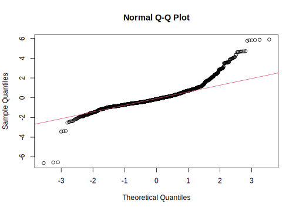
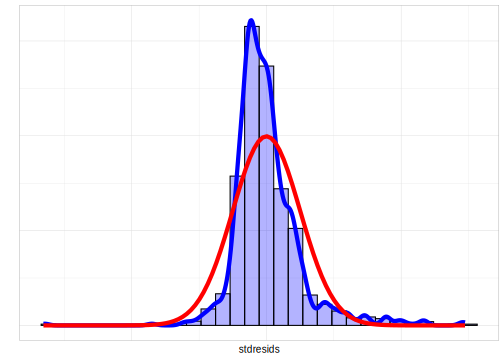
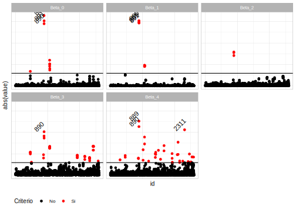

# Modelos de regresión 

Un modelo de regresión es una herramienta estadística utilizada para analizar la relación entre una variable dependiente y una o más variables independientes. Su objetivo es explicar el valor de la variable dependiente en función de las variables independientes; es decir, busca encontrar la mejor relación matemática que describe la asociación entre estas variables.

En este documento, nuestro interés se centra en los modelos de regresión lineal, donde se asume que existe una relación lineal entre la variable dependiente y las independientes. Estos modelos son ampliamente utilizados en diversas disciplinas para entender y predecir fenómenos, tomar decisiones informadas e identificar patrones en los datos. Durante el proceso de construcción del modelo, se estiman los parámetros para minimizar la diferencia entre las estimaciones del modelo y los valores reales observados. Sin embargo, el hecho de que los modelos se ajusten con conjuntos de datos que fueron recolectados siguiendo un diseño de muestreo complejo, hace que la metodología para estimar los parámetros de la regresión deba ajustarse a las particularidades del diseño para así asegurar el insesgamiento de la inferencia. 

## Definiciones básicas

A modo de contexto histórico, @Heeringa_West_Berglund_2017 afirman que los primeros autores en discutir, de manera empírica, el impacto que surten los diseños muestrales complejos en las inferencias relacionadas con modelos de regresión fueron  @kish1974inference; posteriormente @fuller1975regression desarrolló un estimador de varianza para parámetros de modelos de regresión tomando como insumos teóricos la linealización de Taylor con ponderación desigual de las observaciones bajo diseños de muestreo estratificado y de dos etapas.

Ahora bien, como es bien sabido, para el uso de la teoría de modelos de regresión se requieren que se cumplan algunos supuestos estadísticos que en ocasiones son difíciles de verificar en la práctica. En este sentido,  @shah1977inference discuten algunos aspectos relacionados con las violaciones de dichos supuestos y dan algunos métodos apropiados para hacer inferencias sobre los parámetros estimados de los modelos de regresión lineal usando datos de encuestas. 

Asimismo, @binder1983variances obtuvo las distribuciones muestrales de los estimadores para parámetros de regresión en poblaciones finitas y estimadores de varianza relacionados en el contexto de muestras complejas. @skinner1989analysis estudiaron las propiedades de los estimadores de las varianzas para los coeficientes de regresión bajo diseños de muestras complejos. Más adelante, @fuller2002regression generó un resumen de los métodos de estimación para modelos de regresión que contienen información relacionada con muestras complejas. Por último, @pfeffermann2011modelling realizó una discusión sobre los distintos enfoques basados en el ajuste de modelos de regresión lineal a datos de encuestas de muestras complejas, presentando apoyo empírico para el uso del método “*q-weighted*”, que será el recomendado en este documento.

Un modelo de regresión lineal simple se define como $y=\beta_{0}+\beta_{1}x+\varepsilon$; en donde $y$ se presenta como la variable dependiente, $x$ es la variable independiente y $\beta_{0}$ y $\beta_{1}$ son los parámetros del modelo. La variable $\varepsilon$ se conoce como el error aleatorio del modelo y se define como $\varepsilon=y-\hat{y}=y-\beta_{0}+\beta_{1}x$.

Generalizando el modelo anterior, se definen los modelos de regresión lineal múltiples, al permitir la interacción de la variable dependiente con más de dos variables, justo como se presenta a continuación:

$$
y  =  \boldsymbol{x}\boldsymbol{\beta}+\varepsilon
  =  \sum_{j=0}^{p}\beta_{j}x_{j}+\varepsilon
 =  \beta_{0}+\beta_{1}x_{1}+\cdots+\beta_{p}x_{p}+\varepsilon
$$

Otra manera de escribir el modelo de regresión múltiple es:

$$
y_{i}  =  x_{i}\boldsymbol{\beta}+\varepsilon_{i}
$$

En donde, $x_{i}=\left[1\,x_{1i}\,\ldots\,x_{pi}\right]$ y $\boldsymbol{\beta}^{T}=\left[\beta_{0}\,\,\beta_{1}\,\,\ldots\,\,\beta_{p}\right]$.

El subíndice $i$ hace referencia al elemento muestral o respondiente
en el conjunto de datos. @Heeringa_West_Berglund_2017 presenta algunas consideraciones para los modelos de regresión, las cuales son descritas a continuación:

-   $E\left(\varepsilon_{i}\mid x_{i}\right)=0$, lo que significa que
el valor esperado de los residuos condicionado al grupo de covariables
 es igual a cero.
-   $Var\left(\varepsilon_{i}\mid x_{i}\right)=\sigma_{y,x}^{2}$ (homogenidad
de varianza) lo que significa que la varianza de los residuos condicionado
al grupo de covariables es igual y constante.
-   $\varepsilon_{i}\mid x_{i}\sim N\left(0,\,\sigma_{y,x}^{2}\right)$
(normalidad en los errores) lo que significa que, los residuos condicionados
al grupo de covariables siguen una distribución normal. Esta propiedad también se extiende a la variable respuesta $y_{i}$.
-   $cov\left(\varepsilon_{i},\,\varepsilon_{j}\mid x_{i},x_{j}\right)$
(independencia en los residuales) los residuales en diferentes unidades observadas no están correlacionados con los valores dados por sus variables predictoras.

Una vez definido el modelo de regresión lineal y sus supuestos, se puede deducir que la mejor estimación lineal insesgada se define como el valor esperado de la variable dependiente condicionado a las variables independientes $x$ como, $E\left(y\mid x\right)=\hat{\beta}_{0}+\hat{\beta_{1}}x_{1}+\hat{\beta}_{2}x_{2}+\cdots+\hat{\beta}_{p}x_{p}$.


$$
\hat{y}  =  E\left(y\mid x\right)
 =  E\left(\boldsymbol{x}\boldsymbol{\beta}\right)+E\left(\varepsilon\right)
=  \boldsymbol{x}\boldsymbol{\beta}+0
  =  \beta_{0}+\beta_{1}x_{1}+\cdots+\beta_{p}x_{p}
$$

y adicionalmente,

$$
var\left(y_{i}\mid x_{i}\right)  =  \sigma_{y,x}^{2}
$$

Así mismo, se tiene que:

$$
cov\left(y_{i},y_{j}\mid x_{i},x_{j}\right)  = 0
$$
Luego, la variable respuesta tiene la siguiente distribución:

$$
y_{i}  \sim  N\left(x_{i}\boldsymbol{\beta},\sigma_{y,x}^{2}\right)
$$


## Estimación de los parámetros en un modelo de regresión con muestras complejas.

Una vez se establecen los supuestos del modelo y las características distribucionales de los errores, el paso siguientes es el proceso de estimación de los parámetros. A modo ilustrativo e introductorio, si en lugar de observar una muestra de tamaño $n$ de los $N$ elementos de población se hubiera realizado un censo completo, el parámetro de regresión de población finita $\beta_{1}$ podría calcularse como sigue:

$$
\beta_{1}  =  \frac{{ \sum_{i=1}^{N}\left(X_{i}-\bar{X}\right)\left(Y_{i}-\bar{Y}\right)}}{\sum_{i=1}^{N}\left(X_{i}-\bar{X}\right)^{2}}
$$

Ahora bien, cuando se desea estimar los parámetros de un modelo de regresión lineal, pero considerando que la información observada proviene de encuestas con muestras complejas, se altera el enfoque estándar que se le da a la estimación de coeficientes de regresión y sus errores estándar. La principal razón por la que los métodos de estimación de parámetros de los coeficientes de regresión cambian es que la información recolectada por medio de una encuesta compleja generalmente no tiene una idéntica distribución, y tampoco se puede sostener el supuesto de independencia, dado que el diseño muestral así es planeado (dado que los diseños complejos en su mayoría contienen estratificación, conglomerados, probabilidades de selección desiguales, etc.). 

En este contexto, al ajustar modelos  de regresión con este tipo de conjuntos de datos, el uso de estimadores convencionales que se pueden derivar por los m{etodos tradicionales (como máxima verosimilitud, por ejemplo) induciran sesgo puesto que, con estas metodología siempre se está asumiendo que los datos son independientes e idénticamente distribuidos y que provienen de alguna distribución de probabilidad (binomial, Poisson, exponencial, normal, etc.). En su lugar, según @Wolter_2007, se emplean métodos no paramétricos robustos basados en linealización de Taylor o métodos de estimación de la varianza usando replicación (Jackknife, bootstrapping, etc) para eliminar el sesgo al incluir el diseño de muestreo en los análisis.

Con fines ilustrativos, se mostrará la estimación del parámetro $\beta_{1}$ y su varianza para una regresión lineal simple. La extensión a la estimación de los parámetros de un modelo de regresión múltiple, algebraicamente es compleja y se sale del contexto de este libro. A continuación, se presenta la estimación de la pendiente y su varianza en un modelo de regresión lineal simple:

$$
\hat{\beta_{1}}  =  \frac{{\sum_{h}^{H}\sum_{\alpha}^{a_{h}}\sum_{i=1}^{n_{h\alpha}}\omega_{h\alpha i}\left(y_{h\alpha i}-\hat{\bar{y}}_{\omega}\right)\left(x_{h\alpha i}-\hat{\bar{x}}_{\omega}\right)}}{{ \sum_{h}^{H}\sum_{\alpha}^{a_{h}}\sum_{i=1}^{n_{h\alpha}}\omega_{h\alpha i}\left(x_{h\alpha i}-\hat{\bar{x}}_{\omega}\right)^{2}}}
$$

Como se puede observar en la ecuación anterior, el estimador del parámetro es un cociente de totales, por ende, su varianza está dada por:

$$
var\left(\hat{\beta_{1}}\right)  =  \frac{var\left(\hat{t}_{xy}\right)+\hat{\beta}_{1}^{2}var\left(\hat{t}_{x^{2}}\right)-2\hat{\beta}_{1}cov\left(\hat{t}_{xy},\hat{t}_{x^{2}}\right)}{\left(\hat{t}_{x^{2}}\right)^{2}}
$$

A modo de generalización, según @kish1974inference, la estimación de la varianza de los coeficientes en un modelo de regresión lineal múltiple, los métodos de aproximación requieren totales ponderados para los cuadrados y productos cruzados de todas las combinaciones $y$ y $x = {1 x_{1} … x_{p}}$. A continuación, se presenta la estimación de estas varianzas:

\begin{eqnarray*}
var\left(\hat{\beta}\right)=\hat{\Sigma}\left(\hat{\beta}\right) & = & \left[\begin{array}{cccc}
var\left(\hat{\beta}_{0}\right) & cov\left(\hat{\beta}_{0},\hat{\beta}_{1}\right) & \cdots & cov\left(\hat{\beta}_{0},\hat{\beta}_{p}\right)\\
cov\left(\hat{\beta}_{0},\hat{\beta}_{1}\right) & var\left(\hat{\beta}_{1}\right) & \cdots & cov\left(\hat{\beta}_{1},\hat{\beta}_{p}\right)\\
\vdots & \vdots & \ddots & \vdots\\
cov\left(\hat{\beta}_{0},\hat{\beta}_{p}\right) & cov\left(\hat{\beta}_{1},\hat{\beta}_{p}\right) & \cdots & var\left(\hat{\beta}_{p}\right)
\end{array}\right]
\end{eqnarray*}

Para ejemplificar los conceptos trabajados hasta este momento, se tomará la misma base de ejemplo y se inicia con el cargue de las librerías, la base de datos y la definición del diseño de muestreo:


```r
knitr::opts_chunk$set(warning = FALSE,
                      message = FALSE,
                      error = FALSE)

options(digits = 4)
options(tinytex.verbose = TRUE)
library (survey)
library(srvyr)
library(convey)
library(TeachingSampling)
library(printr)
library(stargazer)
library(jtools)
library(broom)
library(tidyverse)
library(ggpmisc)

data(BigCity, package = "TeachingSampling")
encuesta <- readRDS("Data/encuesta.rds") %>% 
  mutate(Age2 = I(Age ^ 2))

library(srvyr)
diseno <- encuesta %>%
  as_survey_design(
    strata = Stratum,
    ids = PSU,
    weights = wk,
    nest = T
  )
```

Para efectos de los ejemplos y como se ha hecho en anteriores ocasiones, se divide la muestra en sub-grupos de la encuesta como sigue:


```r
sub_Urbano <- diseno %>%  filter(Zone == "Urban")
sub_Rural  <- diseno %>%  filter(Zone == "Rural")
sub_Mujer  <- diseno %>%  filter(Sex == "Female")
sub_Hombre <- diseno %>%  filter(Sex == "Male")
```

En este capítulo se ajustarán los modelos de regresión usando la base de datos de ejemplo que se ha venido trabajando en capítulos anteriores. Puesto que, en modelos de regresión, se utiliza muy frecuente el recurso gráfico. A continuación, se define un tema estándar para generar gráficos con el mismo estilo unificado.


Para observar que existe una correlación entre el ingreso y el gasto, las cuales son las variables que se utilizarán para el ajuste de los modelos, se construye un diagrame de puntos usando la librería `ggplot`. Una vez revisada la información poblacional, se utilizará la información obtenida de la muestra para estimar los parámetros y con ello analizar qué tan buenas son las estimaciones. A continuación, se presenta la sintaxis que permite construir el scatterplot para los datos de la muestra.


```r
plot_sin <- ggplot(data = encuesta,
            aes(x = Expenditure, y = Income)) +
            geom_point() +
            geom_smooth(method = "lm",
            se = FALSE, formula = y ~ x) + theme_cepal()

plot_sin + stat_poly_eq(formula = y~x, aes(label = paste(..eq.label..,
     ..rr.label.., sep = "~~~"), size = 5), parse = TRUE)
```


Como se puede observar, los datos de la muestra tienen una tendencia lineal aunque un poco dispersa a medida que crecen los gastos en las familias. Una vez hecho el análisis gráfico, se procede a ajustar los modelos de regresión lineal. Para comparar el efecto que tiene hacer un correcto uso de los factores de expansión del diseño, primero se ajustará un modelo sin tener encuesta dichos factores como se muestra a continuación:
 

```r
fit_sinP <- lm(Income ~ Expenditure, data = encuesta)
summary(fit_sinP)
```

```
## 
## Call:
## lm(formula = Income ~ Expenditure, data = encuesta)
## 
## Residuals:
##     Min      1Q  Median      3Q     Max 
## -2318.3  -189.2   -55.7   130.0  1993.2 
## 
## Coefficients:
##             Estimate Std. Error t value Pr(>|t|)    
## (Intercept) 121.5159    11.4080    10.7   <2e-16 ***
## Expenditure   1.2201     0.0245    49.7   <2e-16 ***
## ---
## Signif. codes:  0 '***' 0.001 '**' 0.01 '*' 0.05 '.' 0.1 ' ' 1
## 
## Residual standard error: 345 on 2603 degrees of freedom
## Multiple R-squared:  0.487,	Adjusted R-squared:  0.487 
## F-statistic: 2.47e+03 on 1 and 2603 DF,  p-value: <2e-16
```

Para el modelo ajustado sin factores de expansión, el $\hat{\beta}_{0}$ es  121.52 y el $\hat{\beta}_{1}$ asociado a la variable gastos es 1.22. Se recalca que la anterior salida produce valores estimados sesgados y su ajuste es simplemente para fines ilustrativos.

Por otro lado, hacer un diagrama de dispersión con los datos de la encuesta utilizando los factores de expansión del diseño, es posible usando el argumento `mapping = aes(weight = wk)` en la función `geom_smooth`como sigue:


```r
plot_Ponde <- ggplot(data = encuesta,
                     aes(x = Expenditure, y = Income)) +
  geom_point(aes(size = wk)) +
  geom_smooth(
    method = "lm",
    se = FALSE,
    formula = y ~ x,
    mapping = aes(weight = wk)
  ) + 
  theme_cepal()

plot_Ponde + stat_poly_eq(
  formula = y ~ x,
  aes(
    weight = wk,
    label = paste(..eq.label.., ..rr.label.., sep = "~~~")
  ),
  parse = TRUE,
  size = 5
)
```


Cuando los datos provienen de levantamientos complejos como los son las encuestas de hogares, ajustar modelos de regresión incluyendo el diseño de muestreo complejo (factores de expansión, estratos y unidades primarias de muestreo) es crucial al analizar las relaciones entre la variable dependiente y las covariables. Sin este tipo de ajustes, los resultados pueden sesgarse y no representar de manera adecuada la realidad, puesto que al ajustar un modelo de regresión ingenuamente, es probable que se produzca un sesgo en los resultados debido a la estructura de muestreo. Los factores de expansión ayudan a corregir este sesgo, garantizando que los resultados sean generalizables a la población de interés. Por otro lado, al ajustar modelos de regresión incluyendo el diseño de muestreo, se mejora la precisión de las estimaciones, lo cual es importante cuando se trabaja con subpoblaciones específicas o grupos minoritarios, donde las muestras pueden ser más pequeñas y la variabilidad puede ser mayor. De esta forma, la estimación de varianzas y errores estándar se torna más precisa, lo que se traduce en intervalos de confianza más exactos y pruebas de hipótesis más robustas.

En resumen, ajustar modelos de regresión utilizando factores de expansión en el análisis de datos provenientes de encuestas complejas es esencial para garantizar la validez, representatividad y precisión de los resultados, cumpliendo con estándares estadísticos y éticos. En este sentido, para ajustar modelos teniendo en cuenta los factores de expansión y el diseño de muestreo complejo, se debe recurrir a la función `svyglm` de la librería `survey`. En el siguiente ejemplo se ilustra el ajuste de un modelo de regresión con datos de encuestas complejas en donde la variable dependiente es el ingreso en función del gasto.


```r
fit_svy <- svyglm(Income ~ Expenditure,
                  design = diseno)
fit_svy
```

```
## Stratified 1 - level Cluster Sampling design (with replacement)
## With (238) clusters.
## Called via srvyr
## Sampling variables:
##  - ids: PSU
##  - strata: Stratum
##  - weights: wk
## 
## Call:  svyglm(formula = Income ~ Expenditure, design = diseno)
## 
## Coefficients:
## (Intercept)  Expenditure  
##      103.14         1.26  
## 
## Degrees of Freedom: 2604 Total (i.e. Null);  118 Residual
## Null Deviance:	    6.35e+08 
## Residual Deviance: 3.11e+08 	AIC: 38300
```

Obteniendo estimaciones para el intercepto de $\hat{\beta}_{0} = 103.14$ y para la pendiente de $\hat{\beta}_{1} = 1.26$. 

## La ponderación de Pfeffermann

@Heeringa_West_Berglund_2017 aborda el problema de cómo ponderar correctamente los modelos de regresión y aborda la cuestión de si se deben utilizar los factores de expansión para estimar los coeficientes de regresión al trabajar con datos de encuestas complejas. En este sentido, se debe saber que en la literatura especializada existen dos paradigmas esenciales: 

- El enfoque basado en el diseño de muestreo, el cual se ilustra en este documento, busca hacer inferencias sobre toda la población finita, y el uso de los factores de expansión garantiza que las estimaciones de los parámetros de regresión sean insesgadas. Sin embargo, el uso de los pesos de muestreo no protege contra la mala especificación del modelo; si el investigador ajusta un modelo mal especificado usando los factores de expansión, se estará calculando estimaciones insesgadas de los parámetros de regresión en un modelo que no describe bien las relaciones en la población finita.
- El enfoque basado en modelos de población, que argumenta que el uso de los factores de expansión en la estimación no debería ser necesario si el modelo está correctamente especificado. Bajo este enfoque la inclusión de los pesos de muestreo sólo sirve para aumentar la varianza de los estimadores, induciendo errores estándar más grande de lo que deberían ser.

La elección entre estos dos enfoques debería depender de la sensibilidad de las inferencias a diferentes métodos de estimación. Es posible recomendar que se utilice software estadístico para ajustar modelos de regresión con y sin pesos de muestreo para evaluar la sensibilidad de los resultados. Si el uso de pesos produce estimaciones y conclusiones sustancialmente diferentes, se sugiere que el modelo podría estar mal especificado y se debería optar por las estimaciones ponderadas. Sin embargo, si el uso de pesos no altera significativamente las estimaciones de los parámetros de la regresión y solo aumenta considerablemente los errores estándar, podría se un indicio de que el modelo está bien especificado y, por tanto, el uso de los pesos puede no ser necesario.
 
Una solución intermedia a estos dos enfoques está dada por @pfeffermann2011modelling, quien propuso una variante (llamada *q-weighted approach*) haciendo una especificación ligeramente diferente de los factores de expansión, la cual se detalla a continuación:

1. Ajustar un modelo de regresión a los pesos finales de la encuesta utilizando las variables predictoras en el modelo de regresión de interés.
2. Obtener las predicciones de los pesos de la encuesta para cada caso como una función de las variables predictoras en el conjunto de datos.
3. Dividir los factores de expansión de la encuesta por los valores predichos en el paso anterior.
4. Usar los nuevos pesos obtenidos para el ajuste de los modelos de regresión. 

A continuación se ejemplificará la forma de calcular estas nuevas ponderaciones, asumiendo que el ingreso está relacionado con el gasto, la zona, el sexo, y el cuadrado de la edad. De esta forma, el siguiente código computacional puede ser usado:


```r
modwk <-
  lm(wk ~ Expenditure + Zone + Sex + Age2, data = encuesta)
wkpred <- predict(modwk)
encuesta %<>% mutate(qw = wk / wkpred)

diseno_qwgt <- encuesta %>%
  as_survey_design(
    strata = Stratum,
    ids = PSU,
    weights = qw,
    nest = T
  )
```

A continuación se muestra el diagrama de dispersión entre los pesos *q-weighted* y los factores de expansión originales:


```r
plot(encuesta$wk, encuesta$qw)
```


Por otro lado, se puede observar que el comportamiento estructural de ambos conjuntos de pesos es similar.


```r
par(mfrow=c(2, 2))

hist(encuesta$wk)
hist(encuesta$qw)
boxplot(encuesta$wk)
boxplot(encuesta$qw)
```


Por ende, utilizando las nuevas ponderaciones, el modelo queda especificado en `R` de la siguiente forma


```r
fit_svy <- svyglm(Income ~ Expenditure + Zone + Sex + Age2,
                  design = diseno_qwgt)

summary(fit_svy)
```

```
## 
## Call:
## svyglm(formula = Income ~ Expenditure + Zone + Sex + Age2, design = diseno_qwgt)
## 
## Survey design:
## Called via srvyr
## 
## Coefficients:
##             Estimate Std. Error t value Pr(>|t|)    
## (Intercept) 72.69927   68.14862    1.07    0.288    
## Expenditure  1.18859    0.21578    5.51  2.2e-07 ***
## ZoneUrban   70.97453   42.13154    1.68    0.095 .  
## SexMale     20.93437   15.99093    1.31    0.193    
## Age2         0.00824    0.00564    1.46    0.147    
## ---
## Signif. codes:  0 '***' 0.001 '**' 0.01 '*' 0.05 '.' 0.1 ' ' 1
## 
## (Dispersion parameter for gaussian family taken to be 122148)
## 
## Number of Fisher Scoring iterations: 2
```


## Diagnóstico del modelo

En el análisis de las encuestas de hogares cuando se ajusten modelos estadísticos es importante realizar verificaciones de calidad y con esto tener certezas de las conclusiones que se obtienen. La mayoría de textos académicos dan un panorama bastante detallado de los supuestos y consideraciones que se deben tener en cuenta para tener un modelo correctamente definido. A continuación, se enlistan algunas de ellas:

-   Determinar si el modelo proporciona un adecuado ajuste a los datos.
-   Examinar si los errores están normalmente distribuidos.
-   Examinar si los errores tienen varianza constante.
-   Verificar si los errores se pueden asumir no correlacionados.
-   Determinar si alguno de los datos tiene valores con un efecto inusualmente grande sobre el modelo de regresión estimado, estos se conocen
como datos influyentes.
-   Determinar si algún punto no sigue la tendencia de la mayoría de los
datos cuando se toma en cuenta el modelo, estos puntos se conocen como outliers.

En este capítulo se abordarán alguno de los supuestos que se deben tener en cuenta al momento de ajustar un modelo de regresión lineal.

### Coeficientes de determinación

Una medida de la bondad del ajuste en un modelo de regresión es el coeficiente de determinación o coeficiente de correlación múltiple ($R^{2})$). Dicho parámetro estima la proporción de la varianza de la población explicada por la regresión y oscila entre cero y uno. Entre más cercano esté de uno significa que mayor variabilidad explica y lo contrario ocurrirá si está cerca de cero. Lo anterior, en ocasiones es muy ambiguo puesto que, por ejemplo, en algunas disciplinas es posible obtener $R^{2}$ con valores muy altos, mientras que en otras se obtienen $R^{2}$ bajos. El cálculo de este parámetro a nivel poblacional se lleva a cabo de la siguiente manera:

$$
R^{2} =  1-\frac{SSE}{SST}
$$

Donde, $SST= \sum_{i=1}^N (y_i - \bar{y})^2$ es la suma de cuadrados totales, que representa la variabilidad total en la variable dependiente, y $SSE= \sum_{i=1}^N (y_i - x_i \beta)^2$ es la suma de cuadrados del error, que representa la variabilidad no explicada por el modelo de regresión. El estimador de este parámetro usando muestras complejas está dado por:

$$
\widehat{R}_{\omega}^{2} = 1-\frac{\widehat{SSE}_{\omega}}{\widehat{SST}_{\omega}}
$$

En donde $\widehat{SSE}_{\omega}$ es la suma de cuadrados del error estimada, dada por:

$$
\widehat{SSE}_{\omega}  =  \sum_{h}^{H}\sum_{\alpha}^{a_{h}}\sum_{i=1}^{n_{h\alpha}}\omega_{h\alpha i}\left(y_{h\alpha i}-x_{h\alpha i}\hat{\beta}\right)^{2}
$$

Para continuar con los modelos ajustados en la sección anterior, se procede a estimar los $R^{2}$ utilizando `R`. Inicialmente, se procede a estimar los parámetros del modelo utilizando la función `svyglm` de `survey` como se mostró anteriormente y también, se ajusta un modelo solo con el intercepto para obtener la estimación de la SST:


```r
modNul <- svyglm(Income ~ 1, design = diseno_qwgt)

s1 <- summary(fit_svy)
s0 <- summary(modNul)

wSST <- s0$dispersion
wSSE <- s1$dispersion
```

Por tanto, la estimación del $R^{2}$ es: 


```r
R2 = 1- wSSE/wSST
R2
```

```
##      variance    SE
## [1,]    0.513 20579
```


### Residuales estandarizados

En el diagnóstico de los modelos, es crucial el análisis de los residuales. Estos análisis proporcionan, bajo el supuesto que el modelo ajustado es
adecuado, una estimación de los errores. Por tanto, un estudio cuidadoso
de los residuales deberá ayudar al investigador a concluir si el procedimiento de ajuste no ha violado los supuestos o si, por el contrario, uno o varios de los supuestos no se verifican y hay necesidad de revisar el procedimiento de ajuste. 

Para realizar el análisis de los residuales, en primera instancia, se definen los residuales de Pearson [@Heeringa_West_Berglund_2017] como sigue:

$$
r_{p_{i}}  =  \left(y_{i}-\mu_{i}\left(\hat{\beta}_{\omega}\right)\right)\sqrt{\frac{\omega_{i}}{V\left(\hat{\mu}_{i}\right)}}
$$

Donde, $\mu_{i}$ es el valor esperado de $y_{i}$,  $w_{i}$ es la ponderación de la encuesta para el i-ésimo individuo del diseño muestral complejo, Por último, $V(\mu_{i})$ es la función de varianza del resultado. Sobre estos residuales se realizan los análisis de normalidad y varianza constante. 

Si el supuesto de varianza constante no se cumple, los estimadores siguen siendo insesgados y consistentes, pero dejan de ser eficientes, es decir, dejan de ser los mejores en cuanto a que ya no tienen la menor varianza entre todos los estimadores insesgados. Una de las formas de analizar el supuesto de varianzas constantes en los errores es hacerlo de manera gráfica. Para ello, se grafica los residuos del modelo contra $\hat{y}$ o los residuos del modelo contra $X_{i}$. Si al realizar estos gráficos se logra evidenciar cualquier patrón que no sea una nube de puntos constante, se puede concluir que la varianza de los errores no es constante.

A manera de ejemplificar los conceptos vistos, se van a utilizar los modelos previamente ajustados. En primero instancia, el análisis del modelo se centrará en los supuestos de normalidad y varianza constante en los errores. La librería `svydiags` está pensada en ayudar en el diagnostico de modelos de regresión lineal, siendo una extensión más para complementar el paquete `survey`. Con las librerías `svydiags` se extraen los residuales estandarizados como sigue: 


```r
library(svydiags)
stdresids = as.numeric(svystdres(fit_svy)$stdresids)
diseno_qwgt$variables %<>% mutate(stdresids = stdresids)
```

Una forma muy común para hacer la evaluación de la normalidad de los residuales es realizar un gráfico cuantil-cuantil normal o QQplot. El QQplot es una gráfica de cuantiles para los residuos observados frente a los calculados a partir de una distribución normal teórica que tiene la misma media y varianza que la distribución de los residuos observados. Por lo tanto, una línea recta de 45° en este gráfico sugeriría que la normalidad es una suposición razonable para los errores aleatorios en el modelo.


```r
qqnorm(stdresids)
qqline(stdresids, col = 2)
```



También podemos hacer el análisis de normalidad por medio del histograma de los residuales estandarizados con el siguiente código, en cuya salida se puede observar que el histograma de los residuales estandarizados (barras y línea azul) no necesariamente sigue el comportamiento de una distribución normal (línea roja). 


```r
ggplot(data = diseno_qwgt$variables,
       aes(x = stdresids)) +
  geom_histogram(
    aes(y = ..density..),
    colour = "black",
    fill = "blue",
    alpha = 0.3
  ) +
  geom_density(size = 2, colour = "blue") +
  geom_function(fun = dnorm,
                colour = "red",
                size = 2) +
  theme_cepal() + labs(y = "")
```



Como se puedo observar en el QQplot, hay evidencia gráfica de que los errores no se distribuyen según una distribución normal. Por otro lado, un análisis que se realiza de manera gráfica es la verificación de que las varianzas de los residuales sean constantes, condicionadas a los valores de las covariables. Esto se puede observar a través de diagramas de dispersión de los residuales estandarizados contra las covariables usadas en el modelo. Primero, se agregan las predicciones a la base de datos para poder realizar las gráficas.


```r
library(patchwork)
diseno_qwgt$variables %<>%
  mutate(pred = predict(fit_svy))

g2 <- ggplot(data = diseno_qwgt$variables,
             aes(x = Expenditure, y = stdresids)) +
  geom_point() +
  geom_hline(yintercept = 0) + theme_cepal()

g3 <- ggplot(data = diseno_qwgt$variables,
             aes(x = Age2, y = stdresids)) +
  geom_point() +
  geom_hline(yintercept = 0) + theme_cepal()

g4 <- ggplot(data = diseno_qwgt$variables,
             aes(x = Zone, y = stdresids)) +
  geom_point() +
  geom_hline(yintercept = 0) + theme_cepal()
g5 <- ggplot(data = diseno_qwgt$variables,
             aes(x = Sex, y = stdresids)) +
  geom_point() +  geom_hline(yintercept = 0) +
  theme_cepal()

(g2 | g3) / (g4 | g5)
```


Como se puede observar en las gráficas de gastos y edad al cuadrado, ambas muestran que las varianzas no son constantes, puesto que la dispersión crece o decrece a medida que cambia el valor de estas covariables.

### Observaciones influyentes

Otras técnicas utilizadas también para el análisis de los modelos consisten en el análisis de observaciones influyentes. Una observación se denomina influyente si al removerla de la nube de puntos esta causa un cambio grande en el ajuste del modelo. Es importante resaltar que un punto influyente podría o no ser un dato atípico. Para detectar observaciones influyentes es necesario tener claro qué tipo de influencia se quiere detectar. Lo anterior puesto que, por ejemplo, una observación puede ser influyente sobre la estimación de los parámetros, pero no para la estimación de la varianza del error. A continuación, se presentan las distintas técnicas estadísticas para la detección de datos influyentes:

1. Distancia de Cook: diagnostica si la i-ésima observación es influyente
en la estimación del modelo, por estar lejos del centro de masa de los
datos. En general, distintos autores consideran que las observaciones son influyentes cuando esta cantidad es mayor que 2 o 3.
2. Estadístico $D_fBeta_{(i)}$: este estadístico mide el cambio en la estimación
del vector de coeficientes de regresión cuando la observación
es eliminada. Se determina que la i-ésima observación es influyente para $B_j$ si $\mid D_{f}Betas_{\left(i\right)j}\mid\geq\frac{z}{\sqrt{n}}$ con $z = 2$. Como alternativa, se puede usar $t_{0.025,n-p}/\sqrt(n)$ donde $t_{0.025,n-p}$ es el percentil $97.5$
3. Estadístico $D_{f}Fits_{\left(i\right)}$*: este estadístico mide el cambio en el ajuste del modelo cuando se elimina una observación particular. En esta instancia, la $i$-ésima observación se considera influyente en el ajuste del modelo si
$\mid DfFits\left(i\right)\mid\geq z\sqrt{\frac{p}{n}}$ con $z = 2$.

Para ejemplificar los conceptos definidos, se seguirá con los modelos ajustados en la sección anterior. Una vez ajustados estos modelos y verificados los supuestos, se procede a hacer el cálculo de la distancia de Cook usando la función `svyCooksD` del paquete `svydiags` como sigue:


```r
library(svydiags)

d_cook = data.frame(cook = svyCooksD(fit_svy),
                    id = 1:length(svyCooksD(fit_svy)))

ggplot(d_cook, aes(y = cook, x = id)) +
  geom_point() +
  theme_bw(20)
```

Como se puede observar, ninguna de las distancias de Cook's es mayor a 3; por ende podemos afirmar que no existen observaciones influyentes. Ahora bien, si se desea corroborar que no hay observaciones influyentes utilizando el estadístico $D_{f}Betas_{\left(i\right)j}$, esto se puede realizar con la función `svydfbetas` como se muestra a continuación:


```r
d_dfbetas <- data.frame(t(svydfbetas(fit_svy)$Dfbetas))
colnames(d_dfbetas) <- paste0("Beta_", 0:4)
d_dfbetas %>% slice(1:10)
```


|  Beta_0| Beta_1|  Beta_2|  Beta_3|  Beta_4|
|-------:|------:|-------:|-------:|-------:|
|  0.0005| -2e-04|  0.0020| -0.0045| -0.0076|
| -0.0005| -1e-04|  0.0013|  0.0026| -0.0031|
| -0.0008| -1e-04|  0.0008|  0.0022|  0.0008|
| -0.0004| -1e-04|  0.0011| -0.0031|  0.0007|
| -0.0008|  0e+00|  0.0008|  0.0021|  0.0014|
|  0.0009|  5e-04| -0.0037| -0.0066|  0.0103|
|  0.0027|  4e-04| -0.0032| -0.0080| -0.0029|
|  0.0011|  3e-04| -0.0029|  0.0081| -0.0045|
|  0.0030|  3e-04| -0.0031| -0.0082| -0.0054|
| -0.0003|  4e-04|  0.0012| -0.0039| -0.0042|

Una vez calculado los $D_{f}Betas_{\left(i\right)j}$ se procede a reacomodar la salida para verificar cuáles observaciones son influyentes. Para esto, de calcula el umbral (cutoff) para definir si es o no influyente la observación. Ese umbral es tomado de las salidas de la función `svydfbetas`. Por último, se genera una variable dicotómica que indique si la observación es o no influyente como se muestra a continuación: 


```r
d_dfbetas$id <- 1:nrow(d_dfbetas)
d_dfbetas <- reshape2::melt(d_dfbetas, id.vars = "id")
cutoff <- svydfbetas(fit_svy)$cutoff
d_dfbetas %<>% mutate(Criterio = ifelse(abs(value) > cutoff, "Si", "No"))

tex_label <- d_dfbetas %>%
  filter(Criterio == "Si") %>%
  arrange(desc(abs(value))) %>%
  slice(1:10L)
tex_label
```


|   id|variable |   value|Criterio |
|----:|:--------|-------:|:--------|
|  889|Beta_0   |  0.3284|Si       |
|  890|Beta_1   | -0.3043|Si       |
|  891|Beta_0   |  0.3037|Si       |
|  889|Beta_1   | -0.2973|Si       |
|  891|Beta_1   | -0.2934|Si       |
|  890|Beta_0   |  0.2903|Si       |
|  889|Beta_4   | -0.2526|Si       |
|  890|Beta_4   | -0.2270|Si       |
| 2311|Beta_4   |  0.2122|Si       |
|  890|Beta_3   |  0.2029|Si       |

Como se pudo observar en la salida anterior hay varias observaciones que resultan influyentes dado el criterio del $D_{f}Betas_{\left(i\right)j}$. A continuación, y de manera ilustrativa, se grafican los $D_{f}Betas_{\left(i\right)j}$ y el umbral con el fin de ver de manera gráfica aquellas observaciones influyentes, teniendo en cuenta que, aquellos puntos rojos en la gráfica representan observaciones influyentes.


```r
ggplot(d_dfbetas, aes(y = abs(value), x = id)) +
  geom_point(aes(col = Criterio)) +
  geom_text(data = tex_label,
            angle = 45,
            vjust = -1,
            aes(label = id)) +
  geom_hline(aes(yintercept = cutoff)) +
  facet_wrap(. ~ variable, nrow = 2) +
  scale_color_manual(values = c("Si" = "red", "No" = "black")) +
  theme_cepal()
```



Si el objetivo es detectar observaciones influyentes pero considerando ahora la estadística $D_{f}Fits_{\left(i\right)}$, se utiliza la función `svydffits` y se siguen los mismos pasos mostrados para el estadístico $D_{f}Betas_{\left(i\right)j}$.A continuación se muestra el código computacional apropiado para realizarlo:


```r
d_dffits <- data.frame(dffits = svydffits(fit_svy)$Dffits,
                      id = 1:length(svydffits(fit_svy)$Dffits))

cutoff <- svydffits(fit_svy)$cutoff

d_dffits %<>% mutate(C_cutoff = ifelse(abs(dffits) > cutoff, "Si", "No"))
ggplot(d_dffits, aes(y = abs(dffits), x = id)) +
  geom_point(aes(col = C_cutoff)) +
  geom_hline(yintercept = cutoff) +
  scale_color_manual(values = c("Si" = "red", "No" = "black")) +
  theme_cepal()
```

Como se puede observar en el gráfico anterior, también hay observaciones influyentes utilizando $D_{f}Fits_{\left(i\right)}$, las cuales se muestran en rojo en el gráfico.


## Inferencia sobre los parámetros del Modelo

Una vez evaluado el correcto ajuste del modelo utilizando las metodologías vistas anteriormente y corroborando las propiedades distribucionales de los errores y, por ende, de la variable respuesta $y$, el paso siguiente es verificar si los parámetros estimados son significativos y si las covariables utilizadas para ajustar el modelo aportan valor en la explicación y/o predicción de la variable de estudio y el fenómeno de interés. 

Dadas las propiedades distribucionales de los estimadores de los coeficientes de regresión, un estadístico de prueba natural para evaluar la significación de dicho parámetro se basa en la distribución t-student y se describe a continuación:

$$
t = \frac{\hat{\beta}_{k}-\beta_{k}}{se\left(\hat{\beta}_{k}\right)}\sim t_{n-p}
$$

Donde $p$ es el número de parámetros del modelo y $n$ el tamaño de la muestra de la encuesta. En este sentido, el estadístico de prueba anterior evalúa las hipótesis $H_{0}:\beta_{k}=0$ versus la alternativa $H_{1}:\beta_{k}\neq0$. Asimismo, se puede construir un intervalo de confianza al $(1-\alpha)\times100\%$ para $\beta_{k}$, el cual está dado por:

$$
\hat{\beta}_{k}\pm t_{1-\frac{\alpha}{2},\,df}\,se\left(\hat{\beta}_{k}\right)
$$

Donde, los grados de libertad ($df$) para el intervalo en una encuesta de hogares (muestras complejas) está dado por el número de conglomerados finales de la primera etapa menos el número de estratos de la etapa primaria $\left(df=\sum_{h}a_{h}-H\right)$.

Para la aplicación de las temáticas vistas (juzgamiento de la prueba de hipótesis de significación y construcción de los intervalos de confianza para los parámetros) utilizaremos el modelo que se ha venido trabajando como ejemplo y aplicaremos las funciones `summary.svyglm` para las pruebas t y `confint.svyglm` para los intervalos de confianza como sigue:


```r
survey:::summary.svyglm(fit_svy)
```

```
## 
## Call:
## svyglm(formula = Income ~ Expenditure + Zone + Sex + Age2, design = diseno_qwgt)
## 
## Survey design:
## Called via srvyr
## 
## Coefficients:
##             Estimate Std. Error t value Pr(>|t|)    
## (Intercept) 72.69927   68.14862    1.07    0.288    
## Expenditure  1.18859    0.21578    5.51  2.2e-07 ***
## ZoneUrban   70.97453   42.13154    1.68    0.095 .  
## SexMale     20.93437   15.99093    1.31    0.193    
## Age2         0.00824    0.00564    1.46    0.147    
## ---
## Signif. codes:  0 '***' 0.001 '**' 0.01 '*' 0.05 '.' 0.1 ' ' 1
## 
## (Dispersion parameter for gaussian family taken to be 122148)
## 
## Number of Fisher Scoring iterations: 2
```

```r
survey:::confint.svyglm(fit_svy)
```


|            |    2.5 %|   97.5 %|
|:-----------|--------:|--------:|
|(Intercept) | -62.2900| 207.6886|
|Expenditure |   0.7612|   1.6160|
|ZoneUrban   | -12.4799| 154.4290|
|SexMale     | -10.7406|  52.6093|
|Age2        |  -0.0029|   0.0194|

De lo anterior se puede observar que, con una confianza del 95%, la variable Expenditure resulta ser significativa para la explicación del fenómeno de interés y ese mismo resultado lo reflejan los intervalos de confianza, puesto que no contienen al cero.

## Estimación y predicción

Según @neter1996applied, los modelos de regresión lineales son utilizado esencialmente con dos fines. Uno es tratar de explicar la variable de interés en términos de covariables que pueden encontrarse en la encuesta o en registros administrativos, censos, etc. Adicionalmente, también son usados para predecir valores de la variable en estudio ya sea dentro del intervalo de valores recogidos en la muestra o por fuera de dicho intervalo. Lo primero se ha abordado a lo largo de todo el capítulo y lo segundo se obtiene de la siguiente manera:


$$
\hat{E}(y_{i}\mid\boldsymbol{x}_{obs,i})=\boldsymbol{x}_{obs,i}\hat{\boldsymbol{\beta}}
$$

De manera explícita, en el modelo que ejemplifica este capítulo, la expresión para las predicciones sería la siguiente:

$$
\hat{E}(y_{i}\mid\boldsymbol{x}_{obs,i})=\hat{\beta}_{0}+\hat{\beta}_{1}x_{1i}
$$

La varianza de la estimación se calcula de la siguiente manera:

$$
var\left(\hat{E}\left(y_{i}\mid x_{obs,i}\right)\right) 
=  x'_{obs,i}cov\left(\hat{\beta}\right)x{}_{obs,i}
$$

A continuación, se presenta cómo se realiza la estimación del valor esperado utilizando `R`. Por ende, primero se estiman los parámetros del modelo:


|term        | estimate| std.error| statistic| p.value|
|:-----------|--------:|---------:|---------:|-------:|
|(Intercept) |  72.6993|   68.1486|     1.067|  0.2883|
|Expenditure |   1.1886|    0.2158|     5.508|  0.0000|
|ZoneUrban   |  70.9745|   42.1315|     1.685|  0.0948|
|SexMale     |  20.9344|   15.9909|     1.309|  0.1931|
|Age2        |   0.0082|    0.0056|     1.460|  0.1469|

Por lo anterior, la estimación del valor esperado o predicción queda:

$$
\hat{E}(y_{i}\mid\boldsymbol{x}_{obs,i})=103.136+1.263x_{1i}
$$
Para calcular la varianza de la estimación, primero se deben obtener las varianzas de la estimación de los parámetros: 


```r
vcov(fit_svy)
```


|            | (Intercept)| Expenditure| ZoneUrban|   SexMale|    Age2|
|:-----------|-----------:|-----------:|---------:|---------:|-------:|
|(Intercept) |   4644.2350|    -13.5405|  579.8621|  310.2784| -0.2086|
|Expenditure |    -13.5405|      0.0466|   -4.5712|   -0.4802|  0.0006|
|ZoneUrban   |    579.8621|     -4.5712| 1775.0665| -148.0881| -0.0647|
|SexMale     |    310.2784|     -0.4802| -148.0881|  255.7098| -0.0034|
|Age2        |     -0.2086|      0.0006|   -0.0647|   -0.0034|  0.0000|

Ahora bien, se procede a realizar los cálculos como lo indica la expresión mostrada anteriormente:


```r
xobs <- model.matrix(fit_svy) %>%
  data.frame() %>% slice(1) %>% as.matrix()

cov_beta <- vcov(fit_svy) %>% as.matrix()

as.numeric(xobs %*% cov_beta %*% t(xobs))
```

```
## [1] 1999
```

Si el objetivo ahora es calcular el intervalo de confianza para la predicción se utiliza la siguiente ecuación:


$$
\boldsymbol{x}_{obs,i}\hat{\beta}\pm t_{\left(1-\frac{\alpha}{2},n-p\right)}\sqrt{var\left(\hat{E}\left(y_{i}\mid\boldsymbol{x}_{obs,i}\right)\right)}
$$

Para realizar los cálculos en `R`, se utiliza la función `confint` y `predict` como sigue:


```r
pred <- data.frame(predict(fit_svy, type = "link"))
pred_IC <- data.frame(confint(predict(fit_svy, type = "link")))
colnames(pred_IC) <- c("Lim_Inf", "Lim_Sup")
pred_IC
```

Ahora, de manera gráfica las estimaciones y los intervalos de confianza para algunas observaciones se verían de la siguiente forma:


```r
pred <- bind_cols(pred, pred_IC)
pred$Expenditure <- encuesta$Expenditure
pred %>% slice(1:6L)
pd <- position_dodge(width = 0.2)
ggplot(pred %>% slice(1:100L),
       aes(x = Expenditure , y = link)) +
  geom_errorbar(aes(ymin = Lim_Inf,
                    ymax = Lim_Sup),
                width = .1,
                linetype = 1) +
  geom_point(size = 2, position = pd) +
  theme_bw()
```

Por último, si el interés es hacer una predicción fuera del rango de valores que fue capturado en la muestra, se debe tener en cuenta que la expresión de la varianza cambia ligeramente. En ese caso, la varianza para la predicción se hace siguiendo la siguiente ecuación:

$$
var\left(\hat{E}\left(y_{i}\mid\boldsymbol{x}_{obs,i}\right)\right)=\boldsymbol{x}_{obs,i}^{t}cov\left(\boldsymbol{\beta}\right)\boldsymbol{x}_{obs,i} + \hat{\sigma}^2_{yx}
$$


Para ejemplificarlos en `R`, supongamos que se desea predecir el valor del ingreso para un gasto de 2600 (valor que no fue observado en la muestra). El primer paso es crear un conjunto de datos nuevos, así:


```r
datos_nuevos <- data.frame(
  Expenditure = 1600,
  Age2 = 40 ^ 2,
  Sex = "Male",
  Zone = "Urban"
)
```

Luego, se construye la matriz de observaciones y se calcula la varianza como sigue:


```r
x_noObs = matrix(c(1, 1600, 1, 1, 40 ^ 2), nrow = 1)
as.numeric(sqrt(x_noObs %*% cov_beta %*% t(x_noObs)))
```

```
## [1] 264.7
```

Por último, el intervalo de confianza sigue la siguiente ecuación:

$$
\boldsymbol{x}_{obs,i}\hat{\beta}\pm t_{\left(1-\frac{\alpha}{2},n-p\right)}\sqrt{var\left(\hat{E}\left(y_{i}\mid\boldsymbol{x}_{obs,i}\right)\right)+\hat{\sigma}_{yx}^{2}}
$$

En `R` la predicción se realiza usando la función `predict` sobre el objeto `fit_svy` de la siguiente manera. Esta salida provee la predicción puntual y su correspondiente error estándar, el cual es idéntico al calculado anteriormente.


```r
predict(fit_svy, newdata = datos_nuevos, type =  "link")
```

```
##   link  SE
## 1 2080 265
```

Finalmente, el intervalo de confianza se calcula usando la función `confint`, así:


```r
confint(predict(fit_svy,newdata = datos_nuevos))
```


| 2.5 %| 97.5 %|
|-----:|------:|
|  1561|   2598|
