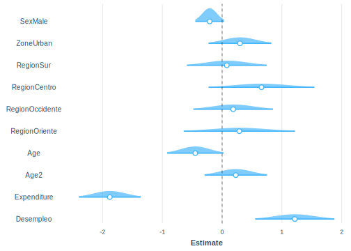

# Modelos lineales generalizados

Los Modelos Lineales Generalizados (MLG) constituyen una extensión natural a los modelos lineales tradicionales al incorporar flexibilidad en la elección de la distribución de la variable de interés. Mientras que los modelos lineales clásicos asumen normalidad como un imperativo en el ajuste e inferencia, los modelos lineales generalizados permiten abordar una variedad más amplia de situaciones, incluyendo respuestas no gausianas y variables de respuesta no lineales. El nombre que reciben se debe a que estos son una genralización de los modelos lineales basados en el supuesto de distribución normal para la variable respuesta. Al igual que los modelos lineales clásicos, tratados en capítulos anteriores, los MLG tienen aplicación en todas las disciplinas del saber.  

Por ejemplo, si la variable de interés es dicotómica, no tendría ningún sentido ajustar un modelo de regresión normal, y se debería usar un modelo de regresión logística para modelar la probabilidad de éxito en términos de una combinación lineal de las variables predictoras. Otro ejemplo es la regresión de Poisson, que emplea la función de enlace log para modelar tasas de eventos en situaciones donde la variable respuesta es el recuento de ocurrencias, como en el análisis de datos de frecuencia de eventos. En resumen, estos modelos lineales generalizados proporcionan una aproximación unificada a la mayoría de los procedimientos usados en estadística aplicada. 

@nelder1972generalized presentaron por primera vez el término en un artículo que, sin lugar a dudas, es uno de los más importantes publicados en el área de estadística, por su gran impacto y aplicación en diferentes disciplinas. En esta publicación se demostró que muchos de los métodos estadísticos ampliamente usados en la época, aparentemente desligados unos de otros, tales como la regresión lineal múltiple, el análisis probit, el análisis de datos provenientes de ensayos controlados, los modelos logit para proporciones, los modelos log-lineales para conteos, los modelos de regresión para datos de supervivencia, entre otros, se podían tratar con un marco teórico unificado y que las estimaciones de máxima verosimilitud para los parámetros de esos modelos podían obtenerse por el mismo algoritmo iterativo.

Los desarrollos teóricos en modelos lineales clásicos parten del supuesto que la variable respuesta tiene distribución normal, cuando un fenómeno en estudio genera datos para los cuales no es razonable la suposición de normalidad, como por ejemplo cuando la respuesta es categórica, una proporción o un conteo, obviamente la respuesta no es normal y no es recomendable analizar los datos suponiendo normalidad. Otro supuesto de los modelos lineales clásicos es el de homogeneidad de la varianza, situación que no se verifica cuando la respuesta es, por ejemplo, una variable aleatoria de poisson, distribución donde la media y la varianza son iguales; es decir, en este modelo un cambio en la media necesariamente implica cambio en la varianza.

Los modelos lineales generalizados son apropiados para modelar datos en condiciones de no normalidad y varianza no constante. Específicamente, en las encuestas de hogares existen variables que meritan su análisis usando modelos lineales generalizados. Es por esto que, este capítulo es de relevancia en este texto. Para ejemplificar los conceptos, inicialmente se cargan las librerías y la base de datos como sigue:


```r
options(digits = 4)
options(tinytex.verbose = TRUE)
library (survey)
library(srvyr)
library(convey)
library(TeachingSampling)
library(printr)
library(stargazer)
library(broom)
library(jtools)
library(modelsummary)
library(patchwork)
```

Cargue de las bases de datos,


```r
encuesta <- readRDS("Data/encuesta.rds") %>% 
  mutate(Age2 = I(Age ^ 2))
```

Por último, se define el diseño muestral utilizando la ponderación de Pfefferman, tal como se vio en el capítulo anterior.


```r
modwk <-
  lm(wk ~ Expenditure + Zone + Sex + Age2, data = encuesta)
wkpred <- predict(modwk)
encuesta %<>% mutate(qw = wk / wkpred)

diseno_qwgt <- encuesta %>%
  as_survey_design(
    strata = Stratum,
    ids = PSU,
    weights = qw,
    nest = T
  )
```

A continuación, se generan nuevas variables en el diseño para ser utilizadas en los ejemplos. En particular, se crea una variable dicotómica que indica si la persona está o no clasificada como pobre. Además, se filtra la base excluyendo a los menores de edad y se crea otra variable que indica si la persona está o no empleada. 


```r
diseno <- diseno_qwgt %>%
  filter(!is.na(Employment)) %>%
  mutate(
    Pobreza = ifelse(Poverty != "NotPoor", 1, 0),
    Desempleo = ifelse(Employment == "Unemployed", 1, 0)
  )
```

## Modelo de regresión logistica para proporciones

La regresión logística es un método de regresión que permite estimar la probabilidad de éxito de una variable cualitativa binaria en función de otras covariables continuas o discretas. La variable de interés es de tipo binario o dicotómico, es decir, tomará el valor de uno (1) si cumple con la condición que se está observando, y cero (0) en caso contrario. De este modo, las observaciones son separadas en los grupos formados según el valor que tome la variable empleada como predictor. 

Si una variable categórica con dos posibles niveles se codifica mediante unos (1) y ceros (0), es posible matemáticamente ajustar un modelo de regresión lineal $\beta_0 + \beta_1 x$ usando alguna técnica de estimación como mínimos cuadrados. Pero surge un inconveniente en esta aproximación, y es que, al tratarse de una recta, es perfectamente posible, obtener valores estimados que sean menores que cero, o incluso mayores que uno, lo cual, claramente va en contravía con la teoría, que requiere que las probabilidades siempre se encuentren dentro del rango [0 ,1]. 

El objetivo de la regresión logística es modelar el logaritmo de la probabilidad de pertenecer a cada grupo; por lo que finalmente la asignación se realiza en función de las probabilidades obtenidas. De esta manera, la regresión logística es ideal para modelar la probabilidad de ocurrencia de un evento en función de diversos factores. Por ende, este tipo de modelos son útiles para correlacionar la probabilidad de ocurrencia de un fenómeno con otras covariables. Por ende la probabilidad aproximada del suceso se denotará mediante una función logística del tipo:

$$
\pi(\textbf{x})= Pr(y = 1 | \textbf{x}) = \frac{\exp\{\textbf{x}'\boldsymbol{\beta}\}}{1+\exp\{\textbf{x}'\boldsymbol{\beta}\}}
$$


Se debe recalcar que no se debe usar una regresión lineal cuando se tiene una variable de tipo  binario como variable dependiente, ya que no es posible estimar la probabilidad del evento estudiado de manera directa, por esta razón se emplea una regresión logística, en la que para obtener las estimaciones de la probabilidad del evento estudiado se debe realizar una transformación (logit). Ahora bien, al aplicar la función logit a ambos lados, la expresión se torna similar al cálculo de una regresión lineal:

$$
g(\textbf{x})=logit(\pi(\textbf{x}))=ln \left\{ \frac{\pi(\textbf{x})}{1-\pi(\textbf{x})} \right \}= \textbf{x}'\boldsymbol{\beta}
$$

De esta forma se asume que existe una relación de tipo lineal entre cada una de las variables explicativas y el logit de la variable respuesta. Obsérvese que existen al menos tres grandes diferencias entre la regresión logística y la regresión lineal. En primer lugar, en la regresión logística no se requiere una relación lineal entre las variables explicativas y la variable de interés; tampoco se requiere que los residuos del modelo guarden una distribución de tipo normal; y, finalmente, no es necesario que los residuos del modelo presenten una varianza constante, es decir que sean homoscedásticos. 
 
Usando técnicas apropiadas que incluyan el diseño de muestreo complejo en la inferencia, la probabilidad estimada de que la variable de interés tome el valor uno, que a su vez es también la esperanza de la variable de interés, en un modelo de regresión logística es la siguiente:
  
$$
\hat{\pi}(\textbf{x})= \frac{\exp\{\textbf{x}'\hat{\boldsymbol{\beta}}\}}{1+\exp\{\textbf{x}'\hat{\boldsymbol{\beta}\}}}
$$

La varianza de los parámetros estimados se calcula a partir de la siguiente expresión:

$$
var\left(\boldsymbol{\hat{B}}\right)=\boldsymbol{J}^{-1}var\left(S\left(\hat{\boldsymbol{B}}\right)\right)\boldsymbol{J}^{-1}
$$

En donde

$$
S\left(B\right)=\sum_{h}\sum_{a}\sum_{i}w_{hai}\boldsymbol{D}_{hai}^{t}\left[\left(\pi_{hai}\left(\boldsymbol{B}\right)\right)\left(1-\pi_{hai}\left(\boldsymbol{B}\right)\right)\right]^{-1}\left(y_{hai}-\pi_{hai}\left(\boldsymbol{B}\right)\right)=0
$$
y,

$$
D_{hai} = \frac{\delta\left(\pi_{hai}\left(\boldsymbol{B}\right)\right)}{\delta B_{j}}
$$

Donde $j=0,\dots,p$. Dado que el modelo tiene enlace logaritmo, para construir los intervalos de confianza se debe aplicar el función exponencial a cada parámetro, 

$$
\hat{\psi}=\exp\left(\hat{B}_{1}\right)
$$

Por ende, el intervalo de confianza estará dado por la siguiente expresión: 

$$
CI\left(\psi\right)=\exp\left(\hat{B}_{j}\pm t_{df,1-\frac{\alpha}{2}}se\left(\hat{B}_{j}\right)\right)
$$


Es importante anotar que la interpretación de los coeficientes de la regresión logística debido a lo no-linealidad que la caracteriza por momentos puede ser complicada, razón por la cual como primera medida se expondrá las similitudes con una regresión lineal clásica y también sus diferencias principales, todo esto, con el fin de llegar a una correcta interpretación de los modelos. Una de las similitudes entre los modelos lineales y los modelos logísticos, es que es posible interpretar los signos de la ecuación estimada de la misma manera en los dos casos, lo que quiere decir que el signo de la pendiente indica la relación de la variable frente a la probabilidad de ocurrencia del evento que explique la variable dependiente, así que, un signo positivo acompañando la covariable indica un aumento de la probabilidad de ocurrencia del evento al cumplir con las características de la covariable; y en caso  contrario, un signo negativo indica la disminución de la probabilidad de ocurrencia del evento observado al cumplir con las características de la covariable. Por otro lado, al igual que con la regresión lineal, el intercepto solo se puede interpretar asumiendo valores cero para los otros predictores. 

Ahora, la interpretación de los coeficientes de regresión entre un modelo logístico y un modelo lineal es bastante diferente, lo que significa que, aunque es posible interpretar los signos de los coeficientes no se interpreta la magnitud de manera directa, ya que la estimación de los coeficientes en la regresión logística corresponde a un logaritmo de probabilidades por lo que es necesaria la transformación previamente señalada. 

Según @gelmanhill2019, los coeficientes de regresión logística exponencidos se pueden interpretar como razones de *Odds*. Luego, si dos resultados presentan las probabilidades de  $(\pi,1-\pi)$, entonces $\pi/(1-\pi)$ es llamado el *Odds*. De este modo, un *Odds* de 1, es equivalente a una probabilidad de 0.5, es decir, resultados igualmente probables. Ahora bien, *Odds* de 0.5 representa probabilidades de (1/3, 2/3). Dividiendo dos *Odds*, $\pi_1/(1-\pi_1 )  /\pi_2/(1-\pi_2 )$  se obtiene una razón de probabilidades. Por ejemplo, una razón de *Odds* igual a 2 correspondería a un cambio de $\pi=0.33$ a $\pi=0.5$ o  un  cambio de $\pi=0.5$ a $\pi=0.67$.  Una ventaja de trabajar con razones de Odds en lugar de probabilidades, es que es posible escalar de manera constante las razones de probabilidades indefinidamente sin llegar a los puntos límite de 0 y 1. Por ejemplo, pasar de un Odds de 2 a un Odds de 4 aumenta la probabilidad de 2/3  a 4/5; duplicar los Odss, nuevamente aumenta la probabilidad a 8/9, y así sucesivamente. 


A continuación, se muestra el ajuste de un modelo logístico para la pobreza, que se considera el fenómeno de interés en este ejemplo. Las covariables que interesa relacionar son el sexo la zona y región de ubicación de la vivienda, la edad, la edad al cuadrado, el gasto y el estaod de desempleo. Para llevar a cabo la implementación de este modelo en `R`, se utiliza la función `svyglm` que tiene en cuenta el diseño muestral complejo:


```r
mod_logistic <- svyglm(
  formula = Pobreza ~ Sex + Zone + Region + Age + 
    Age2 + Expenditure + Desempleo,
  family = binomial,
  design = diseno
)

tidy(mod_logistic)
```


<table>
 <thead>
  <tr>
   <th style="text-align:left;"> term </th>
   <th style="text-align:right;"> estimate </th>
   <th style="text-align:right;"> std.error </th>
   <th style="text-align:right;"> statistic </th>
   <th style="text-align:right;"> p.value </th>
  </tr>
 </thead>
<tbody>
  <tr>
   <td style="text-align:left;"> (Intercept) </td>
   <td style="text-align:right;"> 1.6780 </td>
   <td style="text-align:right;"> 0.4193 </td>
   <td style="text-align:right;"> 4.0016 </td>
   <td style="text-align:right;"> 0.0001 </td>
  </tr>
  <tr>
   <td style="text-align:left;"> SexMale </td>
   <td style="text-align:right;"> -0.2088 </td>
   <td style="text-align:right;"> 0.1222 </td>
   <td style="text-align:right;"> -1.7090 </td>
   <td style="text-align:right;"> 0.0903 </td>
  </tr>
  <tr>
   <td style="text-align:left;"> ZoneUrban </td>
   <td style="text-align:right;"> 0.2983 </td>
   <td style="text-align:right;"> 0.2677 </td>
   <td style="text-align:right;"> 1.1144 </td>
   <td style="text-align:right;"> 0.2676 </td>
  </tr>
  <tr>
   <td style="text-align:left;"> RegionSur </td>
   <td style="text-align:right;"> 0.0782 </td>
   <td style="text-align:right;"> 0.3407 </td>
   <td style="text-align:right;"> 0.2296 </td>
   <td style="text-align:right;"> 0.8189 </td>
  </tr>
  <tr>
   <td style="text-align:left;"> RegionCentro </td>
   <td style="text-align:right;"> 0.6580 </td>
   <td style="text-align:right;"> 0.4513 </td>
   <td style="text-align:right;"> 1.4579 </td>
   <td style="text-align:right;"> 0.1477 </td>
  </tr>
  <tr>
   <td style="text-align:left;"> RegionOccidente </td>
   <td style="text-align:right;"> 0.1846 </td>
   <td style="text-align:right;"> 0.3399 </td>
   <td style="text-align:right;"> 0.5432 </td>
   <td style="text-align:right;"> 0.5881 </td>
  </tr>
  <tr>
   <td style="text-align:left;"> RegionOriente </td>
   <td style="text-align:right;"> 0.2880 </td>
   <td style="text-align:right;"> 0.4748 </td>
   <td style="text-align:right;"> 0.6065 </td>
   <td style="text-align:right;"> 0.5454 </td>
  </tr>
  <tr>
   <td style="text-align:left;"> Age </td>
   <td style="text-align:right;"> -0.0248 </td>
   <td style="text-align:right;"> 0.0133 </td>
   <td style="text-align:right;"> -1.8717 </td>
   <td style="text-align:right;"> 0.0639 </td>
  </tr>
  <tr>
   <td style="text-align:left;"> Age2 </td>
   <td style="text-align:right;"> 0.0001 </td>
   <td style="text-align:right;"> 0.0002 </td>
   <td style="text-align:right;"> 0.8587 </td>
   <td style="text-align:right;"> 0.3924 </td>
  </tr>
  <tr>
   <td style="text-align:left;"> Expenditure </td>
   <td style="text-align:right;"> -0.0063 </td>
   <td style="text-align:right;"> 0.0009 </td>
   <td style="text-align:right;"> -7.1081 </td>
   <td style="text-align:right;"> 0.0000 </td>
  </tr>
  <tr>
   <td style="text-align:left;"> Desempleo </td>
   <td style="text-align:right;"> 1.2159 </td>
   <td style="text-align:right;"> 0.3379 </td>
   <td style="text-align:right;"> 3.5983 </td>
   <td style="text-align:right;"> 0.0005 </td>
  </tr>
</tbody>
</table>
  
La función `tidy` muestra que algunas de las covariables son significativas al 5%. En particular, el intercepto, el gasto y el estado de desempleo. A continuación, se presentan los intervalos de confianza en los cuales se pueden concluir sobre la significancia de los parámetros al revisar si el cero se encuentra dentro del intervalo:


```r
confint(mod_logistic, level = 0.95) 
```


<table>
 <thead>
  <tr>
   <th style="text-align:left;">   </th>
   <th style="text-align:right;"> 2.5 % </th>
   <th style="text-align:right;"> 97.5 % </th>
  </tr>
 </thead>
<tbody>
  <tr>
   <td style="text-align:left;"> (Intercept) </td>
   <td style="text-align:right;"> 0.8469 </td>
   <td style="text-align:right;"> 2.5090 </td>
  </tr>
  <tr>
   <td style="text-align:left;"> SexMale </td>
   <td style="text-align:right;"> -0.4510 </td>
   <td style="text-align:right;"> 0.0334 </td>
  </tr>
  <tr>
   <td style="text-align:left;"> ZoneUrban </td>
   <td style="text-align:right;"> -0.2323 </td>
   <td style="text-align:right;"> 0.8289 </td>
  </tr>
  <tr>
   <td style="text-align:left;"> RegionSur </td>
   <td style="text-align:right;"> -0.5971 </td>
   <td style="text-align:right;"> 0.7536 </td>
  </tr>
  <tr>
   <td style="text-align:left;"> RegionCentro </td>
   <td style="text-align:right;"> -0.2365 </td>
   <td style="text-align:right;"> 1.5525 </td>
  </tr>
  <tr>
   <td style="text-align:left;"> RegionOccidente </td>
   <td style="text-align:right;"> -0.4891 </td>
   <td style="text-align:right;"> 0.8584 </td>
  </tr>
  <tr>
   <td style="text-align:left;"> RegionOriente </td>
   <td style="text-align:right;"> -0.6531 </td>
   <td style="text-align:right;"> 1.2291 </td>
  </tr>
  <tr>
   <td style="text-align:left;"> Age </td>
   <td style="text-align:right;"> -0.0511 </td>
   <td style="text-align:right;"> 0.0015 </td>
  </tr>
  <tr>
   <td style="text-align:left;"> Age2 </td>
   <td style="text-align:right;"> -0.0002 </td>
   <td style="text-align:right;"> 0.0005 </td>
  </tr>
  <tr>
   <td style="text-align:left;"> Expenditure </td>
   <td style="text-align:right;"> -0.0080 </td>
   <td style="text-align:right;"> -0.0045 </td>
  </tr>
  <tr>
   <td style="text-align:left;"> Desempleo </td>
   <td style="text-align:right;"> 0.5461 </td>
   <td style="text-align:right;"> 1.8856 </td>
  </tr>
</tbody>
</table>
  
Para verificar de manera gráfica la distribución de los parámetros del modelo, se realizará un gráfico de estos usando la función `plot_summs` como se muestra a continuación,


```r
library(ggstance)
plot_summs(mod_logistic,
           scale = TRUE,
           plot.distributions = TRUE)
```



Se puede observar en el gráfico que el número cero se encuentra dentro del intervalo de confianza de algunos parámetros, lo que confirma la no significancia de estos. 

Para conocer si una variable es significativa en el modelo es común utilizar el estadístico de Wald que se basa en la razón de verosimilitudes. En este caso se contrastan el modelo con todos los parámetros (completo) con el modelo reducido, es decir, el modelo con menos parámetros (reducido). La estadística de prueba es la siguiente: 

$$
G=-2\ln\left[\frac{L\left(\hat{\boldsymbol{\beta}}\right)_{reducido}}{L\left(\hat{\boldsymbol{\beta}}\right)_{completo}}\right]
$$

El estadístico de Wald para cada una de las variables del modelo del ejemplo se calcula a continuación con la función `regTermTest` para las variables del modelo:


```r
regTermTest(model = mod_logistic, ~ 1)
```

```
## Wald test for 
##  in svyglm(formula = Pobreza ~ Sex + Zone + Region + Age + Age2 + 
##     Expenditure + Desempleo, design = diseno, family = binomial)
## F =  16.01  on  1  and  109  df: p= 0.00011
```

```r
regTermTest(model = mod_logistic, ~ Sex)
```

```
## Wald test for Sex
##  in svyglm(formula = Pobreza ~ Sex + Zone + Region + Age + Age2 + 
##     Expenditure + Desempleo, design = diseno, family = binomial)
## F =  2.921  on  1  and  109  df: p= 0.09
```

```r
regTermTest(model = mod_logistic, ~ Zone)
```

```
## Wald test for Zone
##  in svyglm(formula = Pobreza ~ Sex + Zone + Region + Age + Age2 + 
##     Expenditure + Desempleo, design = diseno, family = binomial)
## F =  1.242  on  1  and  109  df: p= 0.27
```

```r
regTermTest(model = mod_logistic, ~ Region)
```

```
## Wald test for Region
##  in svyglm(formula = Pobreza ~ Sex + Zone + Region + Age + Age2 + 
##     Expenditure + Desempleo, design = diseno, family = binomial)
## F =  0.5838  on  4  and  109  df: p= 0.68
```

```r
regTermTest(model = mod_logistic, ~ Age)
```

```
## Wald test for Age
##  in svyglm(formula = Pobreza ~ Sex + Zone + Region + Age + Age2 + 
##     Expenditure + Desempleo, design = diseno, family = binomial)
## F =  3.503  on  1  and  109  df: p= 0.064
```

```r
regTermTest(model = mod_logistic, ~ Age2)
```

```
## Wald test for Age2
##  in svyglm(formula = Pobreza ~ Sex + Zone + Region + Age + Age2 + 
##     Expenditure + Desempleo, design = diseno, family = binomial)
## F =  0.7373  on  1  and  109  df: p= 0.39
```

```r
regTermTest(model = mod_logistic, ~ Expenditure)
```

```
## Wald test for Expenditure
##  in svyglm(formula = Pobreza ~ Sex + Zone + Region + Age + Age2 + 
##     Expenditure + Desempleo, design = diseno, family = binomial)
## F =  50.52  on  1  and  109  df: p= 1.3e-10
```

```r
regTermTest(model = mod_logistic, ~ Desempleo)
```

```
## Wald test for Desempleo
##  in svyglm(formula = Pobreza ~ Sex + Zone + Region + Age + Age2 + 
##     Expenditure + Desempleo, design = diseno, family = binomial)
## F =  12.95  on  1  and  109  df: p= 0.00048
```
  
Concluyendo una vez más que las únicas variables significativas son el intercepto, el gasto y estado de desempleo, justo como se había mencionado anteriormente. Como es tradicional en el ajuste de modelos de regresión ya sea, clásico o generalizado, se pueden realizar ajustes con interacciones. A continuación, se presenta un ejemplo de cómo se ajustan modelos logísticos con la interacción entre sexo y zona y, sexo y región:


```r
mod_logistic_int <- svyglm(
  formula = Pobreza ~ Sex + Zone + Region + Age +
    Age2 + Expenditure + Desempleo +
    Sex:Zone + Sex:Region,
  family = binomial,
  design = diseno
)

tidy(mod_logistic_int) %>%
  arrange(p.value)
```


<table>
 <thead>
  <tr>
   <th style="text-align:left;"> term </th>
   <th style="text-align:right;"> estimate </th>
   <th style="text-align:right;"> std.error </th>
   <th style="text-align:right;"> statistic </th>
   <th style="text-align:right;"> p.value </th>
  </tr>
 </thead>
<tbody>
  <tr>
   <td style="text-align:left;"> Expenditure </td>
   <td style="text-align:right;"> -0.0063 </td>
   <td style="text-align:right;"> 0.0009 </td>
   <td style="text-align:right;"> -7.1574 </td>
   <td style="text-align:right;"> 0.0000 </td>
  </tr>
  <tr>
   <td style="text-align:left;"> (Intercept) </td>
   <td style="text-align:right;"> 1.6756 </td>
   <td style="text-align:right;"> 0.3886 </td>
   <td style="text-align:right;"> 4.3123 </td>
   <td style="text-align:right;"> 0.0000 </td>
  </tr>
  <tr>
   <td style="text-align:left;"> Desempleo </td>
   <td style="text-align:right;"> 1.1854 </td>
   <td style="text-align:right;"> 0.3356 </td>
   <td style="text-align:right;"> 3.5326 </td>
   <td style="text-align:right;"> 0.0006 </td>
  </tr>
  <tr>
   <td style="text-align:left;"> Age </td>
   <td style="text-align:right;"> -0.0253 </td>
   <td style="text-align:right;"> 0.0136 </td>
   <td style="text-align:right;"> -1.8664 </td>
   <td style="text-align:right;"> 0.0648 </td>
  </tr>
  <tr>
   <td style="text-align:left;"> RegionCentro </td>
   <td style="text-align:right;"> 0.6942 </td>
   <td style="text-align:right;"> 0.4376 </td>
   <td style="text-align:right;"> 1.5863 </td>
   <td style="text-align:right;"> 0.1157 </td>
  </tr>
  <tr>
   <td style="text-align:left;"> ZoneUrban </td>
   <td style="text-align:right;"> 0.2981 </td>
   <td style="text-align:right;"> 0.2518 </td>
   <td style="text-align:right;"> 1.1838 </td>
   <td style="text-align:right;"> 0.2392 </td>
  </tr>
  <tr>
   <td style="text-align:left;"> SexMale:RegionSur </td>
   <td style="text-align:right;"> 0.3697 </td>
   <td style="text-align:right;"> 0.3531 </td>
   <td style="text-align:right;"> 1.0469 </td>
   <td style="text-align:right;"> 0.2976 </td>
  </tr>
  <tr>
   <td style="text-align:left;"> Age2 </td>
   <td style="text-align:right;"> 0.0001 </td>
   <td style="text-align:right;"> 0.0002 </td>
   <td style="text-align:right;"> 0.8601 </td>
   <td style="text-align:right;"> 0.3917 </td>
  </tr>
  <tr>
   <td style="text-align:left;"> RegionOriente </td>
   <td style="text-align:right;"> 0.3285 </td>
   <td style="text-align:right;"> 0.3936 </td>
   <td style="text-align:right;"> 0.8347 </td>
   <td style="text-align:right;"> 0.4058 </td>
  </tr>
  <tr>
   <td style="text-align:left;"> RegionOccidente </td>
   <td style="text-align:right;"> 0.2810 </td>
   <td style="text-align:right;"> 0.3597 </td>
   <td style="text-align:right;"> 0.7811 </td>
   <td style="text-align:right;"> 0.4365 </td>
  </tr>
  <tr>
   <td style="text-align:left;"> SexMale </td>
   <td style="text-align:right;"> -0.1875 </td>
   <td style="text-align:right;"> 0.2412 </td>
   <td style="text-align:right;"> -0.7771 </td>
   <td style="text-align:right;"> 0.4389 </td>
  </tr>
  <tr>
   <td style="text-align:left;"> SexMale:RegionOccidente </td>
   <td style="text-align:right;"> -0.2372 </td>
   <td style="text-align:right;"> 0.3194 </td>
   <td style="text-align:right;"> -0.7427 </td>
   <td style="text-align:right;"> 0.4593 </td>
  </tr>
  <tr>
   <td style="text-align:left;"> RegionSur </td>
   <td style="text-align:right;"> -0.1013 </td>
   <td style="text-align:right;"> 0.3273 </td>
   <td style="text-align:right;"> -0.3096 </td>
   <td style="text-align:right;"> 0.7575 </td>
  </tr>
  <tr>
   <td style="text-align:left;"> SexMale:RegionCentro </td>
   <td style="text-align:right;"> -0.0915 </td>
   <td style="text-align:right;"> 0.3148 </td>
   <td style="text-align:right;"> -0.2907 </td>
   <td style="text-align:right;"> 0.7718 </td>
  </tr>
  <tr>
   <td style="text-align:left;"> SexMale:RegionOriente </td>
   <td style="text-align:right;"> -0.0885 </td>
   <td style="text-align:right;"> 0.4137 </td>
   <td style="text-align:right;"> -0.2139 </td>
   <td style="text-align:right;"> 0.8311 </td>
  </tr>
  <tr>
   <td style="text-align:left;"> SexMale:ZoneUrban </td>
   <td style="text-align:right;"> 0.0289 </td>
   <td style="text-align:right;"> 0.2350 </td>
   <td style="text-align:right;"> 0.1230 </td>
   <td style="text-align:right;"> 0.9024 </td>
  </tr>
</tbody>
</table>

Observando que ninguna de las interacciones tampoco es significativa en el modelo. El gráfico de la distribución de los parámetros del modelo con y sin interacciones se presenta a continuación:


```r
plot_summs(mod_logistic_int,
           mod_logistic,
           scale = TRUE,
           plot.distributions = TRUE)
```


  
El estadístico de Wald sobre los parámetros de interacción del modelo se rpesentan a continuación:


```r
regTermTest(model = mod_logistic_int, ~ Sex:Zone)
```

```
## Wald test for Sex:Zone
##  in svyglm(formula = Pobreza ~ Sex + Zone + Region + Age + Age2 + 
##     Expenditure + Desempleo + Sex:Zone + Sex:Region, design = diseno, 
##     family = binomial)
## F =  0.01512  on  1  and  104  df: p= 0.9
```

```r
regTermTest(model = mod_logistic_int, ~ Sex:Region)
```

```
## Wald test for Sex:Region
##  in svyglm(formula = Pobreza ~ Sex + Zone + Region + Age + Age2 + 
##     Expenditure + Desempleo + Sex:Zone + Sex:Region, design = diseno, 
##     family = binomial)
## F =  0.9353  on  4  and  104  df: p= 0.45
```

## Modelo log-lineal para tablas de contingencia 

Cuando se quieren analizar las relaciones de las variables que generan totales estimados en en una tabla de contingencia (arreglo rectangular que organiza los datos en función de dos o más variables categóricas, mostrando la frecuencia o proporción de casos que caen en cada combinación de categorías) es posible usar un modelo log-lineal. Este tipo de modelos se utiliza para estudiar la asociación entre variables categóricas, controlando o teniendo en cuenta posibles efectos de otras covariables. Además, permite ajustar las asociaciones observadas en la tabla de contingencia y evaluar si estas asociaciones son estadísticamente significativas. 

Los modelos loglineales en tablas de contingencia se pueden usar para determinar si hay una asociación significativa entre las variables categóricas; ajustar la asociación entre variables de interés por otras variables que podrían influir en la relación; evaluar cómo cambia la probabilidad de una categoría en una variable categórica dado un cambio en otra variable categórica; estimar la probabilidad de que un caso caiga en una categoría específica de una variable categórica dada la información de otras variables. 

El término log-lineal básicamente describe el papel de la función de enlace que se utiliza en los modelos lineales generalizados. En el caso más simple, con dos variables categóricas, que inducen datos provenientes de estimaciones de conteos o proporciones en tablas de contingencia, es posible plantear el siguiente modelo estadístico:

$$
\ln(\pi_{ijk}) = \mu + \lambda_i^X + \lambda_j^Y + \lambda_{ij}^{XY}  ,   
$$


En donde $\pi_{ijk}$ es la probabilidad condicional de ocurrencia de la combinación de categorías i, j en las variables categóricas $X$ e $Y$, respectivamente; $\mu$ es el intercepto que representa el logaritmo de la probabilidad de referencia; $\lambda_i^X$ y $\lambda_j^Y$ son los efectos principales asociados con las categorías i y j en las variables $X$ e $Y$, respectivamente; finalmente, $\lambda_{ij}^{XY}$ es el efecto de interacción entre las categorías i y j en las variables categóricas. La función logaritmo natural se utiliza comúnmente en estos modelos para transformar las probabilidades condicionales y permitir la interpretación en términos de log-odds. En resumen, el modelo describe cómo las probabilidades condicionales de eventos categóricos están relacionadas entre sí y cómo estas relaciones pueden ser influenciadas por efectos principales y de interacción en las variables categóricas $X$ e $Y$.

Como se ha definido en secciones y capítulos anteriores, con variables dicotómicas se pueden generar tablas de frecuencias teniendo en cuenta los factores de expansión del diseño. En `R` se hace usando la función `svyby` de la siguiente manera. Primero, se define la variable a la que se le requiere hacer la tabla (`formula`), luego se le indica cuál es la variable clasificadora (`by`). En este caso se quiere hacer una tabla de pobreza claificada por sexo. En tercer lugar se define la función que se quiere aplicar (`FUN`), en este caso, se quieren calcular totales por celda, por último, se define el diseño de muestreo (`design`).  


```r
N_pobreza_sexo <- svyby(
  formula = ~ factor(Pobreza),
  by = ~ Sex,
  FUN = svytotal,
  design = diseno,
  se = F,
  na.rm = T,
  ci = T,
  keep.var = TRUE
)

N_pobreza_sexo
```


<table>
 <thead>
  <tr>
   <th style="text-align:left;">   </th>
   <th style="text-align:left;"> Sex </th>
   <th style="text-align:right;"> factor(Pobreza)0 </th>
   <th style="text-align:right;"> factor(Pobreza)1 </th>
   <th style="text-align:right;"> se.factor(Pobreza)0 </th>
   <th style="text-align:right;"> se.factor(Pobreza)1 </th>
  </tr>
 </thead>
<tbody>
  <tr>
   <td style="text-align:left;"> Female </td>
   <td style="text-align:left;"> Female </td>
   <td style="text-align:right;"> 650.8 </td>
   <td style="text-align:right;"> 356.1 </td>
   <td style="text-align:right;"> 33.63 </td>
   <td style="text-align:right;"> 36.39 </td>
  </tr>
  <tr>
   <td style="text-align:left;"> Male </td>
   <td style="text-align:left;"> Male </td>
   <td style="text-align:right;"> 576.9 </td>
   <td style="text-align:right;"> 284.0 </td>
   <td style="text-align:right;"> 39.90 </td>
   <td style="text-align:right;"> 34.72 </td>
  </tr>
</tbody>
</table>

Al hacer uso de la función `svyby` pero usando en el argumento `FUN= svymean` es posible estimar proporciones como se muestra a continuación:


```r
p_pobreza_sexo <- svyby(
  formula = ~ factor(Pobreza),
  by = ~ Sex,
  FUN = svymean,
  design = diseno,
  se = F,
  na.rm = T,
  ci = T,
  keep.var = TRUE
)

p_pobreza_sexo
```


<table>
 <thead>
  <tr>
   <th style="text-align:left;">   </th>
   <th style="text-align:left;"> Sex </th>
   <th style="text-align:right;"> factor(Pobreza)0 </th>
   <th style="text-align:right;"> factor(Pobreza)1 </th>
   <th style="text-align:right;"> se.factor(Pobreza)0 </th>
   <th style="text-align:right;"> se.factor(Pobreza)1 </th>
  </tr>
 </thead>
<tbody>
  <tr>
   <td style="text-align:left;"> Female </td>
   <td style="text-align:left;"> Female </td>
   <td style="text-align:right;"> 0.6463 </td>
   <td style="text-align:right;"> 0.3537 </td>
   <td style="text-align:right;"> 0.0311 </td>
   <td style="text-align:right;"> 0.0311 </td>
  </tr>
  <tr>
   <td style="text-align:left;"> Male </td>
   <td style="text-align:left;"> Male </td>
   <td style="text-align:right;"> 0.6701 </td>
   <td style="text-align:right;"> 0.3299 </td>
   <td style="text-align:right;"> 0.0377 </td>
   <td style="text-align:right;"> 0.0377 </td>
  </tr>
</tbody>
</table>

El modelo log-lineal en `R` se ajusta utilizando la función `svyloglin` para ajustar un modelo loglineal a datos de encuestas complejas utilizando el diseño de muestreo especificado en `diseno`. Esta función pertenece al paquete `survey` en `R` y sus argumentos son `formula` en donde se especifica la expresión del modelo. En este caso, el modelo incluye la variable `Pobreza`, la variable `Sex`, y la interacción entre ambas (`Pobreza:Sex`). La interacción indica que el efecto de `Pobreza` puede depender de la variable `Sex` y viceversa. La función `svyloglin` tiene en cuenta el diseño de muestreo complejo para proporcionar estimaciones más precisas y adecuadas a la estructura de la encuesta. 
  

```r
mod1 <- svyloglin(formula = ~ Pobreza + Sex + Pobreza:Sex,
                  design = diseno)
summary(mod1)
```

```
## Loglinear model: svyloglin(formula = ~Pobreza + Sex + Pobreza:Sex, design = diseno)
##                   coef      se         p
## Pobreza1       0.32790 0.07207 5.372e-06
## Sex1           0.08664 0.02065 2.729e-05
## Pobreza1:Sex1 -0.02640 0.02753 3.375e-01
```

En la salida anterior se puede observar que el estado de pobreza es independiente del sexo, como se ha mostrado en las secciones anteriores. Ahora bien, puesto que en la salida anterior se pudo observar que la interacción es no significativa, entonces, se ajusta ahora el modelo sin interacción:


```r
mod2 <- svyloglin(formula = ~ Pobreza + Sex,
                  design = diseno)
summary(mod2)
```

```
## Loglinear model: svyloglin(formula = ~Pobreza + Sex, design = diseno)
##             coef      se         p
## Pobreza1 0.32562 0.07122 4.834e-06
## Sex1     0.07828 0.01890 3.460e-05
```
  

Por último, mediante un análisis de varianza es posible comparar los dos modelos como sigue: 


```r
anova(mod2, mod1)
```

```
## Analysis of Deviance Table
##  Model 1: y ~ Pobreza + Sex
## Model 2: y ~ Pobreza + Sex + Pobreza:Sex 
## Deviance= 1.171 p= 0.3391 
## Score= 1.169 p= 0.3394
```

De la anterior salida se puede concluir que la interacción no es significativa en el modelo log-lineal ajustado y que no hay evidencia para preferir un modelo sobre otro. Dado que los valores p son mayores que el nivel de significancia común de 0.05 (p=0.361 y p=0.3613), no hay evidencia suficiente para rechazar la hipótesis nula de que no hay diferencia significativa entre los dos modelos en términos de devianza. Esto sugiere que la inclusión de la interacción `Pobreza:Sex` en el segundo modelo no mejora significativamente el ajuste en comparación con el primer modelo. 

Este estadístico se aplica cuando ya se ha elegido un modelo estadístico ( regresión lineal simple, regresión logística, entre otros).El estadístico de prueba de Wald $\chi^{2}$ para la hipótesis nula de independencia de filas y columnas en una tabla de doble entrada se define de la siguiente manera:

$$
Q_{wald}=\hat{\boldsymbol{Y}^{t}}\left(\boldsymbol{H}\hat{\boldsymbol{V}}\left(\hat{\boldsymbol{N}}\right)\boldsymbol{H}^{t}\right)^{-1}\hat{\boldsymbol{Y}}
$$

donde, 

$$
\hat{\boldsymbol{Y}}=\left(\hat{N}-E\right)
$$

es un vector de $R\times C$ de  diferencias entre los recuentos de celdas observadas y esperadas, esto es, $\hat{N}_{rc}-E_{rc}$. La matriz  $\boldsymbol{H}\hat{\boldsymbol{V}}\left(\hat{\boldsymbol{N}}\right)\boldsymbol{H}^{t}$, representa la matriz de varianza y covarianza estimada para el vector de diferencias. En el caso de un diseño de muestra complejo, la matriz de varianza-covarianza de los conteos de frecuencia ponderada, $\hat{V}\left(\hat{N}\right)$, se estima utilizando métodos de remuestreo o aproximación de Taylor. La matriz $\boldsymbol{H}$  es la inversa de la matriz $\boldsymbol{J}$ dada por:

$$
\boldsymbol{J}=-\left[\frac{\delta^{2}\ln PL\left(\boldsymbol{B}\right)}{\delta^{2}\boldsymbol{B}}\right] \mid \boldsymbol{B}=\hat{\boldsymbol{B}}
$$

Bajo la hipótesis nula de independencia, el estadístico de wald se distribuye chi cuadrado con $\left(R-1\right)\times\left(C-1\right)$ grados de libertad,
$$
Q_{wald}\sim\chi_{\left(R-1\right)\times\left(C-1\right)}^{2}
$$

La transformación F del estadístico de Wald es:
$$
F_{wald}=Q_{wald}\times\frac{df-\left(R-1\right)\left(C-1\right)+1}{\left(R-1\right)\left(C-1\right)df}\sim F_{\left(R-1\right)\left(C-1\right),df-\left(R-1\right)\left(C-1\right)+1}
$$

En `R`, para calcular el estadístico de Wald se hace similarmente al cálculo de los estadísticos anteriores usando la función `summary` como sigue:


```r
summary(mod1, statistic = "Wald")
```

```
## Loglinear model: svyloglin(formula = ~Pobreza + Sex + Pobreza:Sex, design = diseno)
##                   coef      se         p
## Pobreza1       0.32790 0.07207 5.372e-06
## Sex1           0.08664 0.02065 2.729e-05
## Pobreza1:Sex1 -0.02640 0.02753 3.375e-01
```

Se puede concluir que no hay relación entre el estado de pobreza y el sexo. El coeficiente de la interacción es -0.02640, con un error estándar de 0.02753. El valor p asociado es 0.3375, que es mayor que el nivel de significancia común de 0.05. Esto sugiere que no hay evidencia significativa de una interacción entre la pobreza y el sexo. En este mismo sentido, el estadístico de Wald ajustado en `R` se se calcula similarmente al anterior y los resultados fueron similares:


```r
summary(mod1, statistic = "adjWald")
```

```
## Loglinear model: svyloglin(formula = ~Pobreza + Sex + Pobreza:Sex, design = diseno)
##                   coef      se         p
## Pobreza1       0.32790 0.07207 5.372e-06
## Sex1           0.08664 0.02065 2.729e-05
## Pobreza1:Sex1 -0.02640 0.02753 3.375e-01
```

## Modelo multinomial para variables con múltiples categorías

En las secciones anteriores se explicó cómo hacer un análisis de variables aleatorias provenientes de encuestas complejas de tipo binario usando modelos de regresión logística. Sin embargo, es muy común que en estas encuestas existan variables de tipo multinomial; es decir, que tengan más de dos niveles de respuesta. Para el análisis de este tipo de variables se utiliza un modelo multinomial, el cual se desarrollará en esta sección.

El modelo de regresión logístico multinomial es la extensión natural del modelo de regresión logístico binomial y se utiliza para analizar variables con respuestas que tienen tres o más categorías distintas. Esta técnica es más apropiada para variables de encuestas con categorías de respuesta nominales. Para el ajuste de un modelo multinomial se debe tener en cuenta que la variable dependiente debe medirse en el nivel nominal; se debe tener una o más variables independientes que pueden ser continuas o categóricas; la variable dependiente debe tener categorías mutuamente excluyentes y exhaustivas; no debe haber dos o más variables independientes que están altamente correlacionadas entre sí; ademas, debe haber una relación lineal entre cualquier variable independiente continua y la transformación logit de la variable dependiente. El modelo múltinomial está dado por la siguiente expresión:

$$
Pr\left(Y_{ik}\right)=Pr\left(y_{i}=k\mid\boldsymbol{X}_i\right)=\frac{\exp\left(\beta_{0k}+\boldsymbol{X}_{i}'\boldsymbol{\beta}_{k}\right)}{\sum_{j=1}^{m}\exp\left(\beta_{0j}+\boldsymbol{\boldsymbol{X}_{i}'\beta}_{j}\right)}
$$

En donde $Pr\left(y_{i}=k\mid\boldsymbol{X}_i\right)$ representa la probabilidad condicional de que la observación $i$ pertenezca a la categoría $k$ de la variable dependiente $Y$, dado el conjunto de covariables $\boldsymbol{X}_{i}$; $\boldsymbol{\beta}_k$ es el vector de coeficientes de regresión para las variables $\boldsymbol{X}$ en la $k$-ésima categoría. Para la estimación de los parámetros del modelo logístico es posible usar técnicas ajustadas de máxima pseudoverosimilitud, lo que implica maximizar la siguiente versión multinomial de la función de pseudoverosimilitud [@Heeringa_West_Berglund_2017]:

$$
PL_{Mult}\left(\hat{\beta}\mid\boldsymbol{X}\right)  =  \prod_{i=1}^{n}\left\{ \prod_{i=1}^{k}\hat{\pi}_{k}\left(x_{i}\right)^{y_{i\left(k\right)}}\right\} ^{w_{i}}
$$

En la anterior expresión, se tiene que

$y_{i\left(k\right)}=1$ si $y = k$ para la unidad muestreada $i$, 0 en caso contrario. $\hat{\pi}_{k}\left(x_{i}\right)$ es la probabilidad estimada de que $y_{i}=k\mid x_{i}$. $w_{i}$ es el peso de la encuesta para la unidad muestreada $i$. @binder1983variances afirma que la maximización implica la aplicación del algoritmo de Newton-Raphson para resolver el siguiente conjunto de ecuaciones de estimación $\left(K-1\right)\times\left(p+1\right)$,
suponiendo un diseño de muestra complejo con estratos indexados por $h$ y conglomerados dentro de estratos indexados por $\alpha$:

$$
S\left(\boldsymbol{\beta}\right)_{Mult}  =  \sum_{h}\sum_{\alpha}\sum_{i}\omega_{h\alpha i}\left(y_{h\alpha i}^{\left(k\right)}-\pi_{k}\left(\boldsymbol{\beta}\right)\right)x'_{h\alpha i}=0
$$

Donde,

$$
\pi_{k}\left(\boldsymbol{\beta}\right)=\frac{exp\left(\boldsymbol{x}'\boldsymbol{\beta_{k}}\right)}{1+{ \sum_{k=2}^{K}exp\left(\boldsymbol{x}'\boldsymbol{\beta_{k}}\right)}}
$$ 

y 

$$
\pi_{1\left(referencia\right)}\left(\boldsymbol{\beta}\right)=1-\sum_{k=2}^{K}\pi_{k}\left(\boldsymbol{\beta}\right)
$$

Por último, la matriz de varianzas de los parámetros estimados basada en la aplicación de @binder1983variances de la linealización de Taylor a las estimaciones derivadas utilizando la estimación de pseudomáxima verosimilitud es:

$$
\hat{Var}\left(\hat{\boldsymbol{\beta}}\right)  =  \left(J^{-1}\right)var\left[S\left(\hat{\boldsymbol{\beta}}\right)\right]\left(J^{-1}\right)
$$

Para ejemplificar el uso de los modelos multinomiales en encuestas de hogares utilizando `R` se utilizan los siguientes códigos computacionales. Inicialemente, para efectos de comparación, estimemos el porcentaje de personas por desempleo: 


```r
diseno %>% group_by(Employment) %>% 
  summarise(Prop = survey_mean(vartype = c("se", "ci")))
```


<table>
 <thead>
  <tr>
   <th style="text-align:left;"> Employment </th>
   <th style="text-align:right;"> Prop </th>
   <th style="text-align:right;"> Prop_se </th>
   <th style="text-align:right;"> Prop_low </th>
   <th style="text-align:right;"> Prop_upp </th>
  </tr>
 </thead>
<tbody>
  <tr>
   <td style="text-align:left;"> Unemployed </td>
   <td style="text-align:right;"> 0.0427 </td>
   <td style="text-align:right;"> 0.0073 </td>
   <td style="text-align:right;"> 0.0283 </td>
   <td style="text-align:right;"> 0.0571 </td>
  </tr>
  <tr>
   <td style="text-align:left;"> Inactive </td>
   <td style="text-align:right;"> 0.3841 </td>
   <td style="text-align:right;"> 0.0153 </td>
   <td style="text-align:right;"> 0.3538 </td>
   <td style="text-align:right;"> 0.4143 </td>
  </tr>
  <tr>
   <td style="text-align:left;"> Employed </td>
   <td style="text-align:right;"> 0.5732 </td>
   <td style="text-align:right;"> 0.0140 </td>
   <td style="text-align:right;"> 0.5454 </td>
   <td style="text-align:right;"> 0.6010 </td>
  </tr>
</tbody>
</table>


Ahora bien, la estimación del modelo multinomial se realiza con la función `svy_vglm` del paquete `svyVGAM` como se muestra a continuación:


```r
library(svyVGAM)
model_mul <- svy_vglm(
  formula = Employment ~ Age + Sex + Region + Zone,
  design = diseno,
  crit = "coef",
  family = multinomial(refLevel = "Unemployed")
)

summary(model_mul)
```

```
## svy_vglm.survey.design(formula = Employment ~ Age + Sex + Region + 
##     Zone, design = diseno, crit = "coef", family = multinomial(refLevel = "Unemployed"))
## Stratified 1 - level Cluster Sampling design (with replacement)
## With (238) clusters.
## Called via srvyr
## Sampling variables:
##  - ids: PSU
##  - strata: Stratum
##  - weights: qw
## Data variables: HHID (chr), Stratum (chr), NIh (int), nIh (dbl), dI (dbl),
##   PersonID (chr), PSU (chr), Zone (chr), Sex (chr), Age (int), MaritalST (fct),
##   Income (dbl), Expenditure (dbl), Employment (fct), Poverty (fct), dki (dbl),
##   dk (dbl), wk (dbl), Region (fct), CatAge (ord), Age2 (I<dbl>), qw (dbl),
##   Pobreza (dbl), Desempleo (dbl)
##                       Coef       SE     z       p
## (Intercept):1      2.41129  0.78316  3.08 0.00208
## (Intercept):2      2.21128  0.63743  3.47 0.00052
## Age:1              0.02160  0.01066  2.03 0.04275
## Age:2              0.01823  0.00905  2.01 0.04406
## SexMale:1         -2.22316  0.32064 -6.93 4.1e-12
## SexMale:2         -0.59506  0.27908 -2.13 0.03299
## RegionSur:1       -0.43199  0.71209 -0.61 0.54409
## RegionSur:2       -0.27702  0.57377 -0.48 0.62923
## RegionCentro:1     0.36911  0.63111  0.58 0.55864
## RegionCentro:2     0.25684  0.54089  0.47 0.63490
## RegionOccidente:1  0.25319  0.63483  0.40 0.69002
## RegionOccidente:2  0.09176  0.51607  0.18 0.85888
## RegionOriente:1    0.61915  0.67153  0.92 0.35653
## RegionOriente:2    0.47226  0.61531  0.77 0.44277
## ZoneUrban:1       -0.22478  0.41830 -0.54 0.59102
## ZoneUrban:2        0.05425  0.37106  0.15 0.88376
```

La anterior salida muestra los coeficientes estimados para cada variable independiente en el modelo, así como sus errores estándar y valores p asociados. Los valores de los interceptos para las clases `Employed` e `Inactive` del resultado multinomial indican el valor logarítmico de la proporción de probabilidades de pertenecer a la clase correspondiente en comparación con la clase de referencia que es `Unemployed`. Luego, se muestran los coeficientes asociados con la variable `Age` para las clases `Employed` e `Inactive`, que indican cómo el logaritmo de la proporción de probabilidades de pertenecer a una clase en comparación con la clase de referencia cambia por una unidad de cambio en la edad. A continuación, vienen los coeficientes asociados con la variable binaria 'SexMale' para las clases `Employed` e `Inactive`, que indican cómo el logaritmo de la proporción de probabilidades de pertenecer a una clase en comparación con la clase de referencia cambia cuando la variable 'SexMale' cambia de categoría. El resto de coeficientes en la salida se interpreta análogamente. 

Las columnas SE, z y p proporcionan información sobre la significancia estadística de cada coeficiente. El valor p indica si el coeficiente es significativamente diferente de cero. En este caso, muchos de los coeficientes tienen valores de p bajos, lo que sugiere que son estadísticamente significativos.


## Modelo Gamma para variables continuas positivas

Finalmente esta sección tratará sobre modelos para variables continuas que toman valores positivo. En particular, los modelos de regresión gamma constituyen una herramienta valiosa cuando se aborda la modelización de variables con distribuciones asimétricas y con heterocedasticidad, características comunes en datos relacionados con procesos de duración, costos y fenómenos de supervivencia. La regresión gamma se adapta de manera eficaz a situaciones donde la varianza no es constante y la relación entre las variables predictoras y la variable respuesta sigue una distribución gamma. 

La distribución gamma se caracteriza por tener una forma paramétrica que incluye un parámetro de forma y un parámetro de escala. Para garantizar que la variable de respuesta sea positiva, el vínculo inverso se introduce utilizando la función inversa multiplicativa. Este enfoque asegura que la predicción del modelo sea siempre positiva, ya que la distribución gamma se utiliza a menudo para modelar variables que representan valores, costos, duraciones o tiempos hasta eventos, y estas no pueden ser negativas. La elección del vínculo inverso en un modelo de regresión gamma es esencial para garantizar la coherencia con la naturaleza de los datos y para lograr resultados interpretables y significativos en la práctica. Por ende, la función de enlace $g(\cdot)$ para el MLG con una variable dependiente distribuida por un modelo Gamma es $\frac{1}{\mu_{i}}$. Eso significa que el valor esperado de $y_i$ observado, ($E(y_i) = \mu_i$), está relacionado con sus variables de entrada como sigue:


$$
\mu_{i} = \frac{1}{\boldsymbol{x}_i'\boldsymbol{\beta}}
$$


En `R`, es posible utilizar la función `svyglm` del paquete `survey` para ajustar un modelo de regresión gamma a datos de encuestas de hogares. En particular, suponga que la variable de interés es `Income` y que se quiere relacionar con las covariables `Age`, `Sex`, `Region`, `Zone` y `Desempleo`. Nótese que el argumento `family` especifica la distribución de la variable dependiente y la función de enlace a utilizar. En este caso, se está utilizando una distribución gamma y la función de enlace inverso. La notación `Gamma(link = "inverse")` indica que se está modelando la variable dependiente siguiendo una distribución gamma con una función de enlace inverso.


```r
modelo <- svyglm(
  formula = Income ~ Age + Sex +
    Region + Zone + Desempleo,
  design = diseno,
  family = Gamma(link = "inverse")
)

broom::tidy(modelo) %>% 
  arrange(p.value)
```


<table>
 <thead>
  <tr>
   <th style="text-align:left;"> term </th>
   <th style="text-align:right;"> estimate </th>
   <th style="text-align:right;"> std.error </th>
   <th style="text-align:right;"> statistic </th>
   <th style="text-align:right;"> p.value </th>
  </tr>
 </thead>
<tbody>
  <tr>
   <td style="text-align:left;"> (Intercept) </td>
   <td style="text-align:right;"> 0.0021 </td>
   <td style="text-align:right;"> 2e-04 </td>
   <td style="text-align:right;"> 8.6649 </td>
   <td style="text-align:right;"> 0.0000 </td>
  </tr>
  <tr>
   <td style="text-align:left;"> ZoneUrban </td>
   <td style="text-align:right;"> -0.0009 </td>
   <td style="text-align:right;"> 2e-04 </td>
   <td style="text-align:right;"> -4.6608 </td>
   <td style="text-align:right;"> 0.0000 </td>
  </tr>
  <tr>
   <td style="text-align:left;"> Desempleo </td>
   <td style="text-align:right;"> 0.0010 </td>
   <td style="text-align:right;"> 2e-04 </td>
   <td style="text-align:right;"> 3.8719 </td>
   <td style="text-align:right;"> 0.0002 </td>
  </tr>
  <tr>
   <td style="text-align:left;"> Age </td>
   <td style="text-align:right;"> 0.0000 </td>
   <td style="text-align:right;"> 0e+00 </td>
   <td style="text-align:right;"> 2.8444 </td>
   <td style="text-align:right;"> 0.0053 </td>
  </tr>
  <tr>
   <td style="text-align:left;"> SexMale </td>
   <td style="text-align:right;"> -0.0001 </td>
   <td style="text-align:right;"> 1e-04 </td>
   <td style="text-align:right;"> -2.7589 </td>
   <td style="text-align:right;"> 0.0068 </td>
  </tr>
  <tr>
   <td style="text-align:left;"> RegionOccidente </td>
   <td style="text-align:right;"> 0.0002 </td>
   <td style="text-align:right;"> 3e-04 </td>
   <td style="text-align:right;"> 0.7849 </td>
   <td style="text-align:right;"> 0.4342 </td>
  </tr>
  <tr>
   <td style="text-align:left;"> RegionSur </td>
   <td style="text-align:right;"> -0.0001 </td>
   <td style="text-align:right;"> 3e-04 </td>
   <td style="text-align:right;"> -0.4153 </td>
   <td style="text-align:right;"> 0.6787 </td>
  </tr>
  <tr>
   <td style="text-align:left;"> RegionCentro </td>
   <td style="text-align:right;"> 0.0001 </td>
   <td style="text-align:right;"> 2e-04 </td>
   <td style="text-align:right;"> 0.2335 </td>
   <td style="text-align:right;"> 0.8158 </td>
  </tr>
  <tr>
   <td style="text-align:left;"> RegionOriente </td>
   <td style="text-align:right;"> 0.0000 </td>
   <td style="text-align:right;"> 3e-04 </td>
   <td style="text-align:right;"> -0.1131 </td>
   <td style="text-align:right;"> 0.9102 </td>
  </tr>
</tbody>
</table>

De la tabla anterior, el intercepto, la zona urbana, el estado de desempleo, la edad y el sexo masculino resultaron significativos para explicar el ingreso con los datos de la encuesta. Una vez estimado los coeficientes, se estiman los intervalos de confianza para la predicción como sigue: 


```r
pred_IC <-
  data.frame(confint(predict(modelo, type = "response", se = T)))
colnames(pred_IC) <- c("Lim_Inf", "Lim_Sup")

pred_IC %>% slice(1:6L)
```


<table>
 <thead>
  <tr>
   <th style="text-align:right;"> Lim_Inf </th>
   <th style="text-align:right;"> Lim_Sup </th>
  </tr>
 </thead>
<tbody>
  <tr>
   <td style="text-align:right;"> 361.4 </td>
   <td style="text-align:right;"> 523.1 </td>
  </tr>
  <tr>
   <td style="text-align:right;"> 349.6 </td>
   <td style="text-align:right;"> 502.1 </td>
  </tr>
  <tr>
   <td style="text-align:right;"> 364.6 </td>
   <td style="text-align:right;"> 547.4 </td>
  </tr>
  <tr>
   <td style="text-align:right;"> 385.0 </td>
   <td style="text-align:right;"> 587.0 </td>
  </tr>
  <tr>
   <td style="text-align:right;"> 347.0 </td>
   <td style="text-align:right;"> 496.1 </td>
  </tr>
  <tr>
   <td style="text-align:right;"> 365.0 </td>
   <td style="text-align:right;"> 549.0 </td>
  </tr>
</tbody>
</table>

