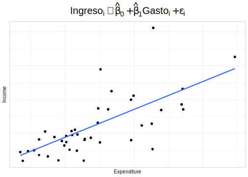
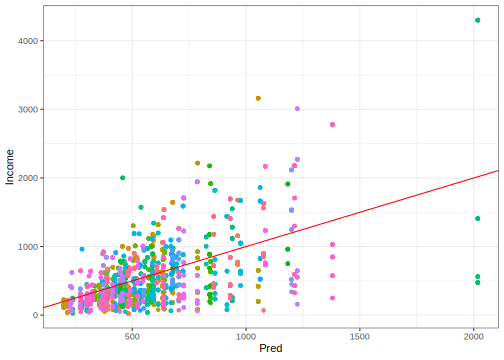
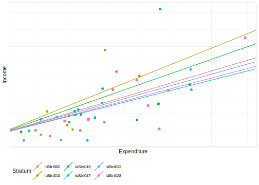
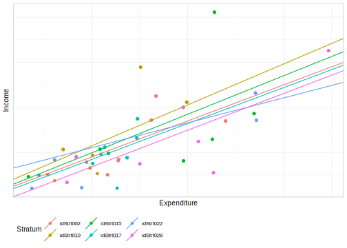
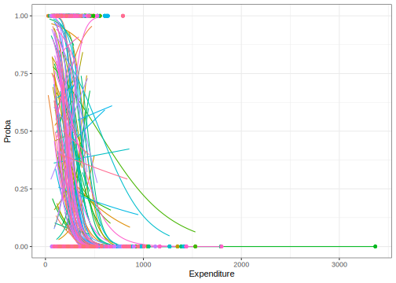

# Modelos multinivel

Los modelos multinivel, también conocidos como modelos de efectos mixtos o modelos jerárquicos, son una técnica estadística utilizada en el análisis de datos de encuestas de hogares para incorporar una estructura jerárquica o multinivel. En estas encuestas, los datos se recopilan a nivel individual (por ejemplo, sobre la edad, el género y la educación de cada miembro del hogar) y a nivel del hogar (por ejemplo, sobre el ingreso del hogar, la propiedad de la vivienda y la ubicación geográfica). Además, permiten analizar cómo los factores a nivel del hogar y a nivel individual influyen en las respuestas a las preguntas de la encuesta. Por ejemplo, un modelo multinivel podría utilizarse para investigar cómo el ingreso del hogar y la edad de los miembros del hogar influyen en el consumo de alimentos saludables.

En los modelos multinivel, se trabajan con dos tipos de efectos: los efectos aleatorios y los efectos fijos. Los efectos fijos representan las relaciones promedio entre las variables, mientras que los efectos aleatorios modelan la variación en estas relaciones entre los hogares. De esta manera, los modelos multinivel permiten tener en cuenta la heterogeneidad en la población y obtener estimaciones más precisas de las variables de interés. Por tanto, los modelos multinivel son una herramienta valiosa en el análisis de datos de encuestas de hogares al permitir analizar cómo los factores a nivel del hogar y a nivel individual influyen en las respuestas a las preguntas de la encuesta y al tener en cuenta la estructura jerárquica de los datos.

Algunas referencias bibliográficas relevantes sobre el uso de modelos multinivel en encuestas de hogares son @goldstein2011, que es una referencia clásica para el análisis de datos multinivel, y aborda el uso de modelos jerárquicos en una variedad de contextos, incluyendo encuestas de hogares; @gelmanhill2019, que ofrece una introducción accesible a la teoría y la práctica de los modelos jerárquicos; @rabe2012multilevel, el cual es una guía práctica para el análisis de datos multinivel y longitudinales utilizando el software estadístico Stata; @browne2006comparison que compara los enfoques Bayesianos y frecuentistas basados en verosimilitud.

Para iniciar este capítulo se cargan las librerías necesarias, la base de datos y el tema de la Cepal para realizar los gráficos:

Cargue de librerías:

```r
knitr::opts_chunk$set(cache = TRUE, warning = FALSE, message = FALSE, error = FALSE)
options(digits = 4)
options(tinytex.verbose = TRUE)
library (survey)
library(srvyr)
library(convey)
library(TeachingSampling)
library(printr)
library(stargazer)
library(broom)
library(jtools)
library(modelsummary)
library(patchwork)
library(ggplot2)
```

Cargue de la base de datos:


```r
encuesta <- readRDS("Data/encuesta.rds")  %>%
  mutate(Age2 = I(Age ^ 2))
```

Creando el tema de la CEPAL para generar los gráficos en este capítulo:


```r
theme_cepal <- function(...) theme_light(10) + 
  theme(axis.text.x = element_blank(),
        axis.ticks.x = element_blank(),
        axis.text.y = element_blank(),
        axis.ticks.y = element_blank(),
        legend.position="bottom", 
        legend.justification = "left", 
        legend.direction="horizontal",
        plot.title = element_text(size = 20, hjust = 0.5),
        ...) 
```


Para efectos de ejemplificar los conceptos que se presentarán en este capítulo, primero considere que la muestra tiene una naturaleza jerárquica, puesto que las viviendas fueron seleccionadas a partir de los estratos. Luego, el estrato será usado para analizar el comportamiento del fenómeno de interés.


```r
encuesta_plot <- encuesta %>%
  dplyr::select(HHID, Stratum) %>% unique() %>%
  group_by(Stratum)  %>% tally() %>%
  arrange(desc(n)) %>% dplyr::select(-n) %>%
  slice(1:6L) %>%
  inner_join(encuesta) %>% filter(Expenditure < 700) %>%
  dplyr::select(Income, Expenditure, Stratum,
                Sex, Region, Zone)
encuesta_plot  %>% slice(1:10L)
```


| Income| Expenditure|Stratum   |Sex    |Region |Zone  |
|------:|-----------:|:---------|:------|:------|:-----|
|  697.3|       296.1|idStrt017 |Male   |Norte  |Rural |
|  697.3|       296.1|idStrt017 |Female |Norte  |Rural |
|  697.3|       296.1|idStrt017 |Male   |Norte  |Rural |
|  697.3|       296.1|idStrt017 |Female |Norte  |Rural |
|  526.8|       294.8|idStrt017 |Male   |Norte  |Rural |
|  526.8|       294.8|idStrt017 |Female |Norte  |Rural |
|  526.8|       294.8|idStrt017 |Female |Norte  |Rural |
|  526.8|       294.8|idStrt017 |Male   |Norte  |Rural |
|  526.8|       294.8|idStrt017 |Male   |Norte  |Rural |
|  526.8|       294.8|idStrt017 |Female |Norte  |Rural |

A modo introductorio, en el siguiente gráfico se ajusta un modelo lineal simple cuya variable de interés son los ingresos de los hogares con una sola variable explicativa correspondiente a los gastos de los hogares, sin considerar el efecto de los estratos en el diseño muestral.


```r
library(latex2exp)
ggplot(data = encuesta_plot,
       aes(y = Income, x = Expenditure)) +
  geom_jitter() +
  theme(legend.position = "none",
        plot.title = element_text(hjust = 0.5)) +
  geom_smooth(formula = y ~ x,
              method = "lm",
              se = F) +
  ggtitle(
    latex2exp::TeX(
      "$Ingreso_{i}\\sim\\hat{\\beta}_{0}+\\hat{\\beta}_{1}Gasto_{i}+\\epsilon_{i}$"
    )
  ) +
  theme_cepal()
```



Como se ha explicado en capítulos anteriores, el modelo de regresión se basa en varios supuestos principales con respecto a la naturaleza de los datos en la población; más específicamente asume independencia de las observaciones. Naturalmente este supuesto no es válido, más aún cuando la selección de la muestra se hace de para cada estrato de muestreo y además, el comportamiento de los estratos muestrales es diferente entre ellos. Teniendo en cuenta lo anterior, se ajusta un modelo de regresión en donde el intercepto cambia de acuerdo con cada estrato. Por lo general, nos referimos a la estructura de datos descrita anteriormente como anidada, lo que significa que los puntos de datos individuales en un nivel (por ejemplo, la persona o el hogar) aparecen solo en un nivel de una variable de nivel superior, como el estrato de muestreo. Por lo tanto, las personas u hoagres están anidados dentro del estrato. 


## Modelo con intercepto aleatorio

En el análisis de los modelos multinivel hay dos tipos de estimaciones que son relevantes. La primera asociada con los coeficientes de regresión, generalmente denominados como los parámetros fijos del modelo; la segunda con las estimaciones de la varianza, generalmente denominadas parámetros aleatorios del modelo. Cualquier análisis de regresión multinivel siempre debe comenzar con la estimación de la varianza de ambos niveles para la variable dependiente. 

El primer paso recomendado en el análisis de regresión multinivel consiste en una descomposición de la varianza de la variable dependiente en los diferentes niveles. Por ejemplo, asumiendo que la variable de interés es el ingreso de las personas y que existe una naturaleza jerárquica entre estas y el estrato, entonces la varianza del ingreso se puede descomponer en dos partes: la varianza dentro del estrato y la varianza entre los estratos. Estos dos componentes de varianza se pueden obtener en una regresión multinivel simple con un modelo nuelo dado por la siguiente expresión: 

$$
y_{ij}=\beta_{0j}+\epsilon_{ij}
$$
En donde, el intercepto depende de manera jerárquica de los estratos; así:

$$
\beta_{0j}=\gamma_{00}+\tau_{0j}
$$
En las anteriroes expresiones, $y_{ij}=$ representa los ingresos de la persona $i$ en el estrato $j$; $\beta_{0j}$ es el intercepto en el estrato $j$; $\epsilon_{ij}$ es el residual de la persona $i$ en el estrato $j$; $\gamma_{00}$ es el intercepto general y $\tau_{0j}$ es el efecto aleatorio para el intercepto. Para este modelo se asume que, 

$$
\tau_{0j}\sim N\left(0,\sigma_{\tau}^{2}\right)
$$ 
Además, 

$$
\epsilon_{ij}\sim N\left(0,\sigma_{\epsilon}^{2}\right)
$$. 


@cai2013investigation afirma que existe evidencia suficiente de que las ponderaciones de muestreo deben usarse en el modelado multinivel para obtener estimaciones insesgadas. Actualmente, diferentes autores recomiendan diferentes enfoques sobre cómo usar los pesos de muestreo en modelos jerárquicos. Por ejemplo, @pfeffermann1998weighting y @asparouhov2006general aconsejan utilizar un enfoque de pseudomáxima verosimilitud para calcular estimaciones dentro y entre los diferentes niveles para obtener estimaciones insesgadas.

A continuación se empezará a ejemplificar el ajuste de los modelos multinivel con encuestas complejas, iniciando con el ajuste de un modelo nulo. Para ajustar los modelos multinivel en `R` se usará la función `lmer()` de la librería `lme4`, usando para el ajuste la ponderación de Pfefferman, tal como se vio en los capítulos anteriores.


```r
modwk <-
  lm(wk ~ Expenditure + Zone + Sex + Age2, data = encuesta)
wkpred <- predict(modwk)
encuesta %<>% mutate(qw = wk / wkpred)
```

El siguiente código en `R` utiliza la función `lmer` del paquete `lme4` para ajustar un modelo multinivel nulo, en donde se quiere modelar el comportamiento de la variable `Income` en función de `Stratum`. El término `(1 | Stratum)` indica un efecto aleatorio para cada estrato de muestreo en la encuesta. Además, el argumento `weights = qw` especifica el vector de pesos de muestreo.


```r
library(lme4)

mod_null  <- lmer(Income  ~ (1  |  Stratum),
                  data  =  encuesta,
                  weights  =  qw)
```

El siguiente código devuelve los coeficientes de los efecto aleatorios para cada estrato en el modelo multinivel nulo ajustado. Estos coeficientes proporcionar información sobre cómo varían los ingresos para diferentes niveles de la variable categórica estrato


```r
head(coef(mod_null)$Stratum)
```


|          | (Intercept)|
|:---------|-----------:|
|idStrt001 |       639.4|
|idStrt002 |       508.4|
|idStrt003 |       485.3|
|idStrt004 |       963.4|
|idStrt005 |       520.1|
|idStrt006 |       440.9|

Un concepto de interés en este tipo de análisis es la correlación intra-clásica (ICC, por sus siglas en inglés) que hace referencia a la proporción de la varianza total de una variable que se explica por las diferencias entre los grupos o niveles (estratos) en el modelo. En otras palabras, la ICC mide la similitud o correlación entre las observaciones dentro del mismo grupo o nivel en comparación con las observaciones de diferentes grupos. Esta cantidad se calcula como: 

$$
\rho=\frac{\sigma_{\tau}^{2}}{\sigma_{\tau}^{2}+\sigma_{\epsilon}^{2}}
$$

Una ICC alta indica que una gran proporción de la variación total de la variable se debe a las diferencias entre los grupos, lo que sugiere que los grupos son distintos entre sí y que los efectos de los grupos deben ser considerados en el modelo. Por otro lado, una ICC baja indica que la mayoría de la variación en la variable está dentro de los grupos y que los efectos de los grupos no son tan importantes para explicar la variabilidad en la variable.

Para efectos de ejemplificar el cálculo de la correlación intraclases, se utiliza la función `icc` de la librería `performance`. El cálculo es el siguiente:


```r
performance::icc(mod_null)
```


| ICC_adjusted| ICC_unadjusted|optional |
|------------:|--------------:|:--------|
|       0.3366|         0.3366|FALSE    |

se puede observar que la correlación intraclase, utilizando el modelo nulo es de casi el 34%, porcentaje de varianza que se atribuye a la diferencia entre los estratos. Por otro lado, como el modelo que se está ajustando es el nulo, la predicción del ingreso para cualquier individuo en el mismo estrato será constante, como se muestra a continuación:


```r
(tab_pred <- data.frame(Pred = predict(mod_null), 
           Income = encuesta$Income, 
           Stratum = encuesta$Stratum)) %>% distinct() %>% 
  slice(1:6L) # Son las pendientes aleatorias
```


|   |  Pred|  Income|Stratum   |
|:--|-----:|-------:|:---------|
|1  | 639.4|  409.87|idStrt001 |
|6  | 639.4|  823.75|idStrt001 |
|10 | 639.4|   90.92|idStrt001 |
|13 | 639.4|  135.33|idStrt001 |
|18 | 639.4|  336.19|idStrt001 |
|22 | 639.4| 1539.75|idStrt001 |

A continuación se muestra la estimación del ingreso en cada estrato de muestreo en relación con el ingreso. Se observa que la predicción en cada estrato es la misma (puntos del mismo color) y que existe una variación mayor a medida que el ingreso aumenta. 


```r
ggplot(data = tab_pred, aes(x = Pred, y = Income, colour = Stratum)) + 
  geom_point() + geom_abline(intercept = 0, slope = 1, colour = "red") +
  theme_bw() + theme(legend.position = "none") 
```



## Modelo con pendiente aleatoria

Este tipo de modelos permiten que la relación entre la variable independiente y la variable dependiente cambie según alguna otra variable explicativa. En otras palabras, permite que la pendiente de la relación entre las variables sea diferente a medida que lo grupos o subconjuntos de datos. En un modelo de regresión lineal simple, la relación entre la variable independiente y la variable dependiente se modela como una línea recta con una pendiente fija. Sin embargo, en un modelo con pendiente aleatoria, se permite que la pendiente varíe según otra variable explicativa.

En este tipo de modelos, la relación entre las variables puede suponer una curva con diferentes pendientes para diferentes subgrupos. Los modelos con pendiente aleatoria son útiles en situaciones donde se espera que la relación entre las variables cambie de manera no lineal o cuando se desea modelar diferencias en la pendiente entre subgrupos. Consideremos el siguiente modelo:

$$
Ingreso_{ij}=\beta_{0}+\beta_{1j}Gasto_{ij}+\epsilon_{ij}
$$

donde $\beta_{1j}$ esta dado como

$$
\beta_{1j} = \gamma_{10}+\gamma_{11}Stratum_{j} + \tau_{1j}
$$
Para este caso en particular, la pendiente varía de acuerdo con los estratos de muestreo, no así el intercepto que seguirá fijo siempre. Para ajustar el modelo se utiliza la función `lmer` como se muestra a continuación:


```r
mod_Pend_Aleatoria <- lmer(Income ~ 1 + (0 + Expenditure | Stratum),
                          data = encuesta,
                          weights  =  qw)
```

Para cada estrato se tienen las siguientes estimaciones para las pendientes aleatorias $\beta_{1j}$:


```r
coef(mod_Pend_Aleatoria)$Stratum %>% slice(1:8L)
```


|          | Expenditure| (Intercept)|
|:---------|-----------:|-----------:|
|idStrt001 |      1.8914|       148.8|
|idStrt002 |      1.2666|       148.8|
|idStrt003 |      1.1200|       148.8|
|idStrt004 |      1.4717|       148.8|
|idStrt005 |      0.8316|       148.8|
|idStrt006 |      0.7942|       148.8|
|idStrt007 |      0.8950|       148.8|
|idStrt008 |      0.8070|       148.8|

Organizando los coeficientes en un gráfico se tiene:


```r
Coef_Estimado <- inner_join(
  coef(mod_Pend_Aleatoria)$Stratum %>%
    add_rownames(var = "Stratum"),
  encuesta_plot %>% dplyr::select(Stratum) %>% distinct()
)

ggplot(data = encuesta_plot,
       aes(y = Income, x = Expenditure,
           colour = Stratum)) +
  geom_jitter() + theme(legend.position = "none",
                        plot.title = element_text(hjust = 0.5)) +
  geom_abline(
    data = Coef_Estimado,
    mapping = aes(
      slope = Expenditure,
      intercept = `(Intercept)`,
      colour = Stratum
    )
  ) +
  theme_cepal()
```



Se puede observar que la estimación de la pendiente varía de manera importante para cada uno de los estratos pero que, al imponer la restricción de un intercepto común para todos los estratos, no hay un buen ajuste en general. Por otro lado, la estimación de los ingresos para las unidades observadas usando este modelo se muestra a continuación:


```r
data.frame(
  Pred = predict(mod_Pend_Aleatoria),
  Income = encuesta$Income,
  Stratum = encuesta$Stratum
) %>%
  distinct() %>%
  slice(1:6L) 
```


|   |   Pred|  Income|Stratum   |
|:--|------:|-------:|:---------|
|1  |  803.8|  409.87|idStrt001 |
|6  |  890.6|  823.75|idStrt001 |
|10 |  288.8|   90.92|idStrt001 |
|13 |  307.2|  135.33|idStrt001 |
|18 |  640.8|  336.19|idStrt001 |
|22 | 1159.6| 1539.75|idStrt001 |

Gráficamente se muestran las estimaciones versus los valores estimados de los ingresos y se logra observar que la predicción está más cerca a la línea de 45 grados que el modelo anterior. 


```r
ggplot(data = tab_pred, aes(x = Pred, y = Income, colour = Stratum)) +
  geom_point() +
  geom_abline(intercept = 0,
              slope = 1,
              colour = "red") +
  theme_bw() +
  theme(legend.position = "none") 
```


## Modelo con intercepto y pendiente aleatoria

Los modelos con intercepto y pendiente aleatoria son un tipo de modelo estadístico que permite modelar la relación entre una variable de respuesta y una o más variables predictoras, teniendo en cuenta tanto efectos fijos como efectos aleatorios en donde el intercepto y la pendiente varían según el subgrupo de interés. En estos modelos, los coeficientes de la regresión (es decir, la pendiente y el intercepto) se consideran aleatorios en lugar de fijos. Esto significa que se asume que estos coeficientes pueden variar entre las unidades de análisis, que pueden ser individuos, grupos, regiones geográficas, etc. Estas variaciones se modelan como efectos aleatorios que se incorporan en la ecuación de regresión. Siguiendo con la encuesta de hogares, consideremos el siguiente modelo:

$$
Ingreso_{ij}=\beta_{0j}+\beta_{1j}Gasto_{ij}+\epsilon_{ij}
$$

En donde, 

$$
\beta_{0j} = \gamma_{00}+\gamma_{01}Stratum_{j} + \tau_{0j}
$$
Y, 

$$
\beta_{1j} = \gamma_{10}+\gamma_{11}Stratum_{j} + \tau_{1j}
$$

El ajuste del modelo se realiza utilizando la función `lmer` como se presenta a continuación:


```r
mod_IntPend_Aleatoria <-
  lmer(Income ~ Expenditure  + (1 + Expenditure | Stratum),
       data = encuesta,
       weights  =  qw)
```

Los coeficientes del modelo son:


```r
coef(mod_IntPend_Aleatoria)$Stratum %>% slice(1:10L)
```


|          | (Intercept)| Expenditure|
|:---------|-----------:|-----------:|
|idStrt001 |     -229.29|      2.7555|
|idStrt002 |       36.19|      1.6039|
|idStrt003 |      151.78|      1.1637|
|idStrt004 |      219.82|      1.3600|
|idStrt005 |      -87.91|      1.2818|
|idStrt006 |       29.15|      1.2178|
|idStrt007 |       40.63|      1.0783|
|idStrt008 |      164.18|      0.9288|
|idStrt009 |       20.03|      0.8187|
|idStrt010 |       91.05|      1.8226|

Gráficamente,


```r
Coef_Estimado <- inner_join(
  coef(mod_IntPend_Aleatoria)$Stratum %>%
    add_rownames(var = "Stratum"),
  encuesta_plot %>% dplyr::select(Stratum) %>% distinct()
)

ggplot(data = encuesta_plot,
       aes(y = Income, x = Expenditure,
           colour = Stratum)) +
  geom_jitter() + theme(legend.position = "none",
                        plot.title = element_text(hjust = 0.5)) +
  geom_abline(
    data = Coef_Estimado,
    mapping = aes(
      slope = Expenditure,
      intercept = `(Intercept)`,
      colour = Stratum
    )
  ) +
  theme_cepal()
```



Como se pudo observar en la gráfica anterior, el ajuste del modelo con intercepto y pendiente aleatoria se ajusta mejor a los datos que los otros dos modelos mostrados anteriormente. A continuación, se realizan las predicciones de los ingresos con el modelo:


```r
data.frame(
  Pred = predict(mod_IntPend_Aleatoria),
  Income = encuesta$Income,
  Stratum = encuesta$Stratum
) %>%
  distinct() %>%
  slice(1:6L)
```


|   |     Pred|  Income|Stratum   |
|:--|--------:|-------:|:---------|
|1  |  725.059|  409.87|idStrt001 |
|6  |  851.538|  823.75|idStrt001 |
|10 |  -25.189|   90.92|idStrt001 |
|13 |    1.594|  135.33|idStrt001 |
|18 |  487.643|  336.19|idStrt001 |
|22 | 1243.348| 1539.75|idStrt001 |

Para poder ver qué tan buena son las predicciones, se realiza el siguiente gráfico:


```r
ggplot(data = tab_pred, aes(x = Pred, y = Income, colour = Stratum)) +
  geom_point() +
  geom_abline(intercept = 0,
              slope = 1,
              colour = "red") +
  theme_bw() +
  theme(legend.position = "none") 
```


Ahora bien, para robustecer el modelo, se ajusta nuevamente, pero agregando la variable zona como se muestra a continuación:


$$
Ingreso_{ij}=\beta_{0j}+\beta_{1j}Gasto_{ij}+\beta_{2j}Zona_{ij} +\epsilon_{ij}
$$

Donde,

$$
\beta_{0j} = \gamma_{00}+\gamma_{01}Stratum_{j} + \gamma_{02}\mu_{j}  + \tau_{0j}
$$

Además, 

$$
\beta_{1j} = \gamma_{10}+\gamma_{11}Stratum_{j} + \gamma_{12}\mu_{j} + \tau_{1j}
$$

Y,

$$
\beta_{2j} = \gamma_{20}+\gamma_{21}Stratum_{j} + \gamma_{12}\mu_{j} + \tau_{2j}
$$

donde $\mu_{j}$ es el gasto medio de los hogares en el estrato $j$. En `R` el ajuste se hace de la siguiente manera: 


```r
media_estrato <- encuesta %>% group_by(Stratum) %>%
  summarise(mu = mean(Expenditure))

encuesta <- inner_join(encuesta, media_estrato, by = "Stratum")

mod_IntPend_Aleatoria2 <-
  lmer(
    Income ~ 1 + Expenditure + Zone + mu +
      (1 + Expenditure + Zone + mu | Stratum),
    data = encuesta,
    weights  =  qw
  )
```

calculando las predicciones de los ingresos de los hogares por estrato:


```r
data.frame(
  Pred = predict(mod_IntPend_Aleatoria2),
  Income = encuesta$Income,
  Stratum = encuesta$Stratum
) %>%
  distinct() %>%
  slice(1:6L)
```


|   |    Pred|  Income|Stratum   |
|:--|-------:|-------:|:---------|
|1  |  723.19|  409.87|idStrt001 |
|6  |  847.74|  823.75|idStrt001 |
|10 |  -15.60|   90.92|idStrt001 |
|13 |   10.78|  135.33|idStrt001 |
|18 |  489.40|  336.19|idStrt001 |
|22 | 1233.57| 1539.75|idStrt001 |


## Modelo logístico  multinivel.

Los modelos logísticos multinivel son una extensión de los modelos logísticos simples, que se utilizan para predecir la probabilidad de un resultado binario en función de una o varias variables explicativas. Sin embargo, en muchas situaciones, los datos se recogen de individuos que están agrupados en diferentes niveles o unidades de análisis, como escuelas, ciudades o países. En estos casos, los modelos logísticos simples pueden no ser suficientes para capturar la estructura jerárquica de los datos y la variación en las respuestas entre los diferentes grupos. Estos modelos resuelven este problema al permitir que los coeficientes del modelo varíen a través de los diferentes niveles de análisis. 

Además, los modelos logísticos multinivel permiten incluir tanto variables a nivel individual como variables a nivel de grupo, lo que aumenta la precisión de las estimaciones y la capacidad de explicar la variabilidad en las respuestas. También permiten estimar la varianza en las respuestas entre los diferentes grupos, lo que es útil para identificar las fuentes de variabilidad y para comparar la variabilidad entre grupos. 

Sea la variable $y_{ij} = 1$ si el individuo $i$ en el estrato $j$ está por encima de la línea de pobreza y $y_{ij} = 0$  en caso contrario, la variable $y_{ij}$ se puede modelar mediante el modelo logístico: 

$$
\pi_{ij}=Pr\left(y_{ij}\right)=Pr\left(y_{ij}=1\mid \boldsymbol{X}, \boldsymbol{\beta}\right)=\frac{\exp\left(\boldsymbol{\beta}_{j}\boldsymbol{x}_{ij}\right)}{1+\exp\left(\boldsymbol{\beta}_{j}\boldsymbol{x}_{ij}\right)}
$$ 

Ó también, 

$$
\log\left(\frac{\pi_{ij}}{1-\pi_{ij}}\right)=\boldsymbol{\beta}_{j}\boldsymbol{x}_{ij}
$$


Los modelos logísticos con intercepto y pendiente aleatoria son un tipo de modelo logístico multinivel que permiten que tanto el intercepto como la pendiente varíen aleatoriamente entre los diferentes grupos de observación. En los modelos logísticos básicos, la relación entre las variables predictoras y la variable de respuesta se modela mediante una función logística, donde la respuesta es la probabilidad de que el resultado binario ocurra. En los modelos con intercepto y pendiente aleatoria, la función logística se ajusta para cada grupo de observación, y tanto el intercepto como la pendiente son variables aleatorias que varían de un grupo a otro. Esto permite que los coeficientes del modelo, que representan la relación entre las variables predictoras y la respuesta, varíen según el grupo de observación.

Por ejemplo, asuma que se quiere modelar la pobreza en términos del gasto y que se considera que el estrato es importante en la variación de este fenómeno. El modelo se define de la siguiente manera:

$$
logit(Pobreza_{ij})=\beta_{0j}+\beta_{1j}Gasto_{ij}+\epsilon_{ij}
$$

En donde,

$$
\beta_{0j} = \gamma_{00}+\gamma_{01}Stratum_{j} + \tau_{0j}
$$

Además, 

$$
\beta_{1j} = \gamma_{10}+\gamma_{11}Stratum_{j} + \tau_{1j}
$$

En `R`, el ajuste se hace de la siguiente manera:


```r
encuesta <-
  encuesta %>% mutate(pobreza = ifelse(Poverty != "NotPoor", 1, 0))

mod_logit_Pen_Aleatorio <-
  glmer(
    pobreza ~ Expenditure  + (1 + Expenditure | Stratum),
    data = encuesta,
    weights  =  qw,
    binomial(link = "logit")
  )
```

Los coeficientes del modelo son:


```r
coef(mod_logit_Pen_Aleatorio)$Stratum %>%
  slice(1:10L)
```


|          | (Intercept)| Expenditure|
|:---------|-----------:|-----------:|
|idStrt001 |      4.9568|     -0.0256|
|idStrt002 |      9.7610|     -0.0351|
|idStrt003 |     -1.1263|     -0.0068|
|idStrt004 |      1.9918|     -0.0158|
|idStrt005 |      8.1255|     -0.0264|
|idStrt006 |     -1.1729|      0.0089|
|idStrt007 |      0.9893|     -0.0121|
|idStrt008 |      1.4810|     -0.0057|
|idStrt009 |      3.6139|     -0.0043|
|idStrt010 |      4.1611|     -0.0206|

Gráficamente el ajuste de los modelo se muestra a continuación:


```r
dat_pred <- encuesta %>% group_by(Stratum) %>%
  summarise(Expenditure = list(seq(min(Expenditure), max(Expenditure), len = 100))) %>%
  tidyr::unnest_legacy()

dat_pred <-
  mutate(dat_pred,
         Proba = predict(mod_logit_Pen_Aleatorio, newdata = dat_pred , type = "response"))

ggplot(data = dat_pred,
       aes(y = Proba, x = Expenditure,
           colour = Stratum)) +
  geom_line() +   theme_bw() +
  geom_point(data = encuesta, aes(y = pobreza, x = Expenditure)) +
  theme(legend.position = "none",
        plot.title = element_text(hjust = 0.5))  
```



Las predicciones se muestran a continuación:


```r
(tab_pred <- data.frame(
  Pred = predict(mod_logit_Pen_Aleatorio,
                 type = "response"), 
           pobreza = encuesta$pobreza, 
           Stratum = encuesta$Stratum, 
           qw = encuesta$qw)) %>% distinct() %>% 
  slice(1:6L) 
```


|   Pred| pobreza|Stratum   |     qw|
|------:|-------:|:---------|------:|
| 0.0194|       0|idStrt001 | 0.6193|
| 0.0194|       0|idStrt001 | 0.6058|
| 0.0194|       0|idStrt001 | 0.6089|
| 0.0194|       0|idStrt001 | 0.6242|
| 0.0194|       0|idStrt001 | 0.6096|
| 0.0061|       0|idStrt001 | 0.6079|

La calidad de la predicción del modelo es muy buena como se muestra a continuación:


```r
tab_pred %>% 
  summarise(Pred = weighted.mean(Pred, qw), 
            pobreza = weighted.mean(pobreza,qw))
```


|   Pred| pobreza|
|------:|-------:|
| 0.3881|  0.3895|
