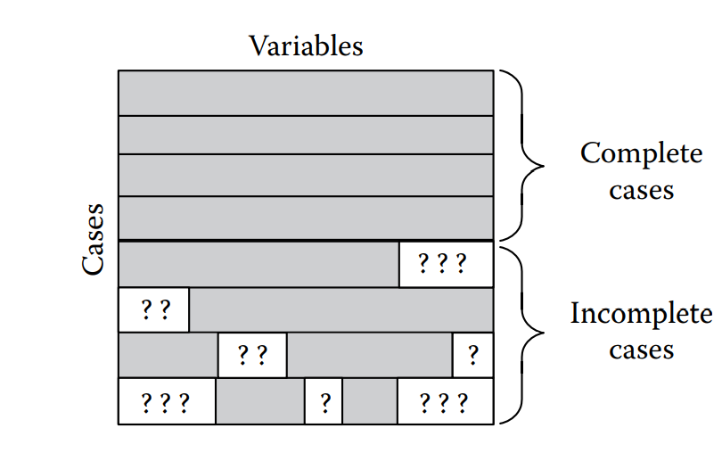
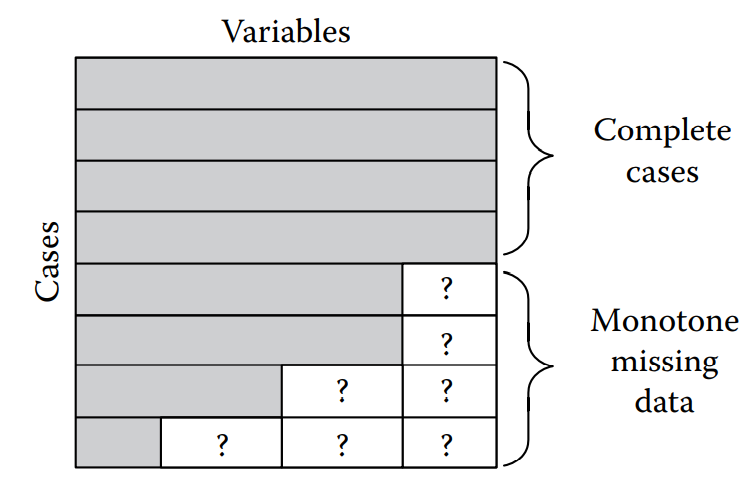
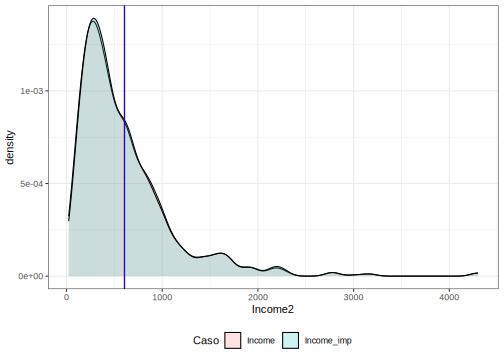

# Imputación múltiple en encuestas de hogares

La ausencia de respuesta es un fenómeno normal y común en las encuestas de hogares, más aún después de la pandemia por Covid-19. Las razones para la aparición de este fenómeno son múltiples; por ejemplo, una longitud extensa en los cuestionarios de las encuestas, la renuencia de los respondientes a entregar información sensible, por desastres naturales o violencia en los territorios que no permiten acceder a las áreas seleccionadas, entre muchas otras. Si la ausencia de respuesta en alguna variable de la encuesta es muy alta, puede poner en riesgo la calidad de las estimaciones que se obtienen utilizando los estimadores clásicos. 

El objetivo principal de este capítulo es abordar el problema de la falta de datos en encuestas de hogares, revisar las posibles causas, el impacto que tiene en la estimación de los indicadores, y mostrar algunas soluciones a la falta de datos en las encuesta. En este sentido, alguno de los avances en la teoría de los métodos en el contexto de muestras complejas son la imputación múltiple [@vanbuuren2012flexible, @carpenter2013multiple, @berglund2014multiple, @raghunathan2016missing] y la imputación fraccional [@kim2004fractional, @kim2014statistical].

## Tres patrones para la ausencia de respuesta

Siguiendo las ideas anteriores, sea $\boldsymbol{X}_{n \times p} = x_{ij}$ una matriz completa (sin valores perdidos) de tal forma que $X_{ij}$ es el valor de la variable $j$ con $j=1, \dots, p$ e $i$ con $i=1, \dots, n$. Adicionalmente, se define $\boldsymbol{M}_{n \times p} = m_{ij}$ una matriz indicadoradonde $m_{ij} = 1$ si el valor de $x_{ij}$ es un dato perdido y $m_{ij}=0$ si $x_{ij}$ está presente. Ahora bien, note que la matriz $M$ describe un patrón de datos faltantes que la media marginal de columna puede ser interpretada como la probabilidad de que $x_{ij}$ sea faltante A continuación, se describen alguna de las particularidades de la matriz $\boldsymbol{M}_{n \times p}$:


- La matriz $\boldsymbol{M}_{n \times p}$ presenta un comportamiento completamente al azar (MCAR, por sus siglas en inglés) si la probabilidad de respuesta es completamente independiente de las variables observadas y de las no observadas. En este caso, el mecanismo de respuesta es ignorable tanto para inferencias basadas en muestreo como en máxima verosimilitud.
- La matriz $\boldsymbol{M}_{n \times p}$ presenta un comportamiento al azar (MAR, por sus siglas en inglés) si la probabilidad de respuesta es completamente independiente de las variables no observadas y no de las observadas. En este caso, el mecanismo de respuesta se considera ignorable para inferencias basadas en máxima verosimilitud.
- La matriz $\boldsymbol{M}_{n \times p}$ presenta un comportamiento no al azar (MNAR, por sus siglas en inglés) si la probabilidad de respuesta no es completamente independiente de las variables no observadas y posiblemente también de las observadas. El mecanismo de respuesta es no ignorable.

En las dos figuras siguientes, se ilustran los casos de observaciones perdidas de manera aleatoria y con un patrón identificado:

{width="250"}
{width="250"}

Como se ha venido trabajando en los capítulos anteriores, primero carguemos la base de datos con la muestra seleccionada y con el fin de poder ejemplificar el tratamiento de datos faltantes, se incluirán manualmente valores perdidos. En este sentido, la lectura de la base se hará a continuación:


```r
encuesta <- readRDS("Data/encuesta.rds") 
```

En primera instancia, se filtran encuestados mayores a 15 años y se calcula  la proporción de la población desempleada, inactiva y empleada antes de generar los valores faltantes, ademas de cargar todas las librerías que se utilizarán en este capítulo:


```r
library (survey)
library(srvyr)
library(convey)
library(TeachingSampling)
library(printr)
library(stargazer)
library(broom)
library(jtools)
library(modelsummary)
library(patchwork)
library(ggplot2)

encuesta <- encuesta |> filter(Age >= 15)
(tab_antes <- prop.table(table(encuesta$Employment)))
```


| Unemployed| Inactive|  Employed|
|----------:|--------:|---------:|
|  0.0409792| 0.373603| 0.5854178|

También se calcula el promedio de ingresos en la muestra:


```r
(med_antes <- mean(encuesta$Income, na.rm = TRUE))
```

```
## [1] 604.2494
```

Luego de los conteos anteriores, se genera un 20% de valores faltantes siguiendo un esquema MCAR. En `R`, la función `sample_frac` es parte del paquete `dplyr` y se utiliza para seleccionar una fracción específica de filas de un conjunto de datos; esta función es útil cuando se desea obtener una muestra aleatoria de un porcentaje específico de observaciones.


```r
set.seed(1234)
encuesta_MCAR <-  sample_frac(encuesta, 0.8)
dat_plot <- bind_rows(list(encuesta_MCAR = encuesta_MCAR,
                           encuesta = encuesta),
                      .id = "Caso")
```


Ahora bien, para poder ver el efecto de la inclusión de datos faltantes de manera gráfica por zona y sexo para la variable ingreso, se realizan las siguientes gráficas:


```r
p1 <- ggplot(dat_plot, aes(x = Zone, y = Income)) +
  geom_boxplot() + facet_grid(. ~ Caso) + theme_bw() +
  geom_hline(yintercept = mean(encuesta$Income),
             col = "red")

p2 <- ggplot(dat_plot, aes(x = Sex, y = Income)) +
  geom_boxplot() + facet_grid(. ~ Caso) + theme_bw() +
  geom_hline(yintercept = mean(encuesta$Income),
             col = "red")

library(patchwork)
p1 | p2
```


Como se puede observar en las gráficas anteriores, la distribución de los ingresos por Zona y Sexo se mantiene similar con o sin presencia de los datos faltantes. Esto se debe a que la no respuesta que se incluyó no depende de la variable de estudio. Ahora bien, analizando la variable de interés se observa que tampoco hay cambios distribucionales notables entre las distribuciones con y sin datos faltantes por sexo, como se puede ver a continuación:


```r
p1 <- ggplot(dat_plot, aes(x = Income, fill = Caso)) +
  geom_density(alpha = 0.3) + theme_bw() +
  theme(legend.position = "bottom") +
  geom_vline(xintercept = mean(encuesta$Income),
             col = "red")

p2 <- ggplot(dat_plot, aes(x = Income, fill = Caso)) +
  geom_density(alpha = 0.3) + facet_grid(. ~ Sex) +
  theme_bw() +
  geom_vline(xintercept = mean(encuesta$Income),
             col = "red") +
  theme(legend.position = "none")

(p1 / p2)
```


Si graficamos ahora la variable gastos, se observan los mismos resultados que para ingresos.


```r
p1 <- ggplot(dat_plot, aes(x = Expenditure, fill = Caso)) +
  geom_density(alpha = 0.3) + theme_bw() +
  theme(legend.position = "bottom") +
  geom_vline(xintercept = mean(encuesta$Expenditure),
             col = "red")

p2 <- ggplot(dat_plot, aes(x = Expenditure, fill = Caso)) +
  geom_density(alpha = 0.3) + facet_grid(. ~ Sex) +
  theme_bw() +
  geom_vline(xintercept = mean(encuesta$Expenditure),
             col = "red") +
  theme(legend.position = "none")

(p1 / p2)
```


Por otro lado, simulemos ahora una pérdida de información al azar (MAR) que dependa de la Zona y del Sexo, como sigue:


```r
library(TeachingSampling)
set.seed(1234)

temp_estrato <- paste0(encuesta$Zone, encuesta$Sex)
table(temp_estrato)
```


| RuralFemale| RuralMale| UrbanFemale| UrbanMale|
|-----------:|---------:|-----------:|---------:|
|         481|       428|         531|       439|

```r
sel <- S.STSI(
  S = temp_estrato,
  Nh = c(481, 428, 531, 439),
  nh = c(20, 380, 20, 280)
)
encuesta_MAR <- encuesta[-sel, ]
dat_plot2 <- bind_rows(list(encuesta_MAR = encuesta_MAR,
                            encuesta = encuesta), .id = "Caso")
```

El código anterior utiliza la librería `TeachingSampling` para realizar un muestreo aleatorio en cada cruce. Primero, se establece la semilla aleatoria en `1234` para asegurarse de que los resultados sean reproducibles. A continuación, se crea una variable llamada `temp_estrato` que combina dos variables de la encuesta `Zone` y `Sex` utilizando la función `paste0` para crear grupos de estratos. La función `table` se usa para mostrar la frecuencia de cada estrato. Luego, se realiza el muestreo estratificado utilizando la función `S.STSI` cuyos argumentos son `S`, el vector de estratos creado anteriormente; `Nh`, el número de unidades en cada estrato (en este caso, 469, 411, 510 y 390); y `nh`,  el tamaño de muestra deseado para cada estrato (en este caso, 20, 380, 20 y 280). 

El resultado del muestreo estratificado es un vector de índices de fila que corresponden a las observaciones seleccionadas para la muestra. Luego, se crea un nuevo conjunto de datos llamado `encuesta_MAR` que excluye las observaciones seleccionadas en la muestra. Finalmente, se usa la función `bind_rows` del paquete `dplyr` para unir los dos conjuntos de datos (`encuesta` y `encuesta_MAR`) en un solo conjunto de datos llamado `dat_plot2`, con una nueva variable llamada `Caso`, que indica el caso de cada observación en el conjunto de datos.

Observemos gráficamente el efecto de la perdida de información en una encuesta en un esquema MAR:


```r
p1 <- ggplot(dat_plot2, aes(x = Caso, y = Expenditure)) +
  geom_hline(yintercept = mean(encuesta$Expenditure),
             col = "red") +
  geom_boxplot() +
  facet_grid(Zone ~ Sex) + theme_bw()

p1
```


En el gráfico anterior se logra observar un cambio en la distribución de los datos en las distintas desagregaciones cuando en la encuesta no se tiene pérdida de información y cuando sí se tiene con un esquema MAR. Naturalmente, esto afectaría en las estimaciones finales que se hagan de los parámetros estudiados. Con mayor claridad, se puede ver el cambio distribucional en la siguiente gráfica:


```r
p1 <- ggplot(dat_plot2, aes(x = Income, fill = Caso)) +
  geom_density(alpha = 0.3) + theme_bw() +
  theme(legend.position = "bottom") +
  geom_vline(xintercept = mean(encuesta$Income),
             col = "red")

p2 <- ggplot(dat_plot2, aes(x = Income, fill = Caso)) +
  facet_grid(. ~ Sex) +
  geom_density(alpha = 0.3) + theme_bw() +
  theme(legend.position = "none") +
  geom_vline(xintercept = mean(encuesta$Income),
             col = "red")

p1 / p2
```


Este comportamiento es natural que suceda en un esquema MAR de datos faltantes puesto que la probabilidad de que los datos estén ausentes está relacionada con los valores observados en otras variables del conjunto de datos. La ventaja que tienen los mecanismos MCAR y MAR es que se puede predecir el valor de los datos faltantes utilizando la información de otras variables disponibles en el conjunto de datos. Esto puede mejorar la calidad de los resultados de los análisis y evitar la necesidad de descartar observaciones con datos faltantes. Otra gráfica en donde se evidencia el cambio de distribución de los gastos entre hombres y mujeres. 


```r
p1 <- ggplot(dat_plot2,
             aes(x = Expenditure, fill = Caso)) +
  geom_density(alpha = 0.3) + theme_bw() +
  theme(legend.position = "bottom") +
  geom_vline(xintercept = mean(encuesta$Expenditure),
             col = "red")

p2 <- ggplot(dat_plot2,
             aes(x = Expenditure, fill = Caso)) +
  facet_grid(. ~ Sex) +
  geom_density(alpha = 0.3) + theme_bw() +
  theme(legend.position = "none") +
  geom_vline(xintercept = mean(encuesta$Expenditure),
             col = "red")

p1 / p2
```


Para seguir con la ejemplificación de los esquemas de datos faltantes, generaremos un esquema de pérdida de información en una encuesta NMAR. Como se mencionó al inicio de este capítulo, en este tipo de esquema la probabilidad de que un dato falte está relacionada con el propio valor de ese dato. En otras palabras, en un esquema NMAR, la probabilidad de que falte un dato no es independiente del valor de ese dato, sino que está influenciada por algún factor que puede estar relacionado con el fenómeno que se está estudiando. Esto puede llevar a que los datos faltantes introduzcan un sesgo apreciable en la inferencia y análisis estadístico de las encuestas de hogares, lo que hace que el manejo adecuado de los datos faltantes en este tipo de esquemas sea particularmente importante en la investigación.


```r
encuesta_MNAR <- encuesta %>%
  arrange(Income) %>%
  slice(1:1300L)

dat_plot3 <- bind_rows(list(encuesta_MNAR = encuesta_MNAR,
                            encuesta = encuesta), .id = "Caso")
```

El código anterior tiene como objetivo crear un nuevo conjunto de datos llamado `encuesta_MNAR` que contiene las primeras 1300 observaciones del conjunto de datos original `encuesta`, ordenadas por la variable `Income`. Evidentemente, la perdida de respuesta no es al azar, e implica que las personas con mayores ingresos no están respondiendo a la encuesta. Posteriormente, el código une el conjunto de datos original `encuesta` con el conjunto de datos `encuesta_MNAR` usando la función `bind_rows`, y crea una nueva variable llamada `Caso` que indica la fuente de los datos. Ahora bien, para ver el efecto que tiene en una encuesta el tener datos faltante con esquema NMAR, se ilustran los siguientes gráficos:


```r
p1 <- ggplot(dat_plot3, aes(x = Income, fill = Caso)) +
  geom_density(alpha = 0.2) + theme_bw() +
  theme(legend.position = "bottom") +
  geom_vline(xintercept = mean(encuesta$Income),
             col = "red") +
  geom_vline(xintercept = mean(encuesta_MNAR$Income),
             col = "blue")

p1
```


Como se puede observar en la gráfica anterior, la distribución de los ingresos cambia notablemente cuando se tienen datos faltantes con esquema NMAR, lo mismo sucede con la variable gastos, como se puede observar en la siguiente gráfica:


```r
p1 <- ggplot(dat_plot3,
             aes(x = Expenditure, fill = Caso)) +
  geom_density(alpha = 0.2) + theme_bw() +
  theme(legend.position = "bottom") +
  geom_vline(xintercept = mean(encuesta$Expenditure),
             col = "red") +
  geom_vline(xintercept = mean(encuesta_MNAR$Expenditure),
             col = "blue")

p1
```


Para ver más al detalle el impacto que tiene la no respuesta con un esquema NMAR, a continuación se muestra una gráfica del ingreso discriminada por sexo y por zona. También se nota un cambio en la distribución de los ingresos significativos.


```r
p1 <- ggplot(dat_plot3, aes(x = Caso, y = Income)) +
  geom_hline(yintercept = mean(encuesta$Income),
             col = "red") +  geom_boxplot() +
  facet_grid(Zone ~ Sex) + theme_bw()

p1
```


## Imputación por la media no condicional.

La imputación por la media no condicional consiste en reemplazar los valores faltantes con la media aritmética de la variable completa, sin tener en cuenta ninguna otra variable. Es decir, la media se calcula a partir de todos los valores disponibles en la variable en cuestión, independientemente de las características de los demás datos.

Para efectos de ejemplificar la solución del problema a los datos faltantes en una encuesta de hogares con un patrón MCAR generemos la siguiente base de datos:


```r
encuesta <- full_join(
  encuesta,
  encuesta_MCAR %>%
    dplyr::select(HHID, PersonID, Income, Employment) %>%
    mutate(
      Income_missing = Income,
      Employment_missin = Employment,
      Employment = NULL,
      Income = NULL
    )
)
```

El código anterior utiliza la función `full_join` de la librería `dplyr` de `R` para combinar los dos conjuntos de datos. La combinación se realiza mediante la unión completa, que devuelve todas las filas de ambas tablas, uniendo las filas con valores coincidentes y rellenando con valores faltantes para las columnas que no tienen una coincidencia en ambas tablas. Ahora bien, para tener como referencia el porcentaje de datos faltantes, se ejecuta el siguiente comando:


```r
encuesta %>% group_by(Zone) %>%
  summarise(Income = sum(is.na(Income_missing) / n()))
```


|Zone  |    Income|
|:-----|---------:|
|Rural | 0.2079208|
|Urban | 0.1927835|

```r
encuesta %>% group_by(Sex) %>%
  summarise(Income = sum(is.na(Income_missing) / n()))
```


|Sex    |    Income|
|:------|---------:|
|Female | 0.1837945|
|Male   | 0.2191465|

La imputación por la media no condicional es un método bastante simple y rápido, y puede ser útil en ciertas situaciones, especialmente cuando la variable en cuestión no tiene una distribución muy sesgada o cuando los valores faltantes son relativamente pocos en comparación con el tamaño de la muestra. Sin embargo, el método de imputación por la media no condicional también tiene limitaciones y puede no ser adecuado en todas las situaciones, especialmente cuando hay sesgos o patrones en los datos faltantes o cuando los datos están altamente correlacionados. Adicionalmente, este método no afecta el promedio, pero si afecta la variabilidad, el sesgo y los percentiles. A continuación, se ejemplifica con los datos de ejemplo este método:


```r
promedio <- mean(encuesta$Income_missing, na.rm = TRUE)
encuesta %<>% dplyr::mutate(Income_imp = ifelse(is.na(Income_missing),
                                                promedio, Income_missing))
sum(is.na(encuesta$Income_imp))
```

```
## [1] 0
```

En el código anterior la imputación se realiza utilizando la media aritmética de los valores no faltantes en `Income_missing` y se almacena en una nueva variable llamada `Income_imp`. La primera línea del código calcula la media aritmética de los valores no faltantes en la columna `Income_missing` y la almacena en una variable llamada `promedio`. La última línea cuenta el número de valores faltantes en la nueva `columna Income_imp` de la base de datos encuesta. Como es natural, después de la imputación, no existen valores faltantes.


```r
dat_plot4 <- tidyr::gather(
  encuesta %>% dplyr::select(Zone, Sex, Income, Income_imp),
  key = "Caso",
  value = "Income2",
  -Zone,
  -Sex
)

p1 <- ggplot(dat_plot4, aes(x = Income2, fill = Caso)) +
  geom_density(alpha = 0.2) + theme_bw() +
  theme(legend.position = "bottom") +
  geom_vline(xintercept = mean(encuesta$Income),
             col = "red") +
  geom_vline(xintercept = mean(encuesta$Income_imp),
             col = "blue")
p1
```


En la gráfica anterior se puede observar que la distribución real y la imputada para la variable de interés cambia de manera significativa; esto muestra que este método, para este conjunto de datos no es el más apropiado dado lo sesgado de la distribución de la variable ingresos. Un caso similar al anterior ocurre si graficamos la variable ingreso por zona y sexo. A continuación, se muestran los diagramas de cajas para revisar la distribución de los datos, arrojando nuevamente las conclusiones obtenidas con el gráfico anterior:


```r
p1 <- ggplot(dat_plot4, aes(x = Caso, y = Income2)) +
  geom_hline(yintercept = mean(encuesta$Income),
             col = "red") +  geom_boxplot() +
  facet_grid(Zone ~ Sex) + theme_bw()

p1
```


## Imputación por la media condicional

El método de imputación por la media condicional es una técnica utilizada en el análisis de datos para tratar valores faltantes o perdidos en una variable numérica. A diferencia del método de imputación por la media no condicional, el método de imputación por la media condicional tiene en cuenta otras variables en el conjunto de datos. Esta técnica se basa en la idea de que la media de una variable puede variar en función de los valores de otras variables. Por lo tanto, en lugar de simplemente reemplazar los valores faltantes con la media aritmética de la variable completa, se utiliza la media de la variable para grupos de observaciones que tienen valores similares en otras variables. El método de imputación por la media condicional puede ser más preciso que el método de imputación por la media no condicional en situaciones en las que las variables están correlacionadas o cuando hay patrones de valores faltantes en los datos.

A continuación, se ejemplifica la técnica de imputación utilizando la variable estrato para hacer el cálculo de los promedios por cada uno de los estratos y así poder imputar los datos faltantes, asumiendo que hay una relación directa entre los estratos y los ingresos de los hogares:


```r
encuesta %<>% group_by(Stratum) %>%
  mutate(Income_imp = ifelse(
    is.na(Income_missing),
    mean(Income_missing, na.rm = TRUE),
    Income_missing
  )) %>%
  data.frame()

sum(is.na(encuesta$Income_imp))
```

```
## [1] 0
```

```r
encuesta %<>%
  mutate(Income_imp = ifelse(is.na(Income_imp),
                             promedio, Income_imp))

sum(is.na(encuesta$Income_imp))
```

```
## [1] 0
```

El anterior código utiliza la función `group_by` para agrupar las observaciones de la base de datos de la encuesta por los niveles de la variable `Stratum`. Luego, se asigna el valor imputado a la columna `Income_imp` en la base de datos encuesta. Si un valor en la columna `Income_missing`es faltante, se reemplaza con la media aritmética de los valores no faltantes en `Income_missing` dentro del estrato correspondiente. Si no es NA, se mantiene el valor original. A continuación, se calculan las medias y desviaciones estándar tanto para los datos imputados como los originales y así poder comparar le efecto de la imputación realizada:


```r
encuesta %>%
  summarise(
    Income_ = mean(Income),
    Income_sd = sd(Income),
    Income_imp_ = mean(Income_imp),
    Income_imp_sd = sd(Income_imp)
  )
```


|  Income_| Income_sd| Income_imp_| Income_imp_sd|
|--------:|---------:|-----------:|-------------:|
| 604.2494|  513.1078|     611.545|      488.7209|

En este escenario, el sesgo relativo para el promedio de los ingresos es menor al 1.5%. Ahora bien, siguiendo la misma idea, el sesgo relativo para la desviación es cercano al 5%. Si se realiza la imputación utilizando la media condicional, agrupando por la variable zona, se tienen los siguientes resultados:


```r
encuesta %>%
  group_by(Zone) %>%
  summarise(
    Income_ = mean(Income),
    Income_sd = sd(Income),
    Income_imp_ = mean(Income_imp),
    Income_imp_sd = sd(Income_imp)
  )
```


|Zone  |  Income_| Income_sd| Income_imp_| Income_imp_sd|
|:-----|--------:|---------:|-----------:|-------------:|
|Rural | 469.1217|  336.5861|    477.9042|      305.5101|
|Urban | 730.8793|  609.0304|    736.7815|      585.6550|

Realizando el mismo ejercicio anterior, se obtienen sesgos relativos para la media de los ingresos para la zona rural de 1.87% y para la zona urbana de 0.8%. En ambos casos se observa una buena imputación de los ingresos. Ahora bien, para observar la distribución de los datos imputados en comparación con los no imputados se realizan las siguientes gráficas: 


```r
dat_plot5 <- tidyr::gather(
  encuesta %>%
    dplyr::select(Zone, Sex, Income, Income_imp),
  key = "Caso",
  value = "Income2",
  -Zone,
  -Sex
)

p1 <- ggplot(dat_plot5, aes(x = Income2, fill = Caso)) +
  geom_density(alpha = 0.2) +
  theme_bw() +
  theme(legend.position = "bottom") +
  geom_vline(xintercept = mean(encuesta$Income),
             col = "red") +
  geom_vline(xintercept = mean(encuesta$Income_imp),
             col = "blue")

p1
```


Se puede observar que, de manera general, la distribución de las observaciones imputadas y originales tienen un comportamiento mejor que con la media no condicional. Si se observa ahora la distribución de los datos por zona y sexo, se puede observar también una buena imputación de las observaciones.


```r
p1 <- ggplot(dat_plot5, aes(x = Caso, y = Income2)) +
  geom_hline(yintercept = mean(encuesta$Income),
             col = "red") +
  geom_boxplot() +
  facet_grid(Zone ~ Sex) +
  theme_bw()

p1
```


## Imputación por *Hot-Deck*

Esta imputación consiste en reemplazar los valores faltantes de una o más variables para un no respondiente (llamado receptor) con valores observados de un respondiente (el donante) similar al no respondiente con respecto a las características observadas en ambos casos. La técnica se basa en la idea de que las unidades similares pueden tener valores similares en las variables de interés. En este enfoque, se selecciona una observación donante que sea similar a la observación receptora en términos de características relevantes (por ejemplo, edad, género, ubicación geográfica, etc.), y se utiliza su valor observado para imputar el valor faltante en la observación receptora.

El término *Hot-Deck* hace referencia a una tarjeta perforada que se utilizaba en los primeros sistemas informáticos para almacenar y recuperar datos. Esta es una técnica relativamente simple y eficaz para imputar valores faltantes en conjuntos de datos pequeños o medianos, y se utiliza comúnmente en encuestas y estudios de investigación social. Sin embargo, puede ser menos efectiva en conjuntos de datos grandes o complejos, donde puede ser difícil encontrar observaciones similares o donde las características relevantes son difíciles de definir o medir de manera confiable.

A continuación, se presenta un código computacional que ejemplifica, para los datos que estamos usando en el capítulo, el uso del método.


```r
donante <- which(!is.na(encuesta$Income_missing))
receptor <- which(is.na(encuesta$Income_missing))
encuesta$Income_imp <- encuesta$Income_missing

set.seed(1234)
for (ii in receptor) {
  don_ii <- sample(x = donante, size = 1)
  encuesta$Income_imp[ii] <- encuesta$Income_missing[don_ii]
}

sum(is.na(encuesta$Income_imp))
```

```
## [1] 0
```

En el código mostrado anteriormente se describe a continuación, la primera línea del código selecciona las observaciones que no tienen valores faltantes en la variable `Income_missing`, la segunda línea selecciona las observaciones que tienen valores faltantes en la variable `Income_missing`; luego se crea una nueva variable `Income_imp` para almacenar los valores imputados. Finalmente, se utiliza un bucle `for` para iterar a través de cada observación receptora. Dentro del bucle, se utiliza la función `sample` para seleccionar una observación donante aleatoria de entre las observaciones que no tienen valores faltantes en la variable `Income_missing`.

Una vez realizada la imputación, se calcula la media y la desviación de los datos completos e imputados:


```r
encuesta %>% summarise(
  Income_ = mean(Income),
  Income_sd = sd(Income),
  Income_imp_ = mean(Income_imp),
  Income_imp_sd = sd(Income_imp)
)
```


|  Income_| Income_sd| Income_imp_| Income_imp_sd|
|--------:|---------:|-----------:|-------------:|
| 604.2494|  513.1078|    618.2937|      528.2157|

Como en los métodos anteriores, el sesgo relativo de la imputación fue de 2.3%. Haciendo el mismo ejercicio, pero esta vez desagregada por zona tenemos:


```r
encuesta %>%
  group_by(Zone) %>%
  summarise(
    Income_ = mean(Income),
    Income_sd = sd(Income),
    Income_imp_ = mean(Income_imp),
    Income_imp_sd = sd(Income_imp)
  )
```


|Zone  |  Income_| Income_sd| Income_imp_| Income_imp_sd|
|:-----|--------:|---------:|-----------:|-------------:|
|Rural | 469.1217|  336.5861|    503.7127|      368.9137|
|Urban | 730.8793|  609.0304|    725.6691|      623.9875|

El sesgo relativo de la estimación en la zona rural es de 7.4% y en al zona urbana es de 0.7%. El mismo ejercicio se puede realizar por sexo:


```r
encuesta %>%
  group_by(Sex) %>%
  summarise(
    Income_ = mean(Income),
    Income_sd = sd(Income),
    Income_imp_ = mean(Income_imp),
    Income_imp_sd = sd(Income_imp)
  )
```


|Sex    |  Income_| Income_sd| Income_imp_| Income_imp_sd|
|:------|--------:|---------:|-----------:|-------------:|
|Female | 589.2330|  504.3041|    602.8075|      503.0951|
|Male   | 621.7771|  522.9428|    636.3699|      555.8522|

A continuación, se muestra la gráfica de la distribución de los datos, tanto los completos como los imputados, observándose que la distribución de los datos imputados es muy similar a la de los datos no imputados:


```r
dat_plot6 <- tidyr::gather(
  encuesta %>% dplyr::select(Zone, Sex, Income, Income_imp),
  key = "Caso",
  value = "Income2",-Zone,-Sex
)

p1 <- ggplot(dat_plot6, aes(x = Income2, fill = Caso)) +
  geom_density(alpha = 0.2) +
  theme_bw() +
  theme(legend.position = "bottom") +
  geom_vline(xintercept = mean(encuesta$Income),
             col = "red") +
  geom_vline(xintercept = mean(encuesta$Income_imp),
             col = "blue")

p1
```


## Imputación por regresión

La imputación por regresión se basa en la construcción de un modelo de regresión a partir de las variables auxiliares disponibles en el conjunto de datos, que se utiliza para predecir los valores faltantes de la variable de interés. Para llevar a cabo la imputación por regresión, se selecciona una variable objetivo que tenga valores faltantes y se identifican las variables predictoras que tienen una correlación significativa con la variable objetivo. Se ajusta un modelo de regresión utilizando las variables predictoras y la variable objetivo disponible, y se utilizan los coeficientes del modelo para predecir los valores faltantes de la variable objetivo.

Para ejemplificar, imputemos la variable ingreso tomando como covariables las variable zona, sexo y estado de empleo; se utiliza un modelo de regresión lineal múltiple, como se muestra a continuación:


```r
encuesta$Income_imp <- encuesta$Income_missing
encuesta_obs <- filter(encuesta,!is.na(Income_missing))
encuesta_no_obs <- filter(encuesta, is.na(Income_missing))

mod <- lm(Income ~ Zone + Sex + Expenditure, data = encuesta_obs)
```

Una vez ajustado el modelo, se realiza el proceso de predicción como se muestra a continuación:


```r
imp <- predict(mod, encuesta_no_obs)
encuesta_no_obs$Income_imp <- imp
encuesta <- bind_rows(encuesta_obs, encuesta_no_obs)
```

Ahora, se hace el cálculo de la variable ingreso completa e imputada:


```r
encuesta %>%
  summarise(
    Income_ = mean(Income),
    Income_sd = sd(Income),
    Income_imp_ = mean(Income_imp),
    Income_imp_sd = sd(Income_imp)
  )
```


|  Income_| Income_sd| Income_imp_| Income_imp_sd|
|--------:|---------:|-----------:|-------------:|
| 604.2494|  513.1078|    611.7477|      498.3293|

Teniendo un sesgo relativo de 1.2%. Haciendo el mismo ejercicio por zona tenemos:


```r
encuesta %>%
  group_by(Zone) %>%
  summarise(
    Income_ = mean(Income),
    Income_sd = sd(Income),
    Income_imp_ = mean(Income_imp),
    Income_imp_sd = sd(Income_imp)
  )
```


|Zone  |  Income_| Income_sd| Income_imp_| Income_imp_sd|
|:-----|--------:|---------:|-----------:|-------------:|
|Rural | 469.1217|  336.5861|    476.1361|      317.3999|
|Urban | 730.8793|  609.0304|    738.8311|      594.5319|

Por último, los ejercicios gráficos se realizan a continuación:


```r
dat_plot7 <- tidyr::gather(
  encuesta %>%
    dplyr::select(Zone, Sex, Income, Income_imp),
  key = "Caso",
  value = "Income2",-Zone,-Sex
)

p1 <- ggplot(dat_plot7, aes(x = Income2, fill = Caso)) +
  geom_density(alpha = 0.2) +
  theme_bw() +
  theme(legend.position = "bottom") +
  geom_vline(xintercept = mean(encuesta$Income),
             col = "red") +
  geom_vline(xintercept = mean(encuesta$Income_imp),
             col = "blue")

p1
```


## Imputación por el vecino más cercano

En la imputación por el vecino más cercano, los valores faltantes se reemplazan por valores de otras observaciones que son similares a la observación con valores faltantes. La imputación por el vecino más cercano se basa en la idea de que los registros similares tienden a tener valores similares para una determinada variable. La técnica consiste en encontrar los $k$ registros más similares a la observación con valores faltantes en función de las variables disponibles en el conjunto de datos y utilizar los valores de estas observaciones para estimar el valor faltante.

Para calcular la similitud entre observaciones, se pueden utilizar diferentes medidas de distancia, como la distancia euclidiana o la distancia de Manhattan. La técnica también permite ajustar el valor de $k$, que representa el número de vecinos más cercanos utilizados para estimar el valor faltante.

Es importante destacar que la imputación por el vecino más cercano es una técnica relativamente simple y fácil de implementar. Sin embargo, su eficacia puede verse limitada por la cantidad y la calidad de los datos disponibles, así como por la elección de los parámetros (como el valor de $k$ y la medida de distancia) que pueden afectar significativamente los resultados obtenidos. Por lo tanto, es importante evaluar cuidadosamente la calidad de los datos y los resultados obtenidos antes de utilizar esta técnica.

Teniendo en cuenta lo anterior, se presentan 3 pasos a tener en cuenta al momento de utilizar esta técnica:

1. Definir una magnitud de distancia (Distancia euclidiana, k-media, K-Medioides, entre otras).
2. Para la $i$-ésimo elemento identificar el donante, cual será el más cercano al receptor según la magnitud de distancia previamente definida.
3. Se imputa el valor faltante con la información del donante identificado previamente.

Para ejemplificar esta metodología, se va a imputar la variable ingresos utilizando como variable de apoyo los gastos del individuo. Se utilizará como distancia la euclidiana.


```r
encuesta$Income_imp <- encuesta$Income_missing
encuesta_obs <- filter(encuesta,!is.na(Income_missing))
encuesta_no_obs <- filter(encuesta, is.na(Income_missing))

for (ii in 1:nrow(encuesta_no_obs)) {
  Expen_ii <- encuesta_no_obs$Expenditure[[ii]]
  don_ii <- which.min(abs(Expen_ii - encuesta_obs$Expenditure))
  encuesta_no_obs$Income_imp[[ii]] <-
    encuesta_obs$Income_missing[[don_ii]]
}

encuesta <- bind_rows(encuesta_obs, encuesta_no_obs)
```

Haciendo el cálculo del promedio de los ingresos para los datos completos y estimados se tienen los siguientes resultados:


```r
encuesta %>%
  summarise(
    Income_ = mean(Income),
    Income_sd = sd(Income),
    Income_imp_ = mean(Income_imp),
    Income_imp_sd = sd(Income_imp)
  )
```


|  Income_| Income_sd| Income_imp_| Income_imp_sd|
|--------:|---------:|-----------:|-------------:|
| 604.2494|  513.1078|     610.505|      513.6812|

Se observa que hay una diferencia de 6 unidades monetarias entre el promedio real y el estimado. Realizando este mismo ejercicio por zona tenemos:


```r
encuesta %>%
  group_by(Zone) %>%
  summarise(
    Income_ = mean(Income),
    Income_sd = sd(Income),
    Income_imp_ = mean(Income_imp),
    Income_imp_sd = sd(Income_imp)
  )
```


|Zone  |  Income_| Income_sd| Income_imp_| Income_imp_sd|
|:-----|--------:|---------:|-----------:|-------------:|
|Rural | 469.1217|  336.5861|    477.9160|      344.1316|
|Urban | 730.8793|  609.0304|    734.7559|      607.0266|

Obteniéndose diferencias de 7 unidades monetarias en el ingreso para la zona rural y de 4 para la urbana. Además, se puede observar que la distribución de los datos imputados son muy próximos que los datos reales.


```r
dat_plot8 <- tidyr::gather(
  encuesta %>%
    dplyr::select(Zone, Sex, Income, Income_imp),
  key = "Caso",
  value = "Income2",-Zone,-Sex
)

p1 <- ggplot(dat_plot8, aes(x = Income2, fill = Caso)) +
  geom_density(alpha = 0.2) +
  theme_bw() +
  theme(legend.position = "bottom") +
  geom_vline(xintercept = mean(encuesta$Income),
             col = "red") +
  geom_vline(xintercept = mean(encuesta$Income_imp),
             col = "blue")

p1
```


## Imputación por el vecino más cercano con regresión

A continuación, se presentan los pasos que se deben tener en cuenta para realizar la imputación utilizando el vecino más cercano con regresión:

1. Ajustar un modelo de regresión entre la variable de interés y las covariables auxiliares. 
2. Realizar la predicción de los valores observados y no observados.
3. Comparar las predicciones obtenidas para los valores observados y no observados.
4. Para la $i$-ésima observación, identificar el donante con la menor distancia entre los valores predichos al receptor.
5. Reemplazar el valor faltante con la información observada proveniente del donante. 

A continuación, se ejemplifica la técnica imputando los ingresos en los hogares realizando un modelo en el cual se toman como covariables el sexo, la zona y los gastos:


```r
encuesta$Income_imp <- encuesta$Income_missing
encuesta_obs <- filter(encuesta,!is.na(Income_missing))
encuesta_no_obs <- filter(encuesta, is.na(Income_missing))

mod <- lm(Income ~ Zone + Sex + Expenditure, data = encuesta_obs)
```

Luego, se predicen los valores observados y no observados con el modelo ajustado anteriormente y se imputa el valor faltante calculando las diferencias entre las predicciones de los datos observados y no observados:


```r
pred_Obs <- predict(mod, encuesta_obs)
pred_no_Obs <- predict(mod, encuesta_no_obs)

for (ii in 1:nrow(encuesta_no_obs)) {
  don_ii <- which.min(abs(pred_no_Obs[ii] - pred_Obs))
  encuesta_no_obs$Income_imp[[ii]] <-
    encuesta_obs$Income_missing[[don_ii]]
}

encuesta <- bind_rows(encuesta_obs, encuesta_no_obs)
```

Por último, se calcula la media de los ingresos y su desviación estándar para los datos completos e imputado como se ha realizado anteriormente:


```r
encuesta %>%
  summarise(
    Income_ = mean(Income),
    Income_sd = sd(Income),
    Income_imp_ = mean(Income_imp),
    Income_imp_sd = sd(Income_imp)
  )
```


|  Income_| Income_sd| Income_imp_| Income_imp_sd|
|--------:|---------:|-----------:|-------------:|
| 604.2494|  513.1078|    607.6411|       515.432|

De la anterior imputación se puede observar que, la diferencia entre los datos reales y los imputados es cercano a 4 unidades monetarias. A continuación, se presentan la gráfica distribucional del ingreso real y del ingreso imputado por el método del vecino más cercano mediante un modelo. Se puede observar que, las dos distribuciones con muy similares.


```r
dat_plot9 <- tidyr::gather(
  encuesta %>%
    dplyr::select(Zone, Sex, Income, Income_imp),
  key = "Caso",
  value = "Income2",-Zone,-Sex
)

p1 <- ggplot(dat_plot9, aes(x = Income2, fill = Caso)) +
  geom_density(alpha = 0.2) + theme_bw() +
  theme(legend.position = "bottom") +
  geom_vline(xintercept = mean(encuesta$Income),
             col = "red") +
  geom_vline(xintercept = mean(encuesta$Income_imp),
             col = "blue")

p1
```



## Imputación múltiple.

La imputación múltiple consiste en crear múltiples copias del conjunto de datos, donde los valores faltantes en cada copia son imputados utilizando modelos estadísticos. Estos modelos se basan en las relaciones entre las variables en el conjunto de datos y se utilizan para estimar los valores faltantes de manera plausible. Luego de que se han creado múltiples copias completas del conjunto de datos, se realizan análisis separados en cada copia para generar resultados. Los resultados de cada análisis se combinan para obtener un único resultado final que refleje la incertidumbre causada por la imputación de los valores faltantes.

La imputación múltiple es una técnica poderosa para lidiar con los datos faltantes, ya que proporciona resultados más precisos y menos sesgados en comparación con otros métodos que simplemente eliminan las observaciones con valores faltantes. Sin embargo, la imputación múltiple es un proceso computacionalmente intensivo y requiere un conocimiento sólido de la teoría estadística para su implementación efectiva. Esta técnica de imputación fue propuesta por @rubin1987multiple y consite en en generar $M > 1$ conjuntos de valores para los datos faltantes. 

En este sentido, suponga entonces que existe un conjunto de $n$ datos que relaciona dos variables $X$, $Y$, a través del siguiente modelo de regresión simple:

$$y_i = \beta x_i + \varepsilon_i$$

Para todo individuo $i = 1, \ldots, n.$, de tal manera que los errores tienen distribución normal con $E(\varepsilon) = 0$ y $Var(\varepsilon) = \sigma ^2$. Suponga que $Y_{Obs}$ es un vector conteniendo los valores observados para un conjunto de individuos de tamaño $n_1$, $Y_{NoObs}$ es el vector de los valores no observados de tamaño $n_0$, es decir, $n_1 + n_0 = n$. Además, se asume que sí fue posible observar los valores de la covariable $X$ para todos los individuos en la muestra.
    
Al final, el valor *imputado* corresponderá al
promedio de esos $M$ valores. Dado que el interés es la estimación de la pendiente de la regresión lineal simple $\beta$, entonces la esperanza estimada al utilizar la metodología de imputación
múltiple está dada por:

$$E(\hat{\beta} | Y_{obs}) = E(E(\hat{\beta} | Y_{obs}, Y_{mis}) | Y_{obs})$$

Esta expresión es estimada por el promedio de las $M$ estimaciones puntuales de
$\hat{\beta}$ sobre las $M$ imputaciones, dado por:

$$\bar{\hat{\beta}} = \frac{1}{M} \sum_{m = 1} ^ M \hat{\beta}_m$$

La varianza estimada al utilizar la metodología de imputación múltiple está dada
por la siguiente expresión: 

$$
V(\hat{\beta} | Y_{obs}) = E(V(\hat{\beta} | Y_{obs}, Y_{mis}) | Y_{obs}) +
V(E(\hat{\beta} | Y_{obs}, Y_{mis}) | Y_{obs}) 
$$

La primera parte de la anterior expresión se estima como el promedio de las
varianzas muestrales de $\hat{\beta}$ sobre las $M$ imputaciones, dado por:

$$\bar{U} = \frac{1}{M} \sum_{m = 1} ^ M Var(\beta)$$

El segundo término se estima como la varianza muestral de las $M$ estimaciones
puntuales de $\hat{\beta}$ sobre las $M$ imputaciones, dada por:

$$B = \frac{1}{M-1} \sum_{m = 1} ^ M (\hat{\beta}_m - \bar{\hat{\beta}})$$


Es necesario tener en cuenta un factor de corrección (puesto que $M$ es finito).
Por tanto, la estimación del segundo término viene dada por la siguiente
expresión:

$$
(1 + \frac{1}{M}) B
$$

Por tanto, la varianza estimada es igual a:
$$\hat{V}(\hat{\beta} | Y_{obs}) = \bar{U} + (1 + \frac{1}{M}) B$$

Se ejemplificará la técnica de imputación múltiple para los datos de la encuesta que se utiliza de ejemplo en este texto:


```r
encuesta$Income_imp <- encuesta$Income_missing
encuesta$Employment_imp <- encuesta$Employment_missin
encuesta_obs <- filter(encuesta,!is.na(Income_missing))
encuesta_no_obs <- filter(encuesta, is.na(Income_missing))
n0 <- nrow(encuesta_no_obs)
n1 <- nrow(encuesta_obs)
```

Inicialmente, se extraen los datos a imputar y se calculan los tamaños de los datos observados y no observados.


```r
M <- 10
set.seed(1234)

for (ii in 1:M) {
  vp <- paste0("Income_vp_", ii)
  vp2 <- paste0("Employment_vp_", ii)
  
  encuesta_temp <-
    encuesta_obs %>% 
    sample_n(size = n1, replace = TRUE)
  
  mod <- lm(Income ~ Zone + Sex + Expenditure, data = encuesta_temp)
  
  encuesta_no_obs[[vp]] <- predict(mod, encuesta_no_obs)
  encuesta_obs[[vp]] <- encuesta_obs$Income
}
```

El código anterior ajusta un modelo de regresión lineal con la variable `Income` como respuesta y las variables `Zone`, `Sex` y `Expenditure` como covariables. Este modelo se utiliza para predecir los valores de la variable `Income` en la base de datos `encuesta_no_obs`. Una vez corrido el código anterior, se seleccionan las variables de ingresos y sus valores plausibles (diferentes conjuntos de imputaciones) como se muestra a continuación:


```r
dplyr::select(encuesta_no_obs,
              Income,
              matches("Income_vp_"))[1:10, 1:4]
```


|  Income| Income_vp_1| Income_vp_2| Income_vp_3|
|-------:|-----------:|-----------:|-----------:|
|  409.87|    550.2195|    566.0432|    567.8296|
|  409.87|    561.1194|    529.3457|    541.8310|
|   90.92|    210.5682|    225.7715|    163.9913|
|   90.92|    221.4682|    189.0739|    137.9927|
|   90.92|    210.5682|    225.7715|    163.9913|
|  135.33|    222.6937|    237.9191|    178.4083|
|  135.33|    222.6937|    237.9191|    178.4083|
| 1539.75|    784.8579|    801.1103|    846.8098|
|  336.00|    507.8955|    472.7913|    439.7467|
|  685.48|    593.0111|    558.0623|    540.9473|

A continuación, se grafica la distribución de los ingresos y los valores plausibles, observándose que las distribuciones son muy similares:


```r
encuesta <- bind_rows(encuesta_obs, encuesta_no_obs)

dat_plot10 <- tidyr::gather(
  encuesta %>%
    dplyr::select(Zone, Sex, matches("Income_vp_")),
  key = "Caso",
  value = "Income2",-Zone,-Sex
)

p1 <- ggplot(dat_plot10, aes(x = Income2, col = Caso)) +
  geom_density(alpha = 0.2) +
  theme_bw() +
  theme(legend.position = "bottom") + geom_density(data = encuesta ,
                                                   aes(x = Income),
                                                   col =  "black",
                                                   size = 1.2)

p1
```


Con los valores plausibles enocntrados anteriormente, se procede a definir el diseño muestral utilizado en este ejemplo y así poder hacer la estimación de los parámetros. A continuación, se define el diseño muestral: 


```r
library(srvyr)

diseno <- encuesta %>%
  as_survey_design(
    strata = Stratum,
    ids = PSU,
    weights = wk,
    nest = T
  )
```

Con el diseño anterior, se estiman los ingresos medios para cada valor plausible junto ocn su varianza, como se muestra a continuación:


```r
estimacion_vp <-  diseno %>%
  summarise(
    vp1 = survey_mean(Income_vp_1, vartype = c("var")),
    vp2 = survey_mean(Income_vp_2, vartype = c("var")),
    vp3 = survey_mean(Income_vp_3, vartype = c("var")),
    vp4 = survey_mean(Income_vp_4, vartype = c("var")),
    vp5 = survey_mean(Income_vp_5, vartype = c("var")),
    vp6 = survey_mean(Income_vp_6, vartype = c("var")),
    vp7 = survey_mean(Income_vp_7, vartype = c("var")),
    vp8 = survey_mean(Income_vp_8, vartype = c("var")),
    vp9 = survey_mean(Income_vp_9, vartype = c("var")),
    vp10 = survey_mean(Income_vp_10, vartype = c("var"))
  )

estimacion_vp
```


|      vp1| vp1_var|      vp2|  vp2_var|      vp3|  vp3_var|     vp4|  vp4_var|      vp5| vp5_var|      vp6|  vp6_var|      vp7|  vp7_var|      vp8|  vp8_var|      vp9| vp9_var|     vp10| vp10_var|
|--------:|-------:|--------:|--------:|--------:|--------:|-------:|--------:|--------:|-------:|--------:|--------:|--------:|--------:|--------:|--------:|--------:|-------:|--------:|--------:|
| 619.3525| 845.706| 617.6058| 844.5521| 617.4322| 867.5133| 617.748| 856.7732| 619.9729| 857.805| 617.1098| 852.6605| 618.3378| 860.7981| 619.2779| 867.9485| 616.9401| 850.131| 615.7853| 870.0434|

A continuación se presentan los datos anteriores discriminado por promedio y varianza:


```r
require(tidyr)
(
  estimacion_vp %<>%
    tidyr::gather() %>%
    separate(key, c("vp", "estimacion")) %>%
    mutate(estimacion = ifelse(is.na(estimacion), "promedio", "var")) %>%
    spread(estimacion, value) %>%
    mutate(vp = 1:10)
)
```


| vp| promedio|      var|
|--:|--------:|--------:|
|  1| 619.3525| 845.7060|
|  2| 615.7853| 870.0434|
|  3| 617.6058| 844.5521|
|  4| 617.4322| 867.5133|
|  5| 617.7480| 856.7732|
|  6| 619.9729| 857.8050|
|  7| 617.1098| 852.6605|
|  8| 618.3378| 860.7981|
|  9| 619.2779| 867.9485|
| 10| 616.9401| 850.1310|

Por último, para obtener la estimación de la media y su varianza utilizando la imputación múltiple, se realizan los siguientes cálculos que se derivan de las expresiones matemáticas antes mostradas:


```r
Media_vp <- mean(estimacion_vp$promedio)
(Ubar <- mean(estimacion_vp$var))
```

```
## [1] 857.3931
```

```r
(B <- var(estimacion_vp$promedio))
```

```
## [1] 1.645758
```

```r
var_vp <- Ubar + (1 + 1 / M)
(resultado <- data.frame(Media_vp,
                         Media_vp_se = sqrt(var_vp)))
```


| Media_vp| Media_vp_se|
|--------:|-----------:|
| 617.9562|    29.30005|

```r
estimacion_var_vp <-  diseno %>%
  summarise_at(vars(matches("Income_vp")),
               survey_var,  vartype = "var")
```

Por otro lado, otro parámetro de interés es la varianza de los ingresos. Este parámetro permite medir la variabilidad de los ingresos de los ciudadanos de la base de datos de ejemplo. La forma de estimarla es la misma que para el promedio de los ingresos y se utilizarán los mismo códigos mostrados anteriormente, cambiando el parámetro a estimar:


```r
(
  estimacion_var_vp %<>%
    tidyr::gather() %>%
    separate(key, c("A", "B", "vp", "estimacion")) %>%
    mutate(
      estimacion = ifelse(is.na(estimacion), "promedio", "var"),
      A = NULL,
      B = NULL,
      vp = as.numeric(vp)
    ) %>%
    spread(estimacion, value)
)
```


| vp| promedio|        var|
|--:|--------:|----------:|
|  1| 262689.8| 3074674460|
|  2| 263092.0| 3079895581|
|  3| 274370.1| 3237991671|
|  4| 269127.4| 3164842634|
|  5| 270450.0| 3165285304|
|  6| 264992.6| 3106582542|
|  7| 270916.0| 3175865575|
|  8| 276069.5| 3251836316|
|  9| 265060.8| 3111426636|
| 10| 275462.0| 3258214990|

Por último, se utilizan las ecuaciones mostradas anteriormente:


```r
Media_var_vp <- mean(estimacion_var_vp$promedio)
Ubar <- mean(estimacion_var_vp$var)
B <- var(estimacion_var_vp$promedio)
var_var_vp <- Ubar + (1 + 1 / M) * B
resultado$var_vp <- Media_var_vp
resultado$var_vp_se <- sqrt(var_var_vp)
cbind(Media_var_vp, var_var_vp)
```


| Media_var_vp| var_var_vp|
|------------:|----------:|
|       269223| 3191037330|

